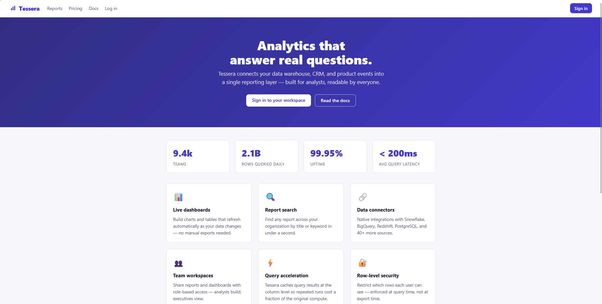
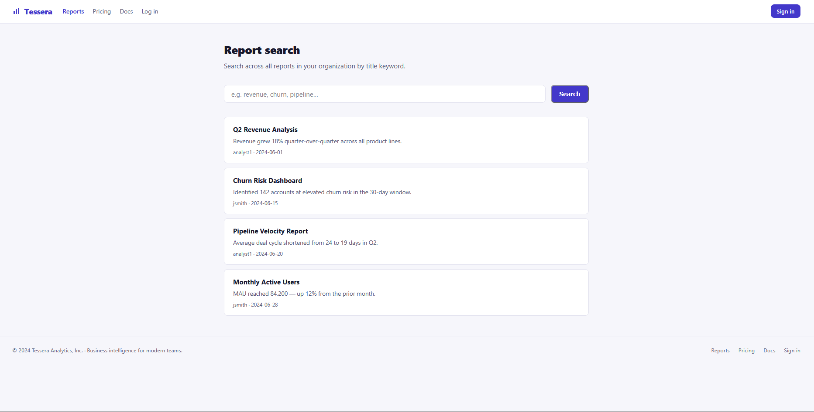
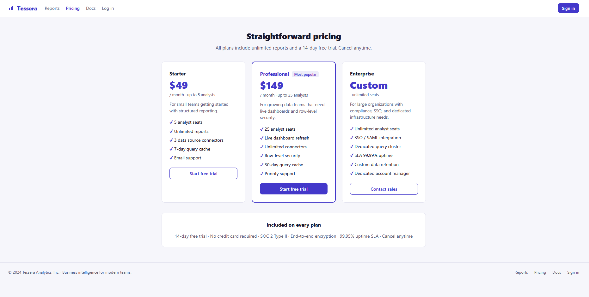
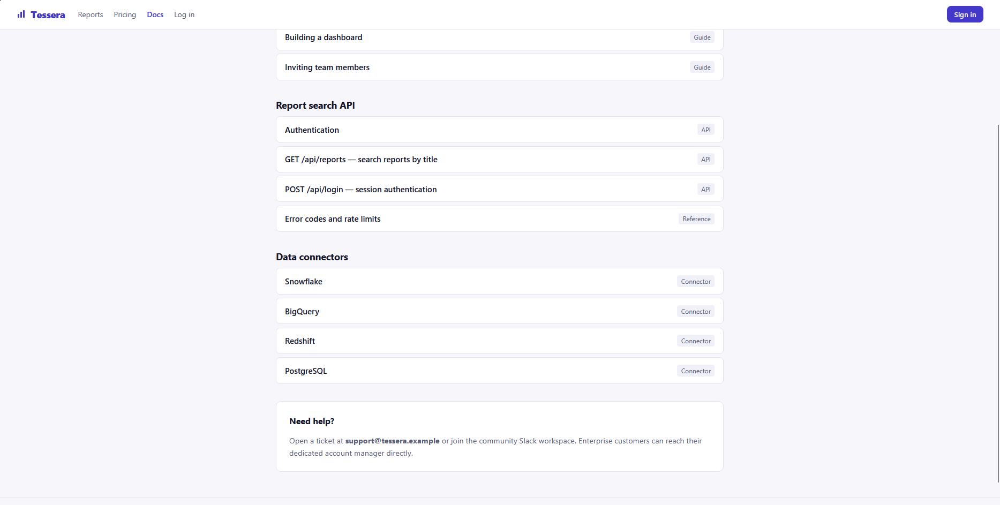
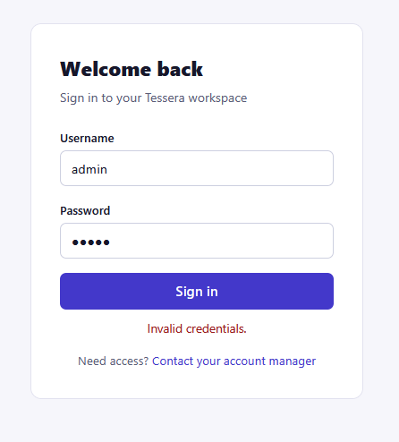
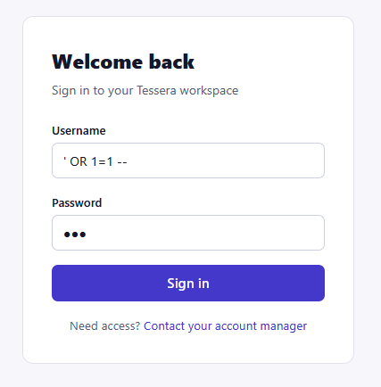
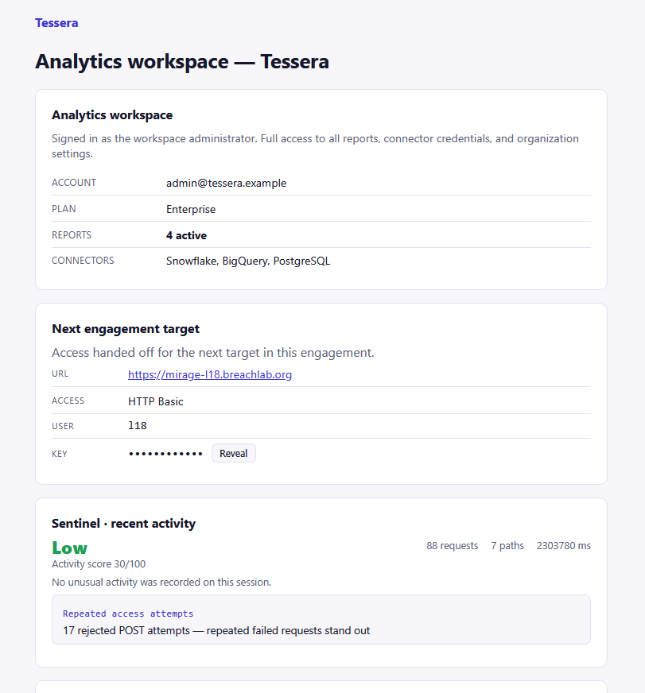

# Level 17: Union of Lies

## Objective

Tessera. SQL built by string concatenation. UNION the query into telling you what it shouldn't.

---

## Reconnaissance

I started enumeration by inspecting the available pages and reviewing the client-side source code.

The frontpage did not reveal anything useful.



The `/reports` page contained a search bar, but normal searches did not expose anything interesting.



The `/pricing` also didn't had anything useful.



The `/docs` page was more useful because it documented the application's API reference, database connections:



The documentation indicated that both report searching and authentication were handled through API endpoints.

---

## Exploitation

I first visited the `/login` page and tested the common `admin:admin` credentials:



The application responsed with `Invalid credentials`.

Since the challenge objective specifically mentioned SQL being built using string concatenation, It indicated toward `SQL injection`.

I then tested a classic authentication-bypass SQL injection payload `' OR 1=1 --`.



The payload successfully bypassed the login check and granted access to the internal application.



This confirmed that the authentication query was vulnerable to `SQL injection` because user-controlled input was being incorporated into the SQL statement without proper parameterization.

## Root Cause

The application's SQL queries were constructed using string concatenation with user-controlled input.

Instead of using parameterized queries, attacker-controlled values were incorporated directly into SQL statements.

Conceptually, an unsafe query can look like:

```sql
SELECT ... FROM users WHERE username = '<user>' AND password = '<pass>'
```

When the application concatenates input directly into this query, SQL syntax can be injected into the username or password field.

The payload `' OR 1=1 --` changes the logic of the query so that the authentication condition can evaluate as true.

The same underlying SQL injection primitive can also be abused with `'UNION SELECT --` to retrieve additional information from the database.

---

## Security Impact

SQL injection is a critical vulnerability because it allows attacker-controlled input to influence the application's database queries.

Potential impacts include:

* Authentication bypass
* Unauthorized access to internal functionality
* Disclosure of sensitive database records
* Extraction of usernames and other application data
* Exposure of database structure and schema information
* Modification or deletion of database records, depending on database permissions
* Potential compromise of other application functionality

In this challenge, the vulnerability first allowed authentication to be bypassed and could then be leveraged for UNION-based information disclosure.

---

## Mitigation

Developers should:

* Use parameterized queries or prepared statements for all database operations.
* Never construct SQL statements by concatenating user-controlled input.
* Apply strict server-side input validation where appropriate.
* Use database accounts with the minimum permissions required by the application.
* Avoid exposing raw database errors to users.
* Implement proper authentication logic independently of user-controlled SQL expressions.
* Perform security testing against all endpoints that accept database-backed input.
* Use ORM/query-builder features safely and avoid falling back to raw SQL with string concatenation.

---

## Key Takeaways

* Always test authentication parameters for SQL injection when user input is incorporated into database queries.
* Common SQL injection payloads can quickly identify authentication-bypass vulnerabilities.
* API documentation can reveal useful endpoints and parameters during reconnaissance.
* A successful authentication bypass is often only the beginning of SQL injection exploitation.
* UNION-based SQL injection can turn a vulnerable query into a database information-disclosure primitive.
* SQL queries should always use parameterized statements instead of string concatenation.

---

## Vulnerability Classification

| Category | Value |
| -------- | ----- |
| Type | SQL Injection |
| OWASP Top 10 | A03:2021 – Injection |
| CWE | CWE-89: Improper Neutralization of Special Elements used in an SQL Command ('SQL Injection') |
