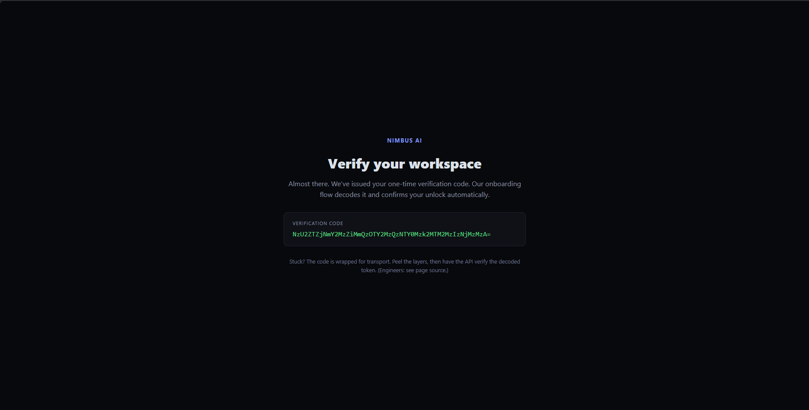
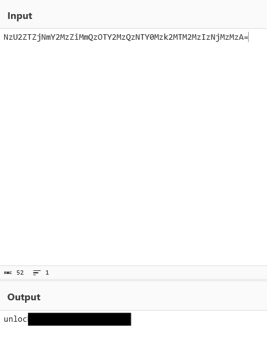
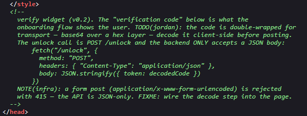
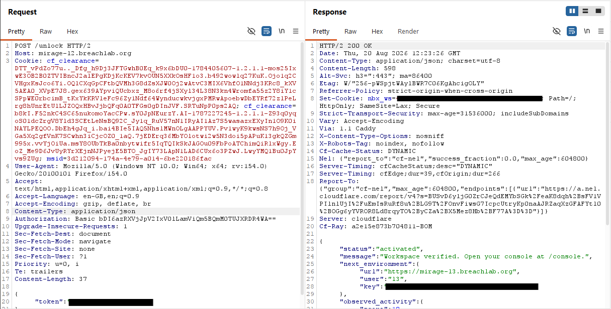

# Level 2: Peel the Encoding

## Objective

Nimbus AI. A verification code wrapped in layers of encoding. Representation is not protection.

---

## Reconnaissance

To authentication, username is `l2` and password is flag obtained in the previous challenge `l1`.

On the front page we can see a one-time verification code which is encoded. It appears to be Base64 encoding, but we we know it will be encoded mutliple times as given the challenge objective.

I decoded the string using **Cyberchef**. An online webapp used for encryption, encoding, compression and data analysis.

The output string looked like an password or a token which we can use later.

I then started inspected the page source code to find any useful content and found this:

* The encoded string we found earlier was encoded two times, first to hexadecimal and then to Base64 encoding (I already figured that out while decoding)
* It appears to be a endpoint directory which can be accessed using `POST` HTTP method.
* The header should contain the `Content-Type: application/json` media type.
* And the body should contain the decoded key in JSON format.

---

## Exploitation

I captured a request using **Burp Suite** and forwarded the request to the **Burp Repeater**.

Then I modified the request according to the comment given in the source code and send the request.

The response gave us the access to the admin page and the challenge flag, which confirmed that the request had been successfully validated.

---

## Root Cause

The challenge relied on client-side information to describe how the backend API should be used. By exposing the endpoint, request format, and required JSON structure within the application's source code, an attacker could manually reproduce the intended request without using the frontend interface.

---

## Security Impact

In a real-world application, exposing internal API details through client-side code can make it easier for attackers to understand how backend services operate. If sensitive actions depend solely on client-supplied parameters without additional server-side validation, attackers may be able to invoke privileged functionality directly.

Potential impacts include:

* Direct interaction with hidden API endpoints
* Automation of backend requests
* Bypassing frontend workflow restrictions
* Increased attack surface through exposed API documentation

---

## Mitigation

Developers should:

* Avoid exposing unnecessary implementation details in client-side code.
* Perform all validation and authorization on the server.
* Never assume that requests originate only from the intended frontend.
* Validate the authenticity and integrity of client-supplied data before processing requests.

---

## Key Takeaways

* Client-side source code often reveals valuable information about backend APIs.
* Modern web applications frequently use JSON rather than traditional form submissions.
* Burp Suite Repeater is an effective tool for crafting and testing custom API requests.
* Understanding HTTP methods, headers, and request bodies is fundamental to web application security testing.
* Always verify whether an API endpoint can be accessed directly without relying on the application's user interface.

---

## Vulnerability Classification

| Category     | Value                                                                        |
| ------------ | ---------------------------------------------------------------------------- |
| Type         | Client-Side Information Disclosure / Manual API Interaction                  |
| OWASP Top 10 | A05:2021 – Security Misconfiguration *(client-side exposure of API details)* |
| CWE          | CWE-200: Exposure of Sensitive Information to an Unauthorized Actor          |