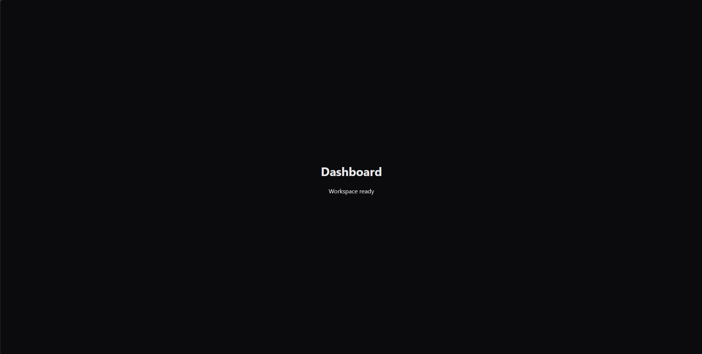
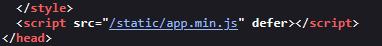
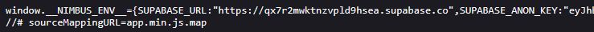
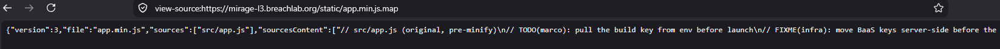
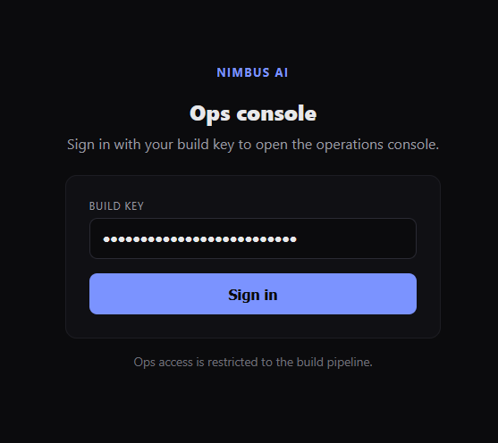
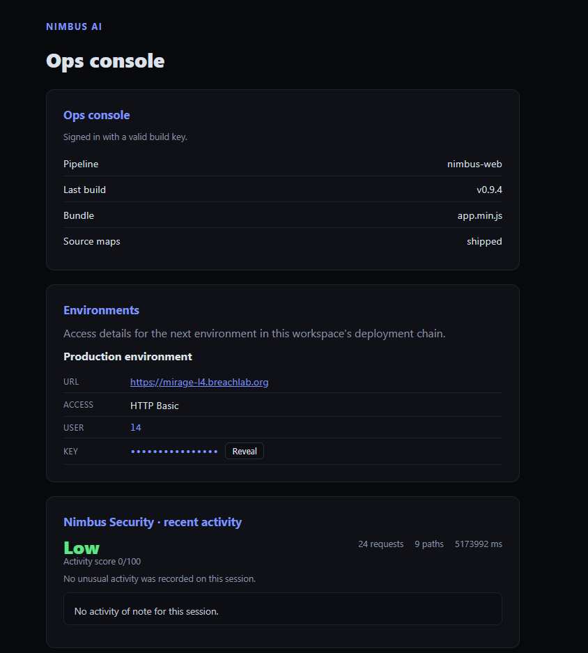

# Level 3: Source Maps Talk

## Objective

Nimbus AI. A shipped source map carries the debug build — and the key that came with it.

---

## Reconnaissance

The onboard application page didn't have anything interesting.



On inspecting the page source code, we found the minified js file.





```js
window.__NIMBUS_ENV__=
{
    SUPABASE_URL:"https://qx7r2mwktnzvpld9hsea.supabase.co",
    SUPABASE_ANON_KEY:<REDACTED>
    };
document.getElementById("status").textContent="Workspace ready";
//# sourceMappingURL=app.min.js.map
```

It contained a Supabase configuration url, authentication token and the source map file name.



```json
{
"version": 3,
"file": "app.min.js",
"sources": ["src/app.js"],
"sourcesContent":
[
    src/app.js (original, pre-minify
    TODO(marco): pull the build key from env before launch
    FIXME(infra): move BaaS keys server-side before the Supabase cutover
    ops console lives at /internal — sign in with the build key below
    const SUPABASE_URL = "https://qx7r2mwktnzvpld9hsea.supabase.co";
    const SUPABASE_ANON_KEY = <REDACTED>;
    const OPS_BUILD_KEY = <REDACTED>;
    window.__NIMBUS_ENV__ = { SUPABASE_URL, SUPABASE_ANON_KEY };
    document.getElementById("status").textContent = "Workspace ready";
    ],
"names": [],
"mappings": ""
}
```

Inside the source map, We got the original, unminified source code which contains an endpoint location `/internal` and a application build key which can be used to authenicate.

---

## Exploitation

We accessed the `/internal` page and use the application build key to authenticate.





Authentication was successful, which granted us the access to the internal application and revealed the challenge flag.

---

## Root Cause

The application exposed its JavaScript source map in the production environment. Because the source map contained the original source code, sensitive implementation details including internal routes and authentication-related values which became accessible to anyone who could request the file.

Although source maps are intended for debugging, they should not expose confidential information in publicly accessible production deployments.

---

## Security Impact

In a real-world environment, exposed source maps can significantly assist attackers during reconnaissance by revealing information that is otherwise hidden within minified code.

Potential impacts include:

* Disclosure of internal API endpoints
* Exposure of authentication mechanisms
* Leakage of API keys or configuration values
* Discovery of hidden administrative functionality
* Faster identification of attack surfaces

Even when no credentials are directly exposed, source maps can dramatically reduce the effort required to understand an application's internal architecture.

---

## Mitigation

Developers should:

* Exclude source map files from production deployments unless absolutely necessary.
* Ensure build pipelines remove debugging artefacts before release.
* Never hardcode secrets, API keys, or authentication values within client-side code.
* Perform regular reviews of publicly accessible assets to identify unintended disclosures.
* Store sensitive configuration securely on the server rather than exposing it to clients.

---

## Key Takeaways

* Always inspect JavaScript files for a `sourceMappingURL` directive.
* Publicly accessible source maps can reveal the original application source code.
* Source maps often expose significantly more information than the minified JavaScript alone.
* Client-side code should never contain secrets or authentication material.
* Source map enumeration should be a standard step during web application reconnaissance.

---

## Vulnerability Classification

| Category     | Value                                                           |
| ------------ | --------------------------------------------------------------- |
| Type         | Source Map Disclosure                                           |
| OWASP Top 10 | A05:2021 – Security Misconfiguration                            |
| CWE          | CWE-215: Insertion of Sensitive Information into Debugging Code |