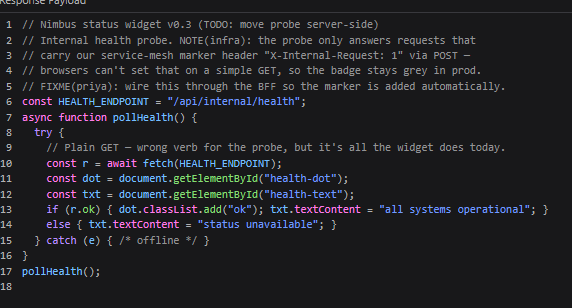
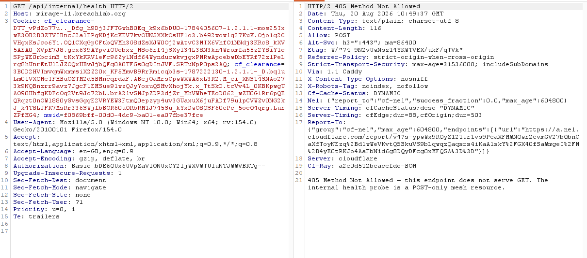
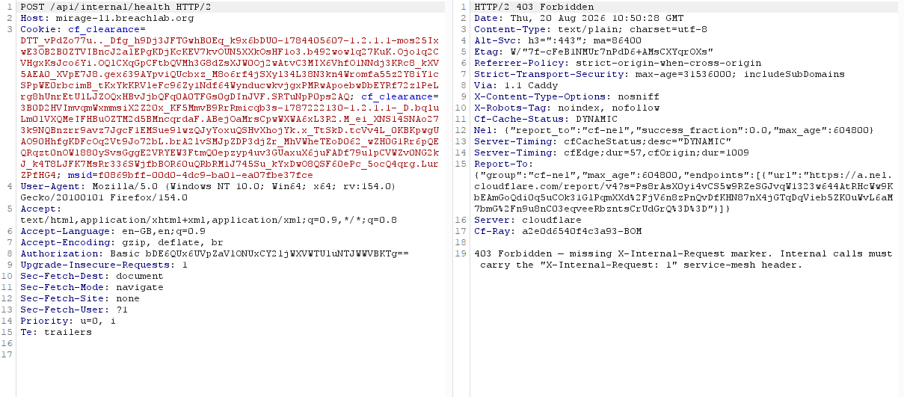
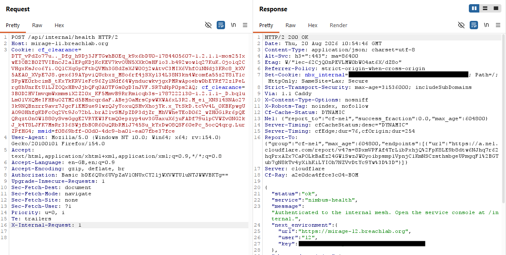

# Level 1: The Wire

Link: [Level 1](https://breachlab.org/tracks/mirage/0)

---

## Objective

Nimbus AI. Forget the form — craft the HTTP request the UI never sends and speak to the service directly.

---

## Reconnaissance

First I inspected the application source code using the Brower Inspect Tool.

While at it, I found an interesting comment and API endpoint written in the application Javascript file.



- This function sends a request to API endpoint.
- If the server responds successfully, it shows “all systems operational” and turns the health dot green.
- If the server gives an error, it shows “status unavailable.”
- If there is a network problem, it does nothing.
- It runs only once, not continuously.

The comment suggested that the frontend was issuing a **GET** request even though the backend expected a different HTTP method.

---

## Exploitation

I intercepted a request using **Burp Suite** and forwwareded it to **Burp Repeater**.

I started testing with different HTTP methods:

The original request was `GET /api/internal/health` gave me `405 Method Not Allowed` status code.



So I changed it to `POST /api/internal/health` which gave me this:



```
403 Forbidden — missing X-Internal-Request marker. Internal calls must carry the "X-Internal-Request: 1" service-mesh header.
```

I knew the HTTP method was correct, all I need is to add `X-Internal-Request: 1` in the header.

This header is used by internal system to which tell the server that the request is coming from a trusted network

I updated the request by including the required header:



This gave me the `200 status code` and the challenge flag, confirming successful access to the internal endpoint.

---

## Root Cause

The application relied on specific HTTP methods and a custom request header as its primary access control mechanism. As these values were easily controlled by the client side, using tools like **Burp Suite** or **curl** can eaily intercept and send modified request to the web application

Security decisions should never rely solely on client controlled request attributes.

---

## Security Impact

In a real-world application, this type of issue could expose internal administrative or diagnostic endpoints. An attacker could gain access to sensitive functionality simply by modifying HTTP methods or adding undocumented headers.

Potential impacts include:

* Exposure of internal APIs
* Information disclosure
* Access to administrative functionality
* Bypass of intended frontend restrictions

---

## Mitigation

Developers should:

* Implement proper server-side authentication and authorization for internal endpoints.
* Avoid relying on custom headers as the sole security mechanism.
* Remove unnecessary debugging messages and developer comments from production responses.
* Validate user permissions independently of the HTTP method or client-supplied headers.

---

## Key Takeaways

* Always inspect HTTP responses for comments or debugging information.
* Error messages often reveal valuable information about backend expectations.
* Test alternative HTTP methods during web application assessments.
* Custom headers should not be treated as authentication mechanisms.
* Burp Suite Repeater is an effective tool for manually testing server behaviour.

---

## Vulnerability Classification

| Category     | Value                             |
| ------------ | --------------------------------- |
| Type         | HTTP Method & Header Manipulation |
| OWASP Top 10 | A01:2021 – Broken Access Control  |
| CWE          | CWE-285: Improper Authorization   |
