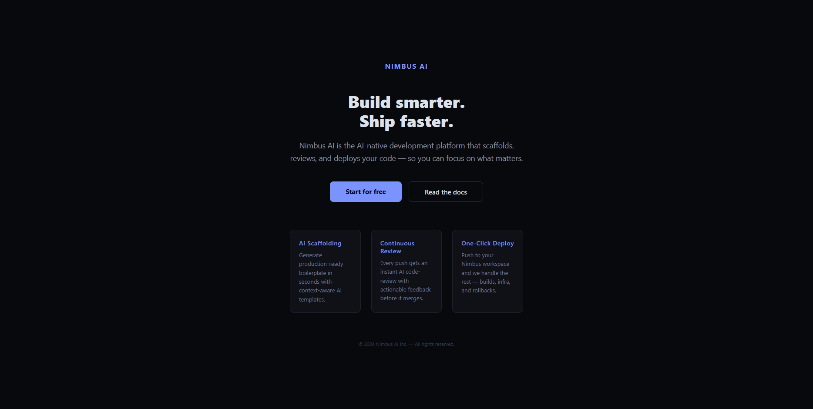
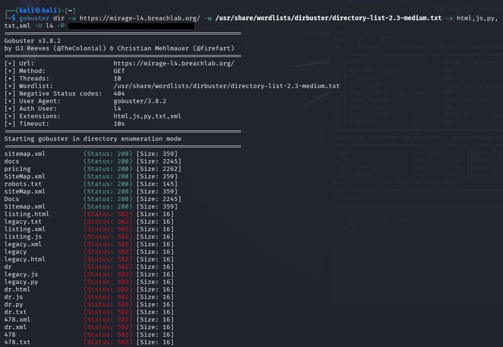
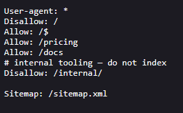
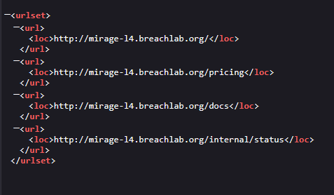
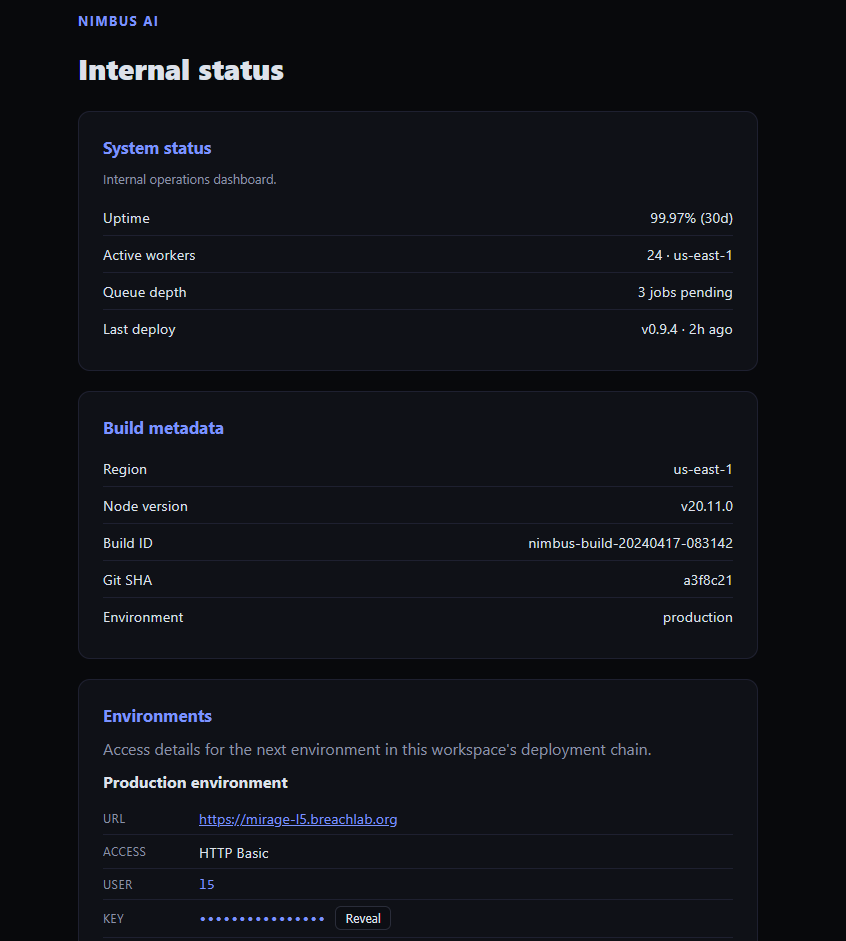

# Level 4: Left in the Open

Link: [Level 4](https://breachlab.org/tracks/mirage/4)

---

## Objective

Nimbus AI. robots, sitemaps and a stray .git — what's published but not linked.

---

## Reconnaissance

The frontpage doesn't have anything interesting.

As normal scan won't work, I modified the command working for authenticated website.

I checked `robots.txt` and `sitemap.xml` and found an internal endpoint `/internal/status`. Other page like `/docs` and `/pricing` didn't had anything which can be useful.

---

## Exploitation

Accessed the internal endpoint:

The endpoint was publicly accessible and immediately returned the challenge flag.

---

## Root Cause

The application disclosed an internal endpoint through publicly accessible discovery files. Although the directory was marked as `Disallow` within `robots.txt`, this directive merely instructs compliant search engines not to crawl the path—it does not provide any security or access control.

The endpoint itself lacked any authentication or authorisation checks, allowing direct access once its location was known.

---

## Security Impact

In production environments, exposing administrative or internal endpoints through `robots.txt` or `sitemap.xml` can significantly aid an attacker's reconnaissance efforts.

Potential impacts include:

* Discovery of hidden application functionality
* Exposure of internal administration panels
* Increased attack surface through endpoint enumeration
* Information disclosure that assists further exploitation

If sensitive endpoints are also missing proper access controls, the impact can escalate to unauthorised access.

---

## Mitigation

Developers should:

* Avoid listing sensitive or administrative paths in publicly accessible discovery files.
* Protect internal endpoints with proper authentication and authorisation.
* Treat `robots.txt` solely as a crawler directive, not a security mechanism.
* Regularly review sitemaps and publicly exposed resources to ensure they do not disclose unnecessary information.

---

## Key Takeaways

* Always inspect `robots.txt` during web application reconnaissance.
* Follow any referenced `sitemap.xml` files and enumerate all listed endpoints.
* Never assume that hidden or undocumented URLs are secure.
* `robots.txt` is **not** an access control mechanism—it only provides instructions to search engine crawlers.
* Public discovery files often reveal valuable information that is overlooked during development.

---

## Vulnerability Classification

| Category     | Value                                                               |
| ------------ | ------------------------------------------------------------------- |
| Type         | Information Disclosure through Enumeration                          |
| OWASP Top 10 | A05:2021 – Security Misconfiguration                                |
| CWE          | CWE-200: Exposure of Sensitive Information to an Unauthorized Actor |
