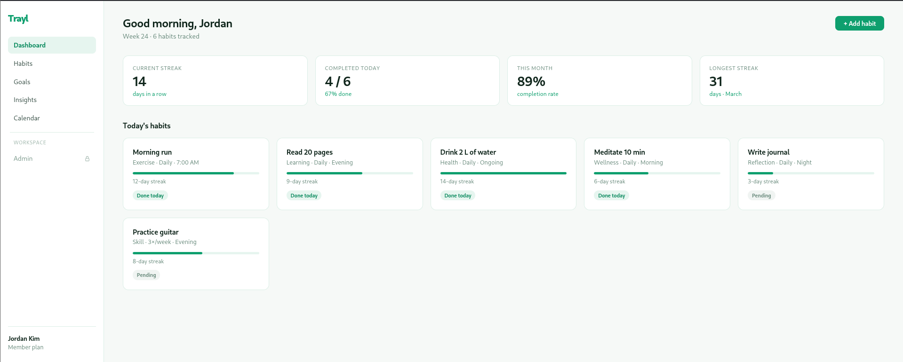
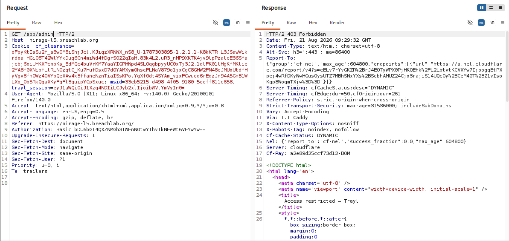
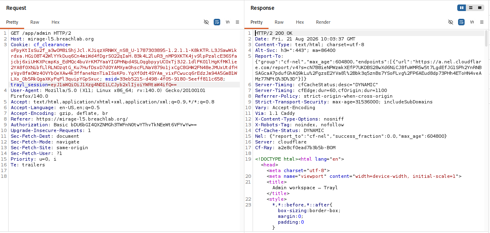
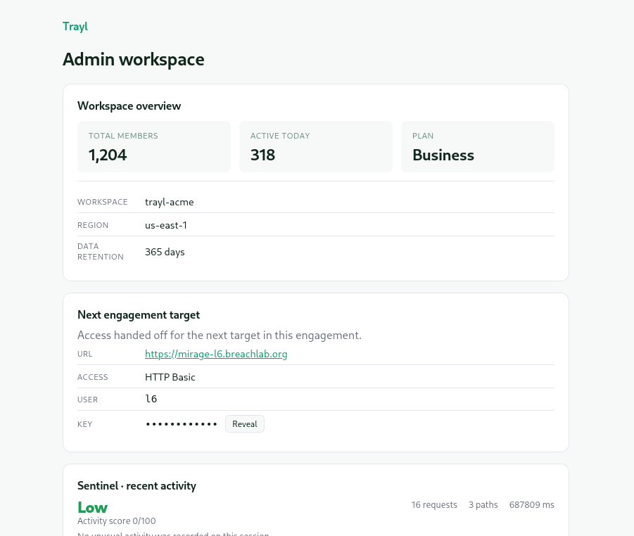

# Level 5: Trust the Client

Link: [Level 5](https://breachlab.org/tracks/mirage/5)

---

## Overview

Trayl. The app keeps your role in a cookie it lets you edit. Forge the principal.

---

## Reconnaissance

At first we can see the frontpage which has nothing interesting.
The source code also didn't have anything interesting either.



The admin page was inaccessable


I captured a request, forwarded it to the **Burp Repeater** and checked for any clue.
While at it, I saw a application session token in the request which appeared to be Base64 encoded.



```
trayl_session=eyJ1aWQiOiJ1Xzg4NDIiLCJyb2xlIjoibWVtYmVyIn0=
```

Using **Cyberchef**, I decoded the token and got a user id in json format:

```json
{"uid":"u_8842","role":"member"}
```

From the objective, we know by now that we can edit and use this token to access the admin page.

---

## Exploitation

I simply changed the role value from `member` to `admin` to test if it works

```json
{"uid":"u_8842","role":"admin"}
```

After modifying the JSON object, I encoded back into Base64 to match the format expected by the application.

Change the token value with the modified Base64 value and send the request.



The server accepted the modified cookie without performing any integrity or authorisation checks.



As a result, the application treated the session as an administrator and granted access to the administrative interface, where the challenge flag was located.

---

## Root Cause

This was the **A01:Broken Access Control** vulnerability, it happens when a web app fails to enforce user permissions properly. This flaw allows an user view data, use features, or change information they are not allowed to see or have access to.

The application trusted authorisation information supplied by the client. Rather than determining user privileges on the server, it relied directly on the value stored inside the session cookie.

Because the cookie was only Base64-encoded and lacked any integrity protection (such as a digital signature or server-side validation), it could be modified without detection.

---

## Security Impact

In a production environment, this vulnerability could allow attackers to escalate privileges simply by modifying client-side session data.

Potential impacts include:

* Privilege escalation from a standard user to an administrator
* Unauthorised access to administrative functionality
* Modification or deletion of sensitive data
* Complete compromise of application security controls

Broken Access Control remains one of the most critical web application vulnerabilities because it often leads directly to unauthorised access.

---

## Mitigation

Developers should:

* Store authorisation information exclusively on the server.
* Never trust client-controlled values when making access control decisions.
* Protect session tokens using cryptographic signing or encryption where appropriate.
* Validate every privileged request against server-side user permissions.
* Implement the principle of least privilege throughout the application.

---

## Key Takeaways

* Base64 encoding does **not** provide confidentiality or integrity.
* Session cookies should never contain editable authorisation data.
* Always inspect cookies during web application assessments.
* If a cookie appears encoded rather than encrypted, attempt to decode and analyse its contents.
* Access control decisions must always be enforced on the server.

---

## Vulnerability Classification

| Category     | Value                                                                  |
| ------------ | ---------------------------------------------------------------------- |
| Type         | Client-Side Role Manipulation                                          |
| OWASP Top 10 | A01:2021 – Broken Access Control                                       |
| CWE          | CWE-602: Client-Side Enforcement of Server-Side Security               |
| Related CWE  | CWE-565: Reliance on Cookies without Validation and Integrity Checking |

