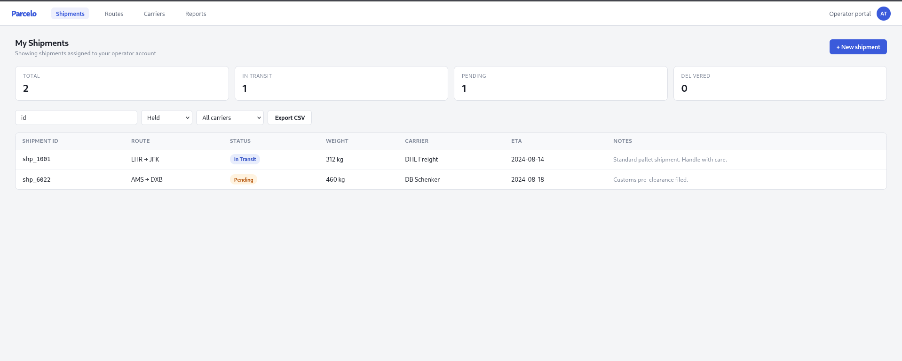
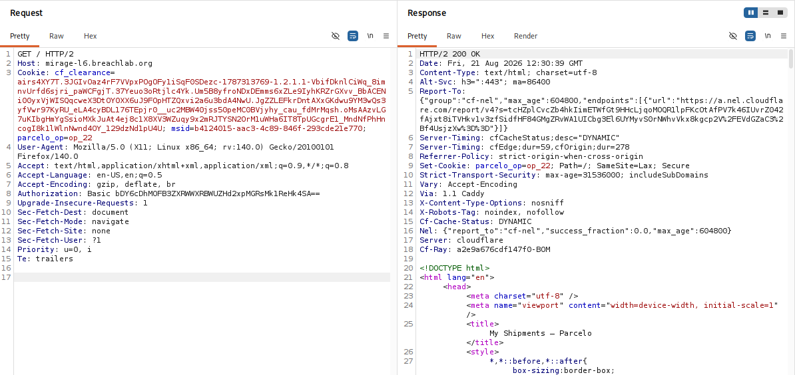
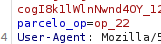
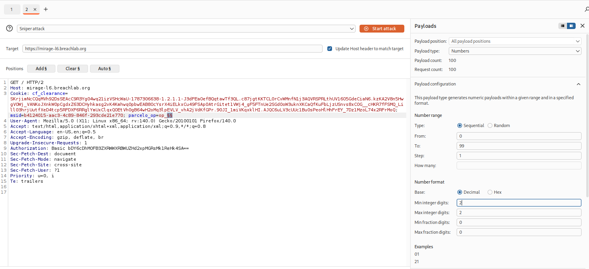
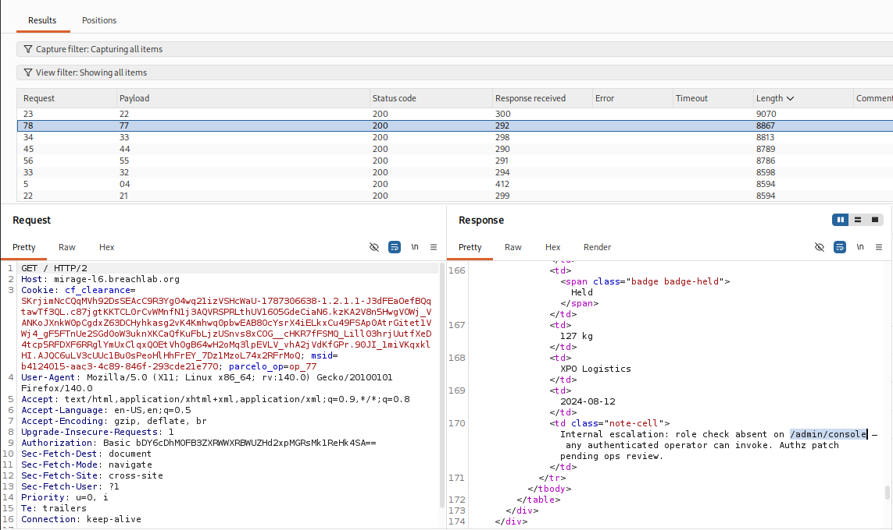
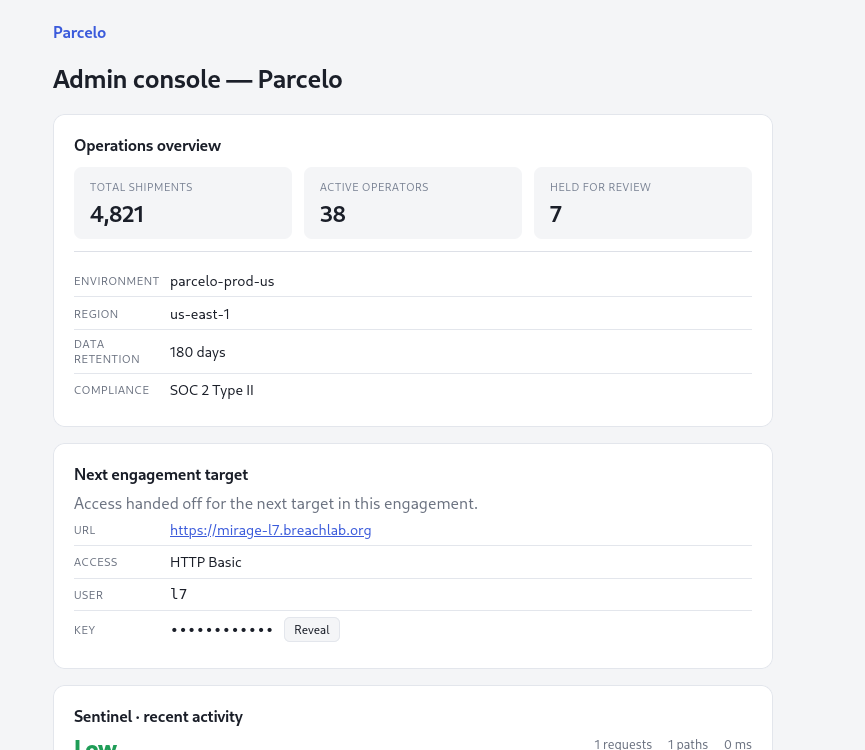

# Level 6: Other People's Objects

---

## Objective

Parcelo. Object references with no ownership check — read the shipments that aren't yours (IDOR/BOLA).

---

## Reconnaissance

The frontpage doesn't look anything interesting except for these orders.

As the objective suggest, the application might be vulnerable to IDOR (Insecure Direct Object Reference) also know as BOLA(Broken Object Level Authorization).

It happens when a system uses direct numbers or names to find data, but forgets to check if you are allowed to see that data.

## Exploitation

I captured a request and forwarded it to the **Burp Repeater**.

In the request, I noticed an id in the header field which looked like an account ID:

So I thought, why not change this value and see if I can access another account's orders by just changing the ID. Manual changing would take a lot of time.

I simply used the **Burp Intruder**, as i can send multiple request with different parameters. Setup a `Sniper attack` using numbers from 01 to 99 to test if I get any result.

After the fuzzing, I sorted the list by height lenght order (Higher the length, more content it the page). First was the `op_22` which we already have.

The second `op_77` was rather interesting, It not only displayed us a different shipment details from our but also revealed an internal admin console which lacked proper authorization.

Because the endpoint failed to enforce role-based access control, admin console was easily accessable to anyone using the application.

This gave access to the admin page and the challenge flag was successfully retrieved.

---

## Root Cause

The application suffered from two distinct authorisation weaknesses:

1. **Broken Object Level Authorization (BOLA/IDOR)** — Shipment objects could be accessed by changing predictable identifiers without verifying ownership.

2. **Broken Function Level Authorization** — The administrative console failed to validate whether the authenticated user possessed administrative privileges before granting access.

The combination of these issues allowed sensitive internal information to be discovered and subsequently exploited.

---

## Security Impact

In a production environment, an attacker could enumerate records belonging to other users simply by modifying predictable object identifiers.

Potential impacts include:

* Unauthorised access to other users' data
* Disclosure of confidential internal information
* Enumeration of sensitive business records
* Discovery of additional attack paths
* Privilege escalation through exposed administrative functionality

Although the flag was ultimately obtained through the administrative console, the initial weakness was the application's failure to enforce object-level authorisation.

---

## Mitigation

Developers should:

* Validate ownership or permissions for every requested object on the server.
* Avoid exposing predictable sequential identifiers where possible.
* Implement role-based access control for administrative functionality.
* Ensure internal notes and operational information are never exposed through user-accessible APIs.
* Perform regular authorisation testing to verify both object-level and function-level access controls.

---

## Key Takeaways

* Always test whether object identifiers can be modified to access other users' resources.
* Sequential identifiers are common indicators that IDOR testing should be performed.
* Keep the authenticated session unchanged while modifying only the object reference.
* Review every response carefully—information disclosure can often reveal additional vulnerabilities.
* Broken Object Level Authorization frequently leads to more significant security issues when combined with other access control flaws.

---

## Vulnerability Classification

| Category                  | Value                                                                              |
| ------------------------- | ---------------------------------------------------------------------------------- |
| Type                      | Broken Object Level Authorization (BOLA) / Insecure Direct Object Reference (IDOR) |
| OWASP API Security Top 10 | API1:2023 – Broken Object Level Authorization                                      |
| OWASP Top 10              | A01:2021 – Broken Access Control                                                   |
| CWE                       | CWE-639: Authorization Bypass Through User-Controlled Key                          |
