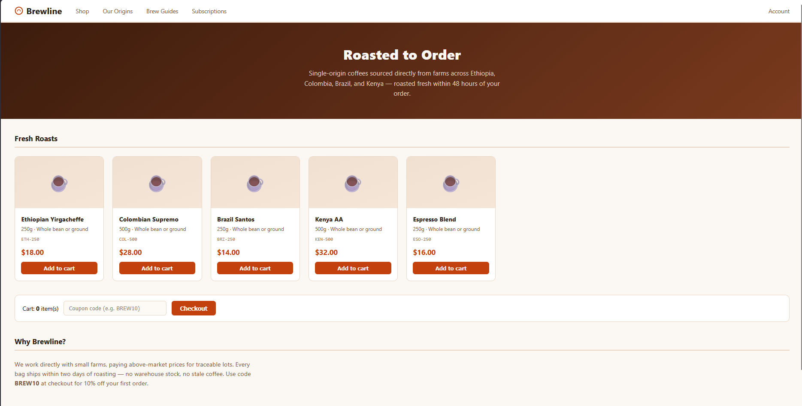
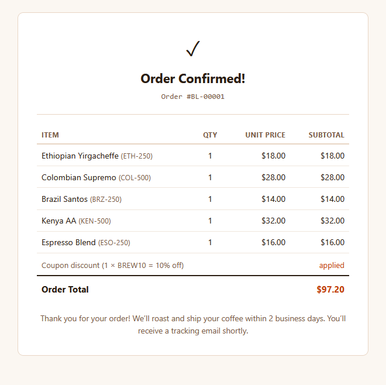
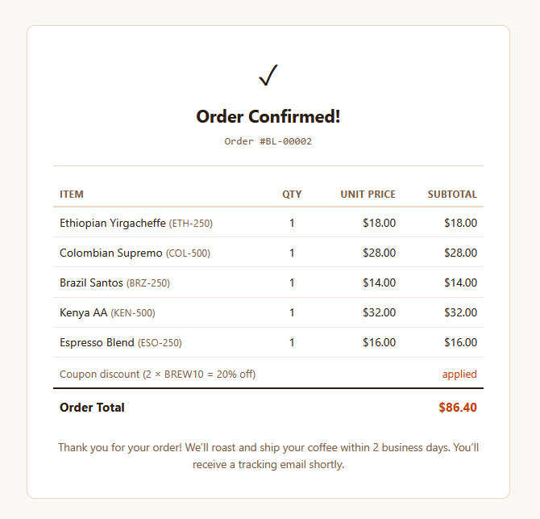
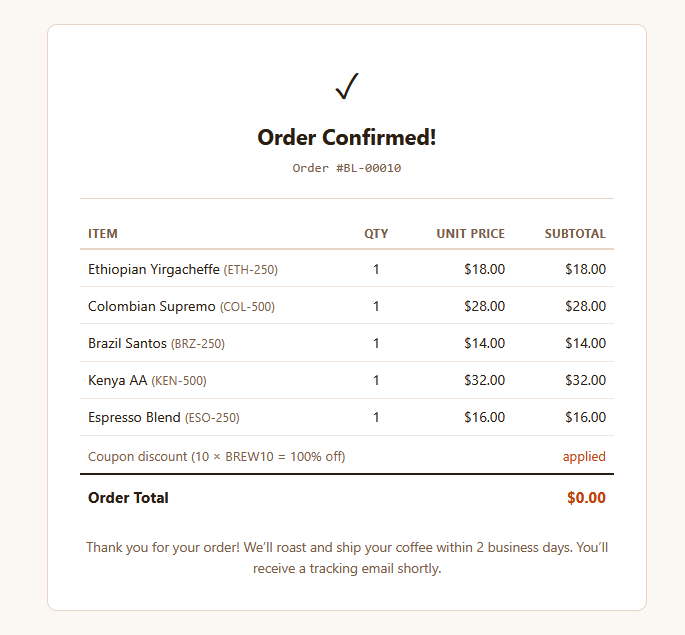
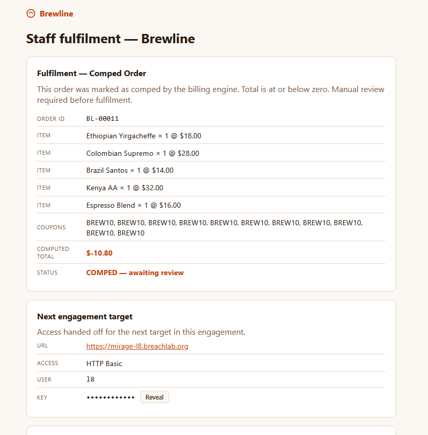

# Level 7: Break the Logic

---

## Objective

Brewline. The checkout math trusts you. Stack coupons and negatives until the logic breaks.

---

## Reconnaissance & Exploitation

The application provides a coffee purchasing platform in which we could add beverages to the cart and apply a promotional discount coupons to get a discount on our order.

To understand how discounts were processed, I added some beverages to the cart and applied the **10% discount coupon**.

All appears to be normal at first.

Then I went back and tried to add another **10% discount coupon** to by already coupon applied order.

Guess what! I can stack multiple coupon on the same order which will decrease the price of my order. This was a **business logic vulnerability** which allowed us to use the same discount coupon on a already applied order without any proper validation.

So I adding total 10 coupon which will give me **100% discount** on my order. The application continued to accept the same coupon without any validation which broke the coupon system logic.

I applied the same coupon one more time and it completely broke the coupon logic system, showing a negative price of the order and revealed the challenge flag.

---

## Root Cause

The application failed to enforce business rules surrounding coupon redemption.

Specifically, it did not:

* Track whether a coupon had already been redeemed.
* Prevent duplicate coupon usage.
* Enforce a maximum cumulative discount.
* Validate the order state before processing additional discounts.

Rather than exploiting a software bug, the challenge abused flaws in the application's business workflow.

---

## Security Impact

Business logic vulnerabilities can have severe financial consequences even when no traditional security vulnerability exists.

Potential impacts include:

* Free or heavily discounted purchases.
* Financial losses through unlimited coupon redemption.
* Abuse of promotional campaigns.
* Revenue leakage.
* Manipulation of purchasing workflows.

Because these attacks exploit intended functionality in unintended ways, they are often difficult to detect using automated vulnerability scanners.

---

## Mitigation

Developers should:

* Restrict coupons to a single redemption where appropriate.
* Enforce server-side validation for coupon usage.
* Define and enforce maximum discount limits.
* Track coupon redemption history for each user and order.
* Validate the entire purchase workflow before applying promotional discounts.

---

## Key Takeaways

* Not every vulnerability involves code execution or injection attacks.
* Business logic testing is an essential part of web application security assessments.
* Always test whether discounts, reward points, vouchers, or promotional codes can be reused.
* Automated scanners rarely identify business logic flaws—manual testing is often required.
* Applications must enforce business rules on the server rather than relying on expected user behaviour.

---

## Vulnerability Classification

| Category     | Value                                 |
| ------------ | ------------------------------------- |
| Type         | Business Logic Flaw (Coupon Stacking) |
| OWASP Top 10 | A04:2021 – Insecure Design            |
| CWE          | CWE-840: Business Logic Errors        |
