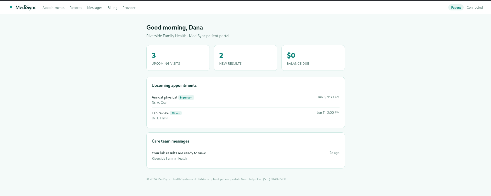
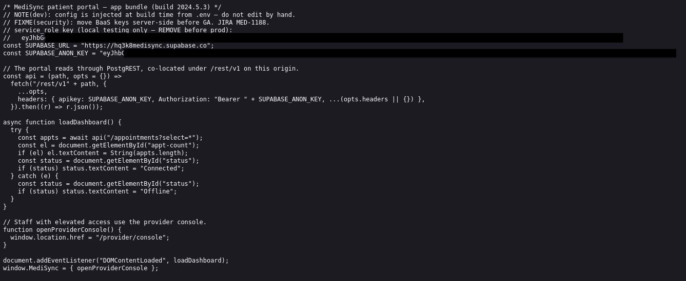
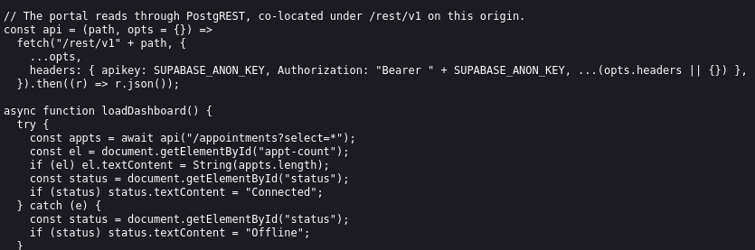
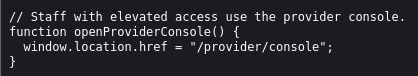
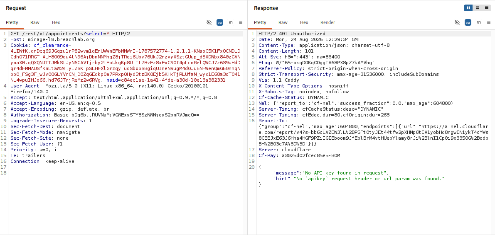
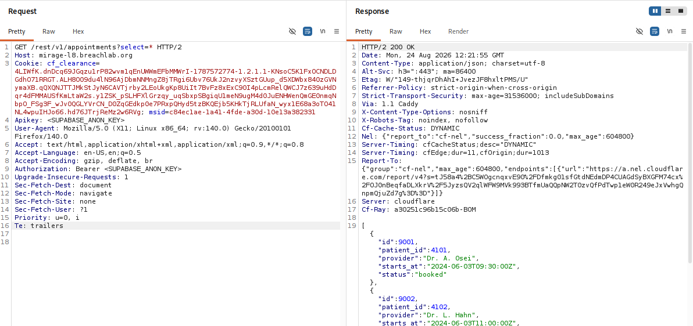
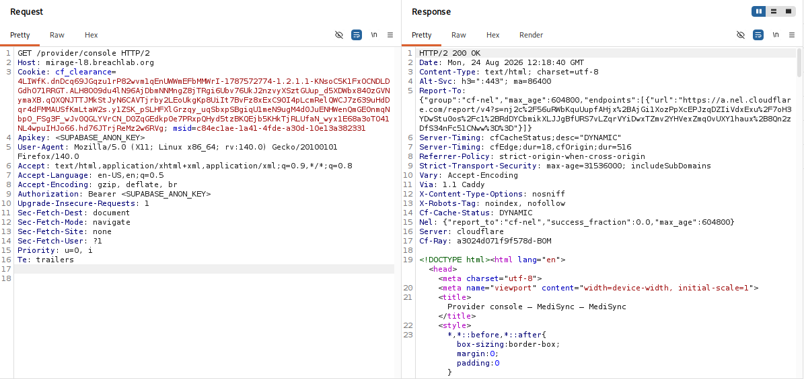
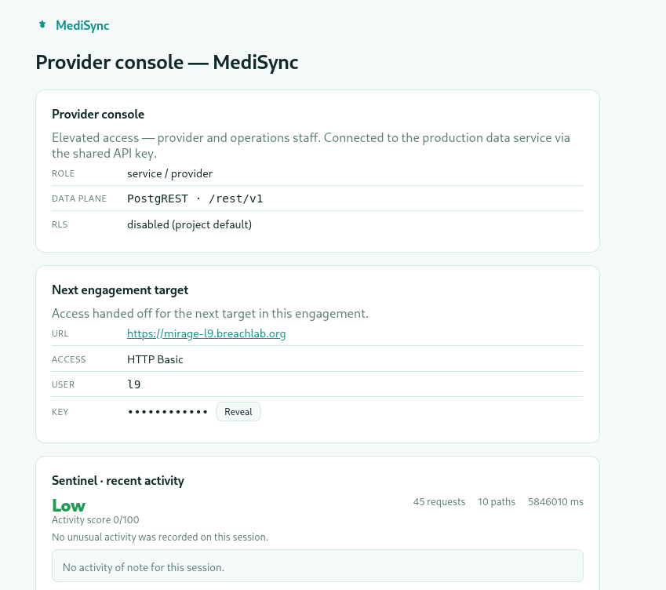

# Level 8: Keys in the Bundle

---

## Objective

MediSync. The shipped bundle carries a backend key — and the database answers it directly (Supabase anon read).

---

## Reconnaissance

It looks like a hospital portal where patients can track their doctor appointments, view medical reports, messages, medical bills and admin console which requries an authorization token to access.




First things first, lets inspect the application source code (You will always find a clue there).

While analyzing the source code, I discovered:
* Supabase URL (unique API endpoint address)
* ANON key (a public, safe-to-share client API key)



It also says the application communicated with the backend using the Supabase REST API and revealed an API endpoint used to retrieve appointment information.

- The public key is used to fetch the data for appointments record table and hands it to the user which is totally safe, no doubt.



- The function also have internal console location which we were not able access earlier.



---

## Exploitation

To test out this, I captured a request, forwarded it to the **Burp Repeater** and sent a request with the public key in the header.



I says it requires an API key in the header to fetch the response.

Then I modified the request according to the source code instruction and sent it. (Yup I removed the key from the header for the screenshots)

```http
GET /rest/v1/appointments?select=* HTTP/2
apikey: <SUPABASE_ANON_KEY>
Authorization: Bearer <SUPABASE_ANON_KEY>
```



And we got the appointment list in the response which was expected.

Now I had a doubt in my mind!
"Can we access the admin console using the same public key?"

To test this out, I simply changed the request header to `GET /provider/console HTTP/2` and sent the request.



And yes, using the public key we got the access to the admin console where the challenge flag was present.



---

## Root Cause

* Client-Side Authorization: The application relies entirely on front-end logic to handle routing and gate access to the admin console.

* Lack of Server-Side Validation: The backend endpoint didn't validated a stateful user session before serving the between user data and sensitive admin data (admin console).

* Over-reliance on the Public Key:
  - The backend relied on a static public key for database queries.
  - Because the frontend code directly exposes the key, it assumes anyone holding it is authorized to interact with the database, mistaking a public routing credential for an access control credential.

---

## Security Impact

In a production environment, this type of vulnerability could allow attackers to gain unauthorized access to privileged functionality by crafting requests with manipulated client-controlled data.

Potential impacts include:

* Unauthorized access to administrative interfaces.
* Disclosure of sensitive data.
* Privilege escalation.
* Bypass of intended authorization workflows.
* Abuse of trusted backend APIs.

Although the public key alone is not inherently sensitive, improper server-side authorization can allow it to be abused when combined with flawed application logic.

---

## Mitigation

Developers should:

* Perform all authorization checks on the server using trusted data sources.
* Never trust client-supplied objects when making access control decisions.
* Validate the authenticated user's permissions independently of any request body.
* Apply the principle of least privilege to backend API endpoints.
* Avoid exposing unnecessary implementation details within client-side source code.

---

## Key Takeaways

* Client-side source often reveals valuable information about backend.
* Exposed API configuration should always prompt further investigation of accessible endpoints.
* Authorization decisions must be based on server-side data, not client-controlled input.
* Access to privileged functionality should never depend on request data supplied by the client.
* Modern web application testing requires analyzing both frontend assets and backend logic.

---

## Vulnerability Classification

| Category     | Value                                                    |
| ------------ | -------------------------------------------------------- |
| Type         | Broken Access Control / Authorization Logic Flaw         |
| OWASP Top 10 | A01:2021 – Broken Access Control                         |
| CWE          | CWE-284: Improper Access Control                         |
| Related CWE  | CWE-602: Client-Side Enforcement of Server-Side Security |
