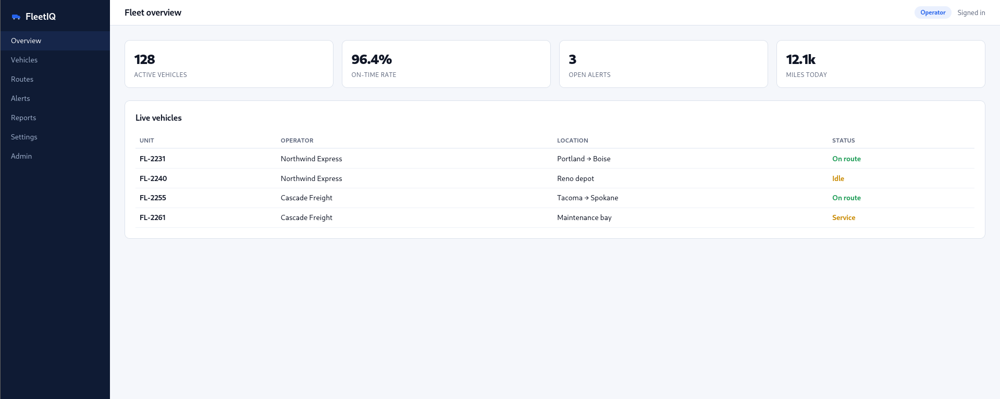
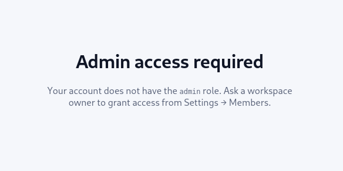
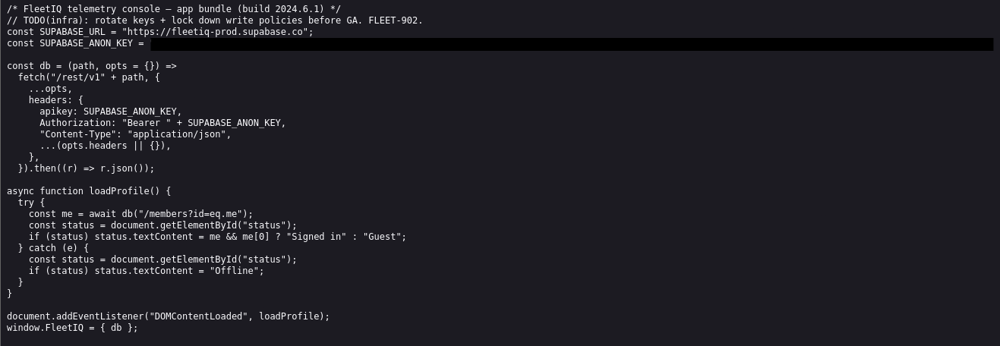
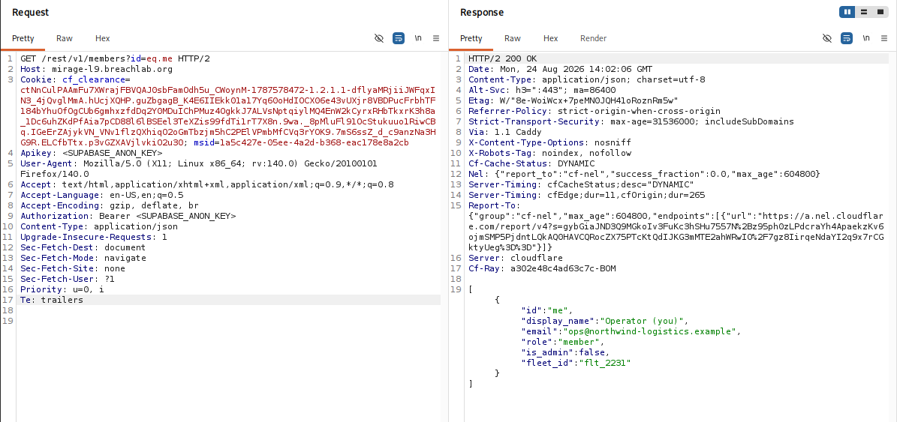
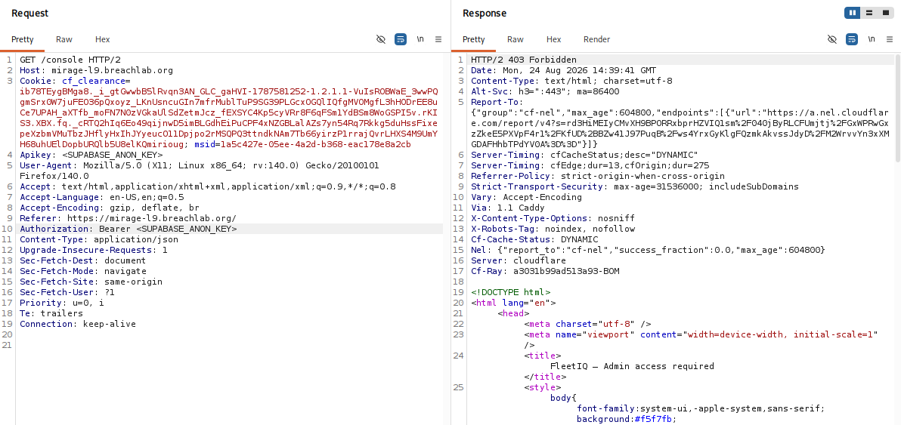
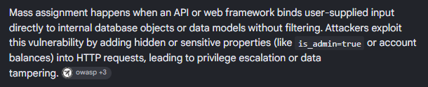
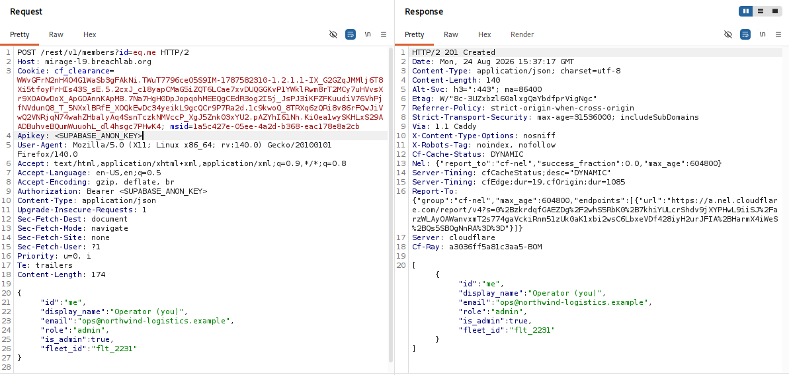
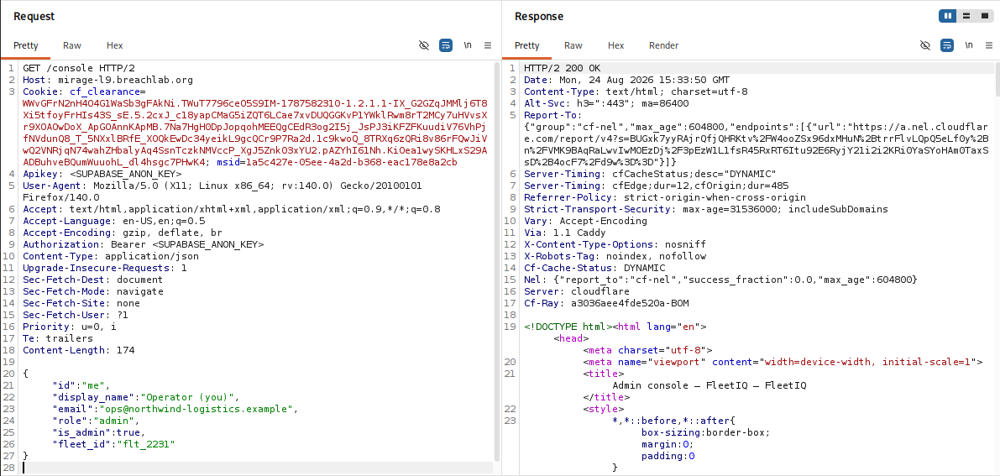
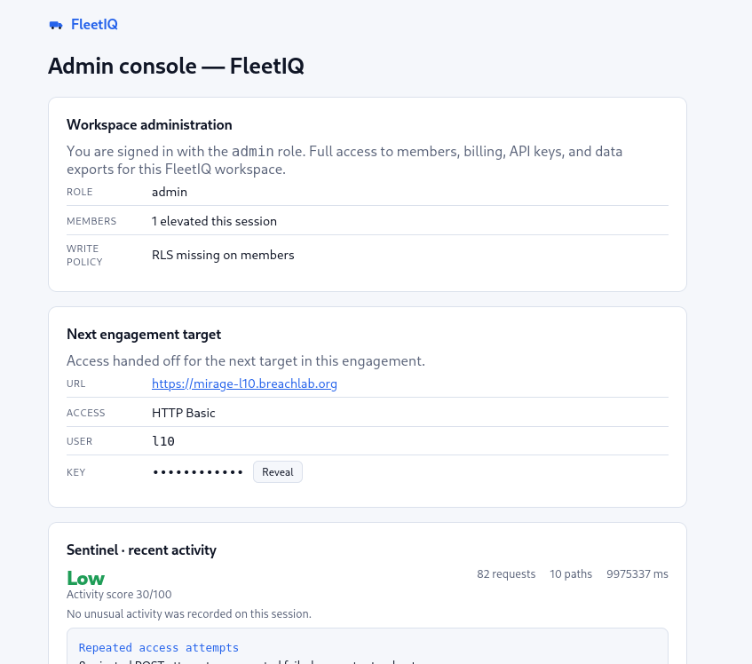

# Level 9: Over-Posting

Link: [Level 9](https://breachlab.org/tracks/mirage/9)

---

## Objective

FleetIQ. Write-side rules are missing — over-post the field that makes you admin (mass assignment).

---

## Reconnaissance

The application looks like a logistics dashboard which tracks transport vehicles, show routes, alerts, reports, application settings (which have no use) and a admin page which we don't have access to.



This page seems interesting, it says we should have `admin` role assigned to us by the application owner to access the admin console.



On inspecting the application source code, we got the javascript file where:



We got:

* A Supabase endpoint URL.
* A Supabase public API.
* An API endpoint `/api/v1/members?id=eq.me` which can be accessed using these in the header:

```html
apikey: <SUPABASE_ANON_KEY>
Authorization: Bearer + <SUPABASE_ANON_KEY>
Content-Type: application/json
```

Let's go and test this out.

---

## Exploitation

First, capture a request in **Bursuite**, forward the request to **Burp Repeater**, modified the request according to the source code.



```json
{
  "id":"me",
  "display_name":"Operator (you)",
  "email":"ops@northwind-logistics.example",
  "role":"member",
  "is_admin":false,
  "fleet_id":"flt_2231"
}
```

Okay, this was rather something interesting. It displaced the id, name, email, role and a boolean field which tells if a user have admin privileges using true/false.

Then I changed the header to `GET /console HTTP/2`, kept the public key in the header and sent the request.



And yes, that didn't worked.

Then I read the challenge objective which mentioned about **Mass Assignment**.

I simply googled about this vulnerability.



Mass Assignment vulnerabilities occur when an application automatically maps all client-supplied fields onto backend objects without restricting properties which may be modified. For more info, check this out [PayloadsAllTheThings](https://swisskyrepo.github.io/PayloadsAllTheThings/Mass%20Assignment/).

After understanding how this vulnerabilty can be exploited, I modified the JSON body like this and sent the request in POST http method.

```json
{
  "id":"me",
  "display_name":"Operator (you)",
  "email":"ops@northwind-logistics.example",
  "role":"admin",
  "is_admin":true,
  "fleet_id":"flt_2231"
}
```



The POST method will automatically injects the modified field into the Object-Relational Mapping (ORM) object through a process called automatic binding.

Because the code blindly trusts request body, the ORM will assumes the application intended to set this field.

This will add an account with admin privileges without any validation.

Changed the header to `GET /console HTTP/2`.



This gave me direct access to the admin console with contains the challenge flag.



---

## Root Cause

The backend API automatically accepted and persisted client-supplied properties without enforcing an allowlist of editable fields.

Rather than limiting updates to legitimate profile attributes, the application trusted the entire JSON object provided by the client, allowing security-critical properties such as `role` and `is_admin` to be modified.

This resulted in a straightforward privilege escalation.

---

## Security Impact

Mass Assignment vulnerabilities can have severe consequences when privileged attributes are exposed through writable API endpoints.

Potential impacts include:

* Privilege escalation to administrative accounts.
* Unauthorized modification of user permissions.
* Bypass of role-based access controls.
* Complete compromise of application security.
* Unauthorized access to administrative functionality and sensitive data.

Because modern REST APIs frequently accept JSON objects directly from clients, this vulnerability is particularly common in applications that rely on automatic object binding.

---

## Mitigation

Developers should:

* Use an allowlist of fields that clients are permitted to modify.
* Reject or ignore unexpected properties supplied in request bodies.
* Store and manage privileged attributes exclusively on the server.
* Validate authorization before processing profile updates.
* Use dedicated Data Transfer Objects (DTOs) instead of directly binding request bodies to database models.

---

## Key Takeaways

* Always inspect API responses for privileged fields such as `role`, `is_admin`, or `permissions`.
* Attempt to include unexpected properties when testing update endpoints.
* A successful response does not always indicate proper validation—verify whether the changes were actually applied.
* Security-sensitive attributes should never be client-controlled.
* Mass Assignment remains a common vulnerability in RESTful APIs that rely on automatic object mapping.

---

## Vulnerability Classification

| Category                  | Value                                                                                   |
| ------------------------- | --------------------------------------------------------------------------------------- |
| Type                      | Mass Assignment / Over-Posting                                                          |
| OWASP Top 10              | A01:2021 – Broken Access Control                                                        |
| OWASP API Security Top 10 | API3:2023 – Broken Object Property Level Authorization (BOPLA)                          |
| CWE                       | CWE-915: Improperly Controlled Modification of Dynamically-Determined Object Attributes |
