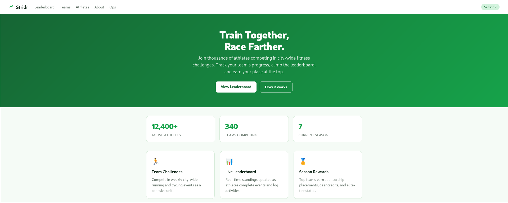
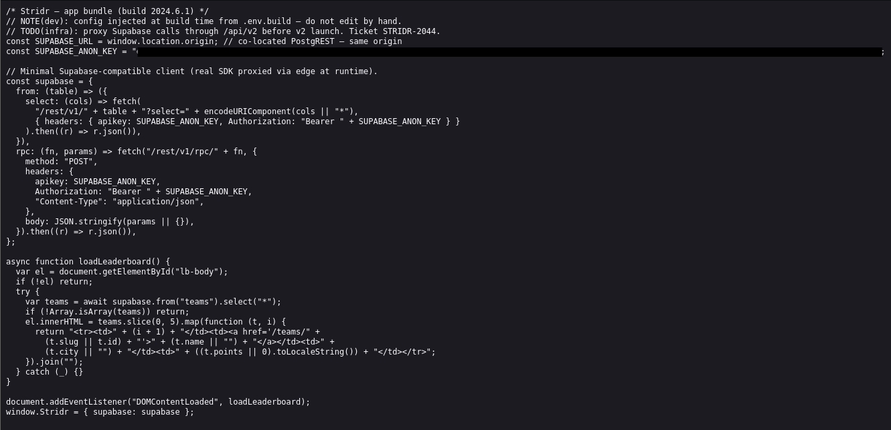
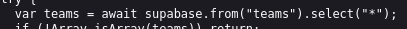
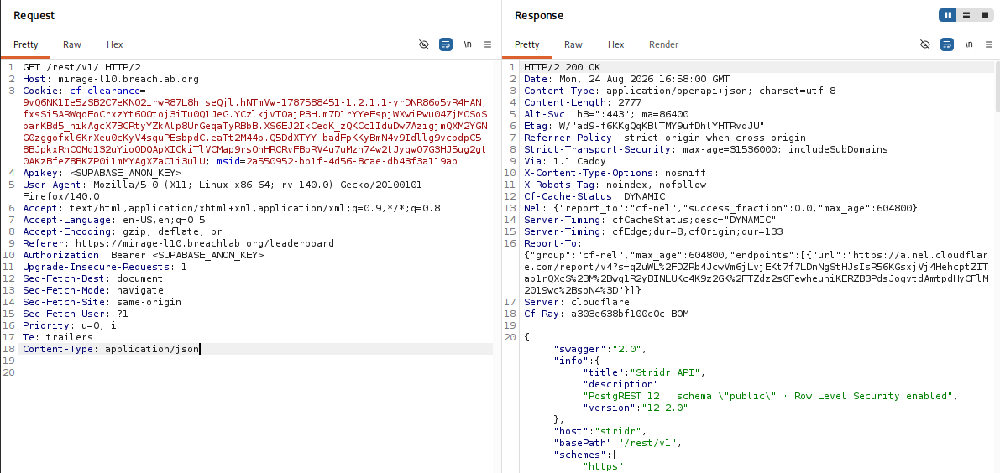
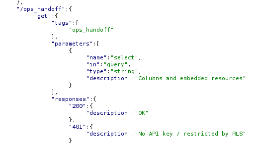
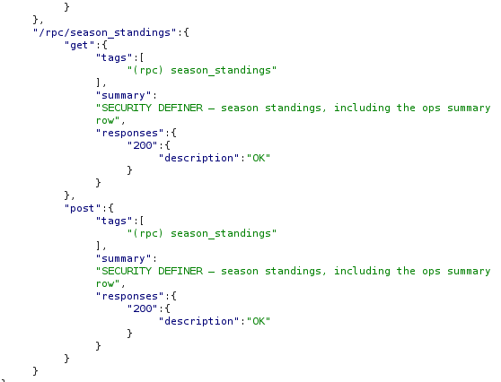
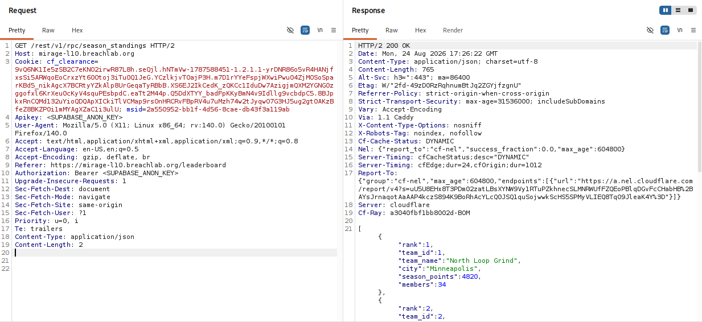
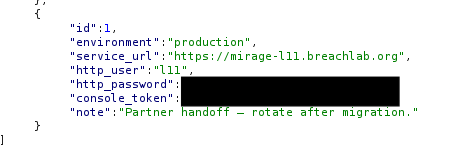

# Level 10: Row-Level Lies

---

## Objective

Stridr. RLS looks on — until a SECURITY DEFINER rpc and an embedded select read around it.

---

## Reconnaissance

This looks like a fitness-challenge platform. Nothing interesting!

The interesting part is this, the `/ops/console` page which we don't have access of and requires a valid console token to access the console.

First thing first, Inspect the source code (It always have something useful). And guess what, it does have interesting stuffs:

* A Supabase URL
* A Supabase Public key
* A function on how the application connects to the database and fetch the resources.

Here is some interesting part:

This function basically used a **Asterisk (*)**, a wildcard character which can downloads everything from the teams table. Any hidden data in the teams table will be exposed easily.

I left that aside for later and went to test the API endpoints given in the source code.

I captured a request using **Burpsuite**, forwarded it to the **Burp Repeater**.

Added the public key values as per the source code function.

Every path was enforced using RLS excpet `/rpc/season_standings`, which tells that a user can access this location without any restriction.

The summary says that a user can fetch summary row or access raw table rows which also contains the `ops` summary row.

The `SECURITY DEFINER` function makes the code run with the rights of the user who owns or made the object , instead of the user who calls it.

It means the `/rpc/season_standings` doesn't do any authorization checks as it runs on the root privileges which is already trusted by the application.

---

## Exploitation

I changed the header to `GET /rest/v1/rpc/season_standings HTTP/2` and sent the request.

This revealed not only the `console_token` for the admin console, but also gave out the challenge flag.

---

## Root Cause

Although Row Level Security was correctly enabled on almost every database tables, but a single table row was not restricted which contained the admin console table content.

PostgreSQL RPC implemented a **`SECURITY DEFINER`** function which makes the code run with root privileges.

Because the function executed with the privileges of its owner, it performed internal database queries that bypassed the normal Row Level Security policies.

The RPC also lacked additional authorization checks to ensure that only appropriately privileged users could invoke it.

As a result, a restricted dataset became accessible through the RPC endpoint revealing sensitive informations.

---

## Security Impact

Improperly implemented `SECURITY DEFINER` functions can completely undermine database-level access controls.

Potential impacts include:

* Bypass of Row Level Security policies.
* Unauthorized disclosure of sensitive records.
* Exposure of administrative or operational data.
* Privilege escalation through trusted database functions.
* Increased attack surface via publicly accessible RPC endpoints.

Even when RLS is correctly configured, insecure RPC implementations can effectively negate its protections.

---

## Mitigation

Developers should:

* Avoid using **`SECURITY DEFINER`** unless it is absolutely necessary.
* Perform explicit authorization checks within privileged database functions.
* Restrict execution privileges on RPC endpoints to authorised roles only.
* Review all exposed database functions during security assessments.
* Apply the principle of least privilege to database roles and service accounts.

---

## Key Takeaways

* Enumerate available RPC endpoints when assessing Supabase or PostgreSQL-backed applications.
* Publicly accessible API documentation can reveal valuable implementation details.
* `SECURITY DEFINER` functions deserve special attention during security testing.
* Row Level Security is only effective when every access path respects its policies.
* Database-level security controls can be bypassed if privileged functions fail to enforce proper authorization.

---

## Vulnerability Classification

| Category                  | Value                                                      |
| ------------------------- | ---------------------------------------------------------- |
| Type                      | Row Level Security (RLS) Bypass via `SECURITY DEFINER` RPC |
| OWASP Top 10              | A01:2021 – Broken Access Control                           |
| OWASP API Security Top 10 | API5:2023 – Broken Function Level Authorization            |
| CWE                       | CWE-285: Improper Authorization                            |