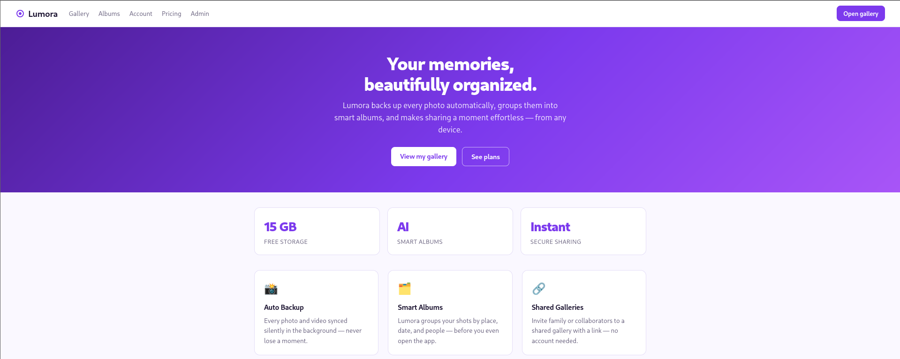
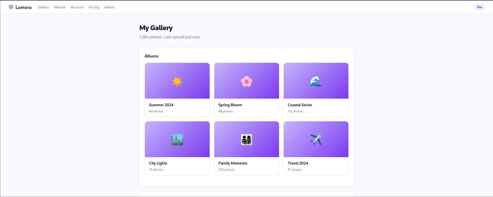
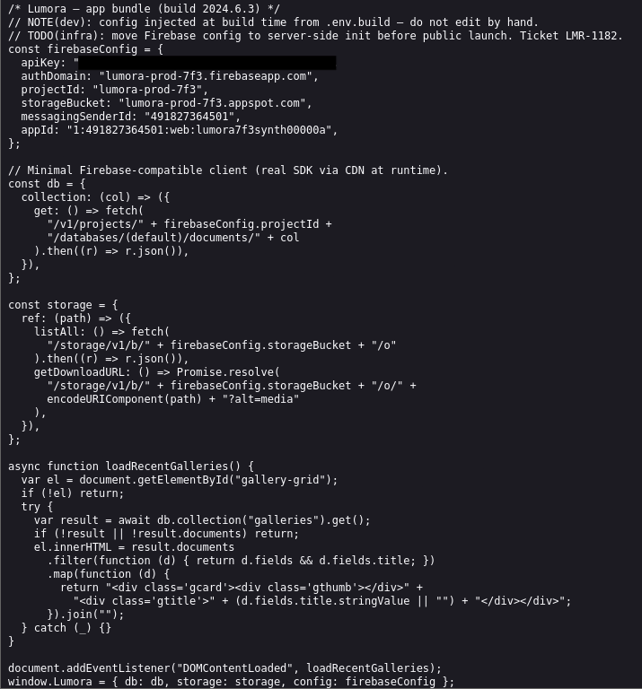
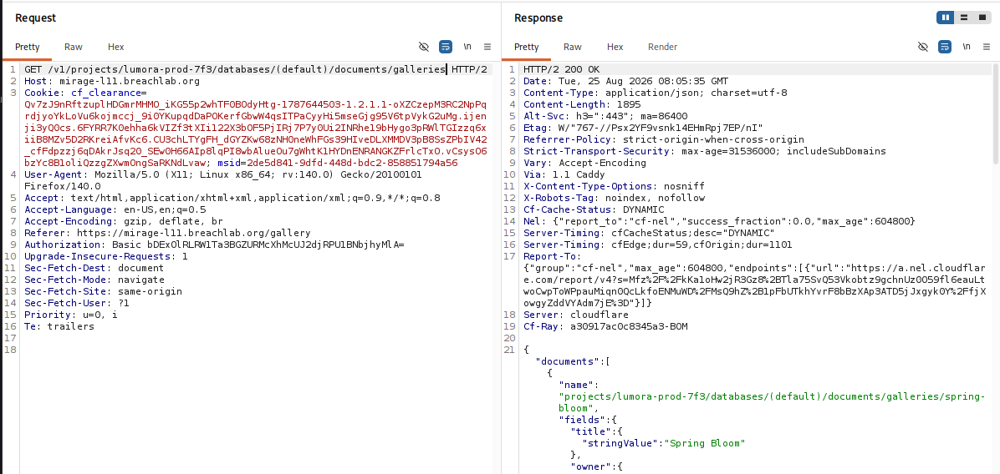
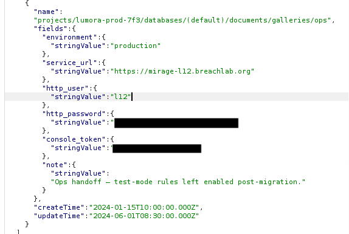
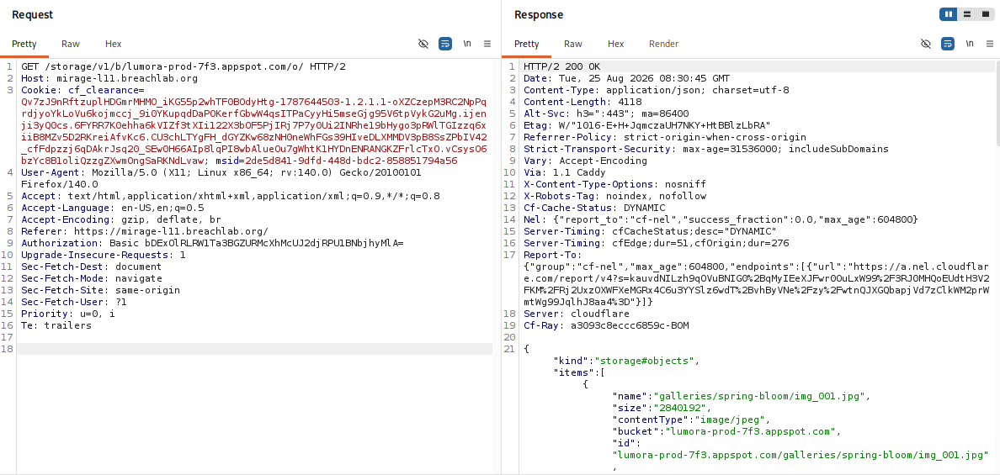

# Level 11: Open Rules

---

## Objective

Lumora. Firebase rules and a cloud-storage ACL left open to anyone who asks.

---

## Reconnaissance

Looks like a photo backup website which take backup of photos from the device and stores them on a cloud server (like Google Photos).

There is an admin page which seems to be locker for us and required a authorized token to get access.

I started inspecting the source code and it seems to have some interesting data in the javascript file.

The source file reveals:

* Firebase Configuration Metadata
* An endpoint location to:
    - Firestone Project
    - Firebase Storage
* A comment indicating that these were production environment code which seems like it got deployed to the frontent which any checks.

---

## Exploitation

First, I captured a request in **Burpsuite** and forwarded it ti the **Burp Repeater**.

The source code gave us this path: `/v1/projects/ + firebaseConfig.projectId + /databases/(default)/documents/ + col`

We also have the,
    - project ID: lumora-prod-7f3
    - collection (col): galleries

Using the values, I crafted the complete location path: `/v1/projects/lumora-prod-7f3/databases/(default)/documents/galleries`

Changed the header in **Burpsuite** and sent the request.

We got a list of Firestone documents from the `galleries` collection.

Not only that, we also got the admin console access token and the challenge flag.

Also, I was able to access the Storage Bucket.

---

## Root Cause

The leaked frontend source code revealed the API endpoints for both Database and Storage Bucket.

The application's Firebase Firestore security rules were not set properly which allowed unauthenticated users to read an entire collection.

Rather than restricting access based on authentication or user permissions, the backend returned all requested documents directly to the client.

As a result, sensitive information intended only for authorised users became publicly accessible through ordinary network requests.

---

## Security Impact

Misconfigured Firestore security rules can expose large amounts of sensitive information with minimal effort.

Potential impacts include:

* Unauthorised access to application data.
* Disclosure of confidential documents.
* Leakage of user information.
* Exposure of internal application content.
* Increased attack surface through publicly accessible backend resources.

Because the data is returned directly through legitimate API responses, these issues are often easy for attackers to discover during routine reconnaissance.

---

## Mitigation

Developers should:

* Configure Firestore security rules using the principle of least privilege.
* Require authentication before allowing access to sensitive collections.
* Restrict document access based on user identity and authorization requirements.
* Regularly audit Firestore rules to identify unintended public access.
* Avoid exposing confidential information through client-accessible collections.

---

## Key Takeaways

* Browser View Source Code and Developer Tools are valuable for analyzing backend communication.
* Always inspect the **Network** tab in addition to the rendered webpage.
* Firebase configuration often reveals how the application communicates with Firestore.
* Review raw API responses rather than relying solely on what the user interface displays.
* Misconfigured Firestore security rules can expose entire collections without authentication.

---

## Vulnerability Classification

| Category     | Value                                                               |
| ------------ | ------------------------------------------------------------------- |
| Type         | Exposed Firebase Firestore Read                                     |
| OWASP Top 10 | A01:2021 – Broken Access Control                                    |
| CWE          | CWE-200: Exposure of Sensitive Information to an Unauthorized Actor |
