# Level 12: Front the Door

Link: [Level 12](https://breachlab.org/tracks/mirage/12)

---

## Objective

Ledgerline. Login throttling buckets by a header you control — guess past the gate.

---

## Reconnaissance

Looks like a financial management web application made for small scale businesses.

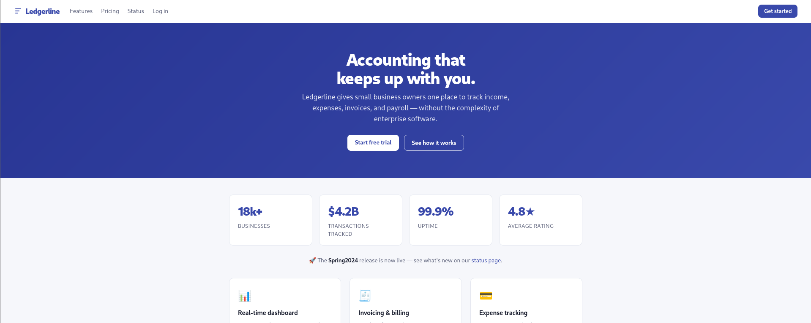

There is a login page.

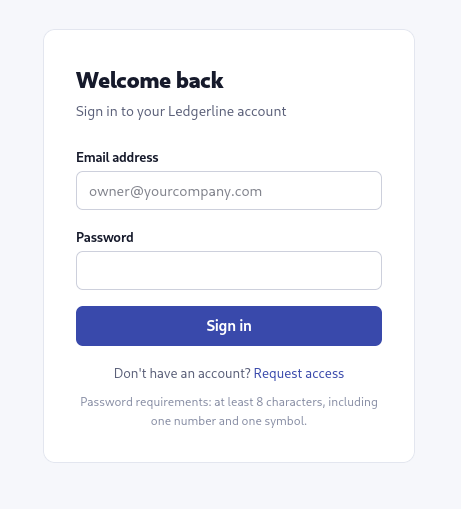

This login page seems to be the attack surface for this application.

I tested a random email to test out what reponse we get.

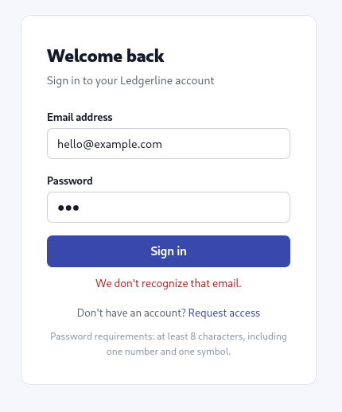

Seems obvious, that won't work. There is a page to request access for the login, let's test that out.

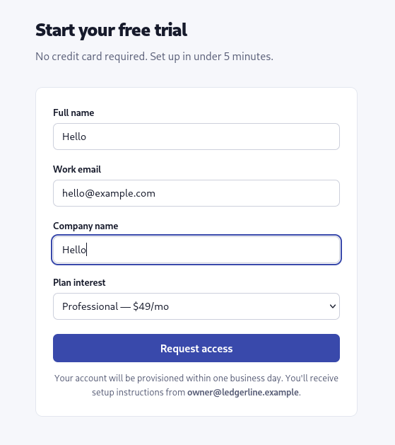

This also didn't worked out either. Let test logging with the email given the request access page `owner@ledgerline.example`.

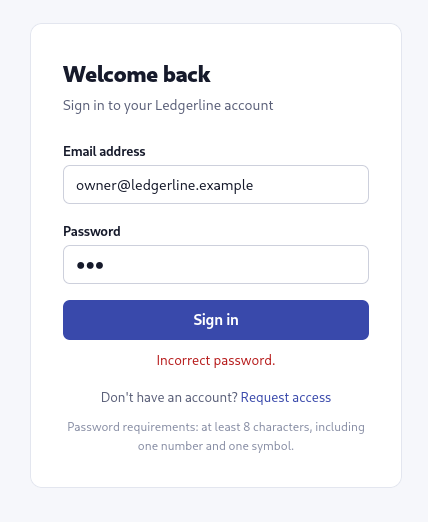

Seems interesting, now it gave a different response that the previous one. It seems this owner email have he access to the login page.

There is also another interesting thing. The password policy for the login page:

* Must be atleast 8 character long
* Contain one number & one symbol


Let's try to brute force the login page.

---

## Exploitation

I captured a request in **Burpsuite**, forwarded it to the **Burp Intruder** for the attack.

I am using the `sniper attack` mode for the brute force, using the `Seclists` Password list for the test.

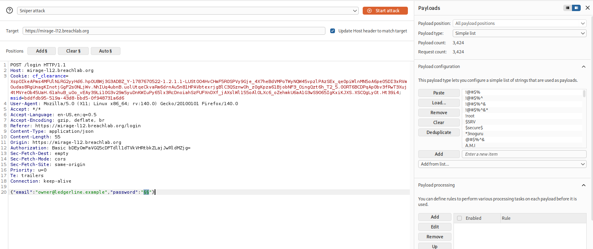

Oops, I guess the brute force attack won't work, as there is a rate limiter mechanism which will block attacks like brute force.

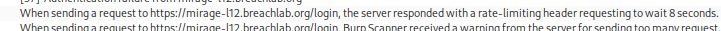

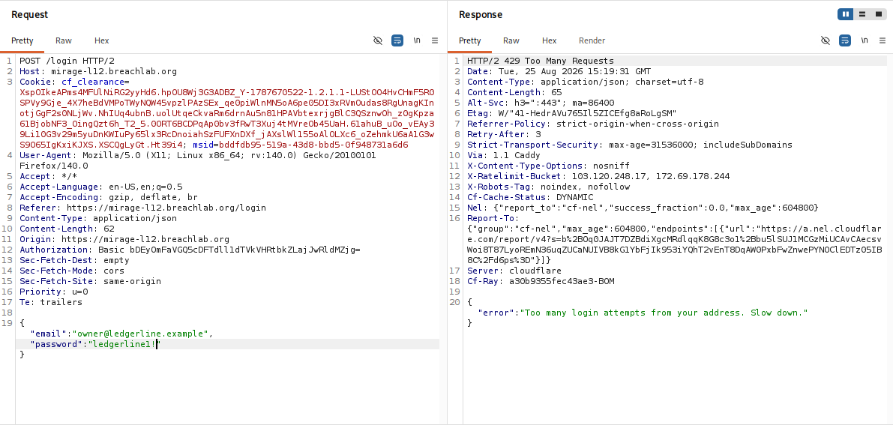

We have to think of something else then.

Let's go and inspect the source code again for any missed clues. Here I got the login page function which is seems interesting:

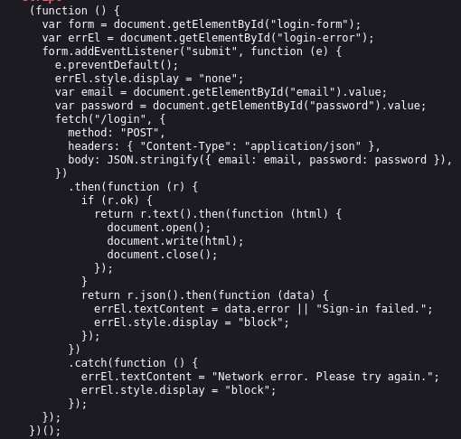

```js
document.open();
document.write(html);
document.close();
```
- On successful login, the function returns a new HTML page.
- It wipes out the current webpage and overwrites it with a new HTML page using `document.write`
- The problem is that, the `document.write()` method is heavily outdated and can cause modern browsers to throw warnings or break scripts.

Modern approach: A successful login should return a token (like a JWT) or a status code, and the JavaScript should redirect the user using `window.location.href = "/dashboard";`.

While testing some request, I notices a response header which contained a constant IP address and a dynamic IP addrss which changes every time

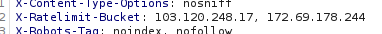

I simply googled the response header for more information on this.

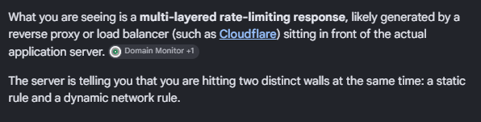

The first IP seems to be the actual server IP, which explains why it is static.

While the Dynamic IP seems to the reverse proxy IP generated from the rate limiting function.

This will be our key for the attack, because if that static IP is indeed the backend server's actual IP address, exposing it completely defeats the purpose of using a proxy or Web Application Firewall (WAF).

Using this we can bypass the rate-limiting function.

[PayloadAllTheThings](https://swisskyrepo.github.io/PayloadsAllTheThings/Brute%20Force%20Rate%20Limit/) ways comes in handy!

I knew the generic password wordlist won't work, we have to use a custom wordlist specific for the login page.

So I used **Cewl**, a application that crawls a target website to create a customized dictionary of words for password-cracking attacks.

```bash
cewl https://example.com -v --auth_type basic --auth_user id --auth_pass password -d 7 -m 8 --with-numbers -k -w wordlist.txt
```

For Authentication, use the login credentials which is used to access the challenge application at start.

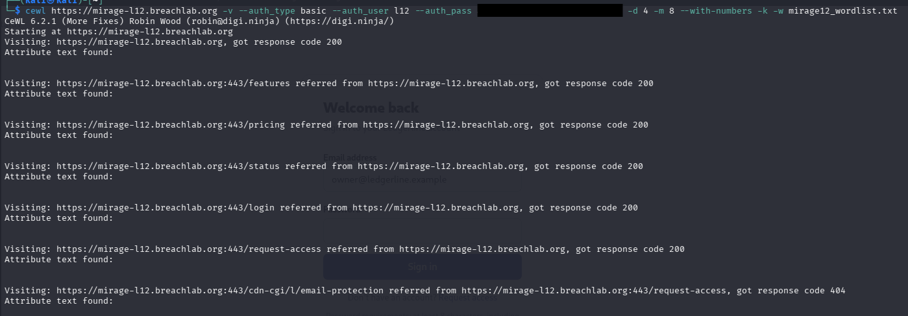

I got the wordlist ready, but it was still missing a key component for the password, one symbol was required in the password to complete the criteria.

I simply googled `most frequently used characters to change the password when asked` and it was the `exclamation mark (!)`.

I added the `!` to every word in the custom wordlist using `sed -i 's/$/!/' wordlist.txt`.

I changed the earlier attack mode to `cluster bomb attack` mode, which uses multiple payload sets and tests every single cross-combination of those payloads.

Added the `X-Forwarded-For` request header, which will help us bypass the rate-limit mechanism.

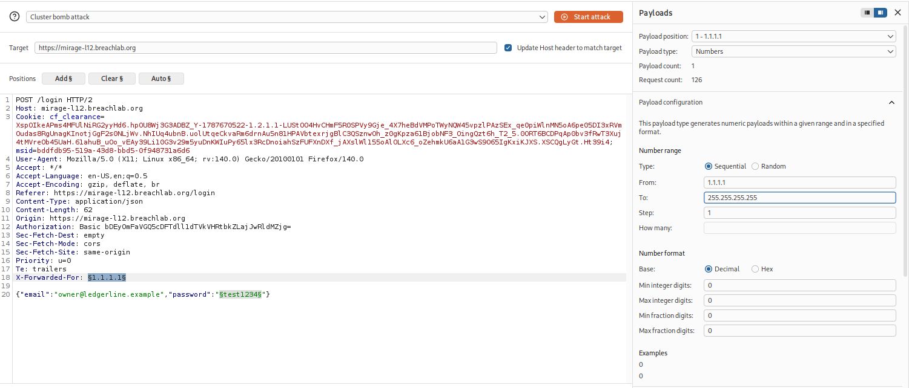

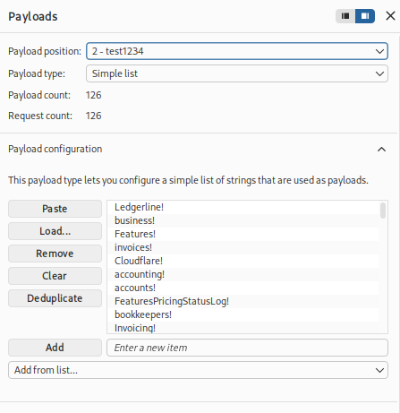

Chnaged the payloads setting and started the attack.

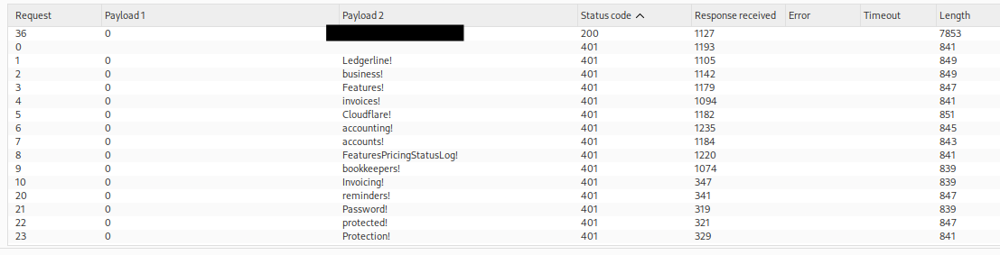

We got the password for the login page, using the credentials we got access to the admin console which had the challenge flag.

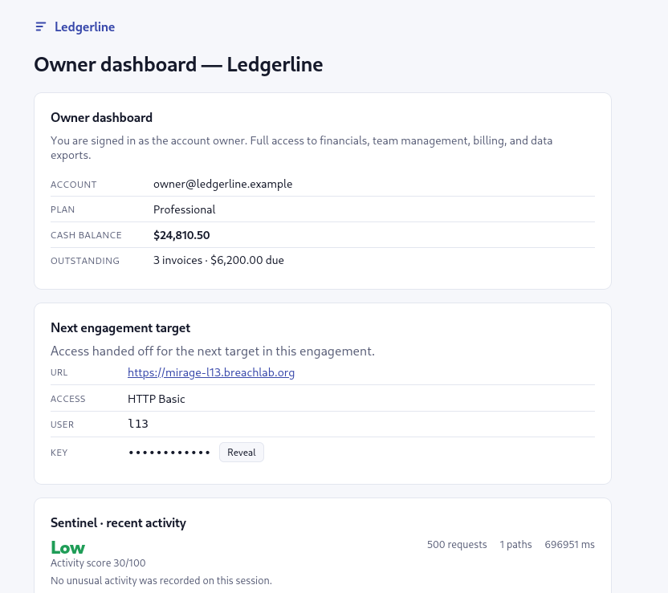

---

## Root Cause

The application trusted the client-controlled `X-Forwarded-For` header when enforcing rate-limiting mechanism.

Because attackers could freely modify this header, each authentication request appeared to originate from a different client, effectively bypassing the rate limit.

In addition, the login endpoint disclosed whether an account existed by returning different error messages for invalid usernames and incorrect passwords, enabling user enumeration prior to the password attack.

Also the password which authenticated the login was already present on the website, which allowed to create a custom wordlist for the password attack.

---

## Security Impact

Improperly implemented rate limiting can significantly weaken authentication security.

Potential impacts include:

* Bypass of login rate-limit.
* Credential stuffing attacks.
* Password spraying.
* Online brute-force attacks.
* User account compromise.
* Increased effectiveness of account enumeration.

When combined with username disclosure, the attack surface becomes substantially larger.

---

## Mitigation

Developers should:

* Perform rate limiting using the actual client IP obtained from trusted infrastructure rather than client-controlled headers.
* Only trust forwarding headers when added by trusted reverse proxies.
* Return generic authentication error messages that do not distinguish between invalid usernames and incorrect passwords.
* Implement account lockout or progressive authentication delays.
* Monitor repeated authentication failures and alert on suspicious login activity.
* Use strong password combination which are not related to the accout details like name, home, address etc.

---

## Key Takeaways

* Always inspect authentication responses for user enumeration opportunities.
* Analyse response headers when testing rate limiting.
* Never assume login throttling is implemented securely.
* Client-controlled headers should never be trusted for security decisions.
* Burp Suite Intruder is highly effective for testing authentication controls when combined with targeted payload generation.

---

## Vulnerability Classification

| Category     | Value                                                              |
| ------------ | ------------------------------------------------------------------ |
| Type         | Login Throttling Bypass via Client-Controlled Header               |
| OWASP Top 10 | A07:2021 – Identification and Authentication Failures              |
| CWE          | CWE-307: Improper Restriction of Excessive Authentication Attempts |
| Related CWE  | CWE-290: Authentication Bypass by Spoofing                         |
