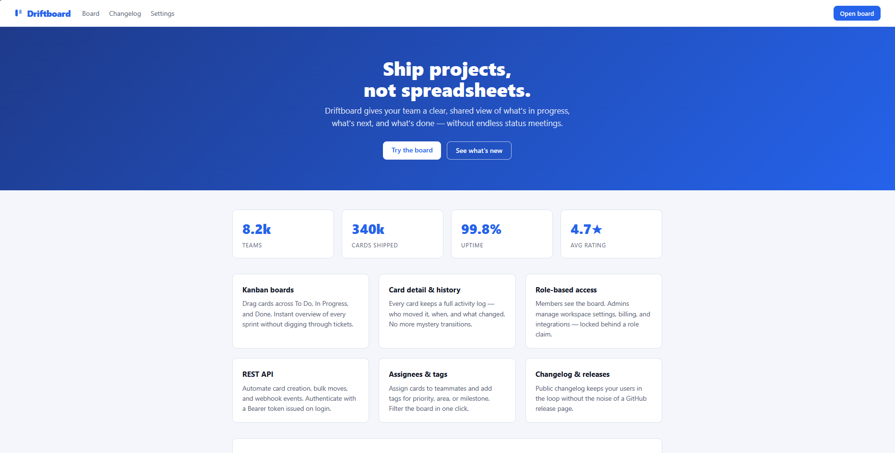
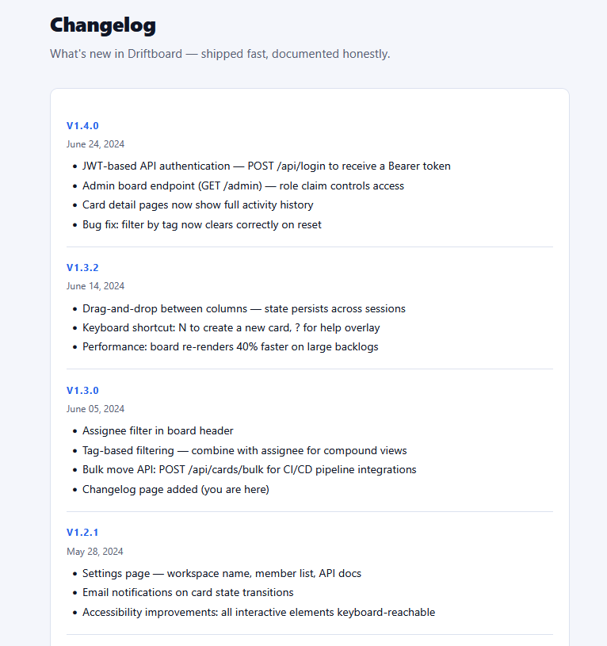
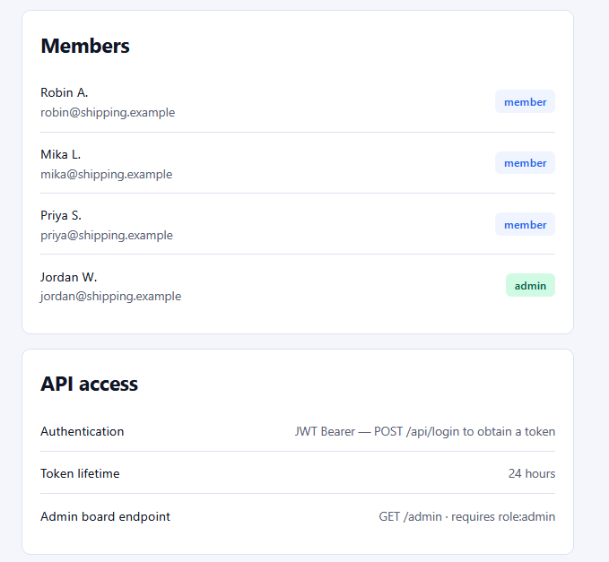
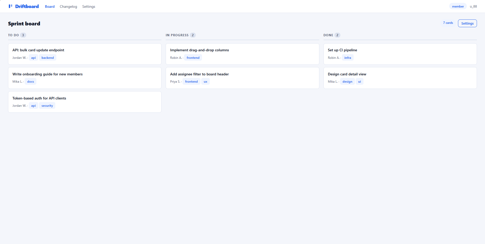
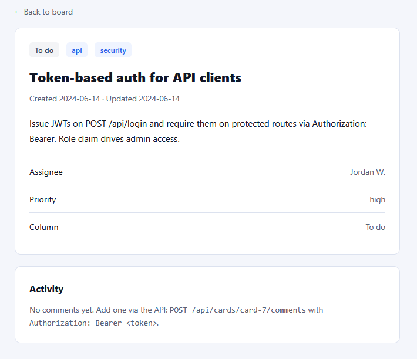
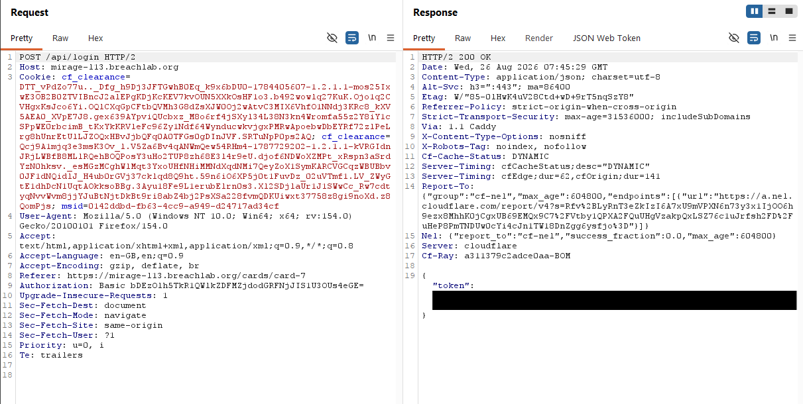
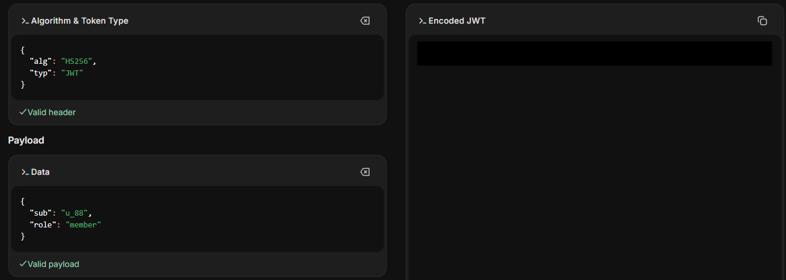
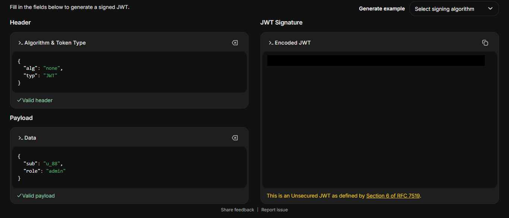
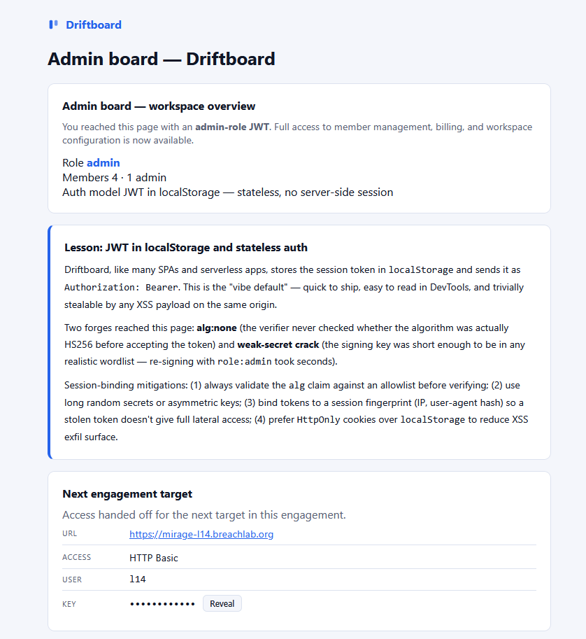

# Level 13: Forge the Token

Link: [Level 13](https://breachlab.org/tracks/mirage/13)

---

## Objective

Driftboard. A JWT signed with a weak secret (and an alg it shouldn't accept). Mint yourself admin.

---

## Reconnaissance

Looks like a project management application, let's look around.



Looks like the website contains a changelog page which gave us two endpoints:
  - Login page: `/api/login`
  - Admin console: `/admin`
  - for bulk move operation for CI/CD pipeline: `/api/cards/bulk`



A setting page which shows the users and their roles in the application.



A To-do page where work progess are recorded like to-do, in-progress and completed works. It also seem we have the `member` role assigned to us.



Among that, there is an interesting to-do message left by the admin.



The developer built an authentication system using JSON Web Tokens (JWT), the comment `Role claim drives admin access` tells the server to look inside the token to see if it contains `admin` role or not.

If a JWT token is poorly configured like:
  - uses a weak secret key
  - `none` algorithm
  - doesn't verify the signature properly
  
Anyone can modify token's role to admin and escalate the privileges.

---

## Exploitation

Let's go and test some request uisng **Burpsuite**. Simply capture a request, forward it to the **Burp Repeater**, change the header you want to test and send the request.



We got a JWT token.

Now to change the values inside the JWT token, we can use [jwt.io](https://www.jwt.io/)

First add the JWT token in `JWT Decocde`, decode it and you will get the decoded header and payload in JSON format.

Then add the decoded JSON values in the `JWT Encoder` and change the values, algorithm to `none` and role to `admin`.





Go back to **Burpsuite**, change the request header and sent the request:

```html
GET /admin HTTP/2
Authorization: Bearer <JWT token>
```

And here we got, we got access to the admin console and retrieved the challenge password.



---

## Root Cause

The JWT token was poorly configured which let us change the `alg` value to `none` instead of enforcing the expected signing algorithm.

Because the server trusted the claims contained within the token without verifying its signature, an attacker could modify security-sensitive fields such as `role` and submit the forged token as though it were legitimate.

The application relied entirely on the client-supplied JWT for authorization decisions.

---

## Security Impact

Improper JWT validation can completely compromise an application's authentication and authorization model.

Potential impacts include:

* Authentication bypass.
* Privilege escalation.
* Administrative account impersonation.
* Unauthorized access to protected resources.
* Complete compromise of role-based access control.

Any claim contained within the JWT becomes attacker-controlled if the signature is not properly validated.

---

## Mitigation

Developers should:

* Explicitly validate the JWT signing algorithm against an allowlist.
* Reject tokens using the `none` algorithm, should be used only while testing not in production.
* Always verify the token signature before trusting any claims.
* Use strong signing keys or asymmetric signing algorithms.
* Store authentication tokens in **HttpOnly** cookies where appropriate to reduce exposure to client-side attacks.
* Never rely solely on client-controlled JWT claims for authorization without proper validation.

---

## Key Takeaways

* Developer comments and documentation often reveal valuable implementation details.
* Always inspect JWTs during web application assessments.
* Test for common JWT vulnerabilities such as algorithm confusion and signature validation flaws.
* Authorization decisions should only be made after successful signature verification.
* Misconfigured JWT validation can lead directly to privilege escalation.

---

## Vulnerability Classification

| Category     | Value                                                   |
| ------------ | ------------------------------------------------------- |
| Type         | JWT Algorithm Confusion (`alg: none`)                   |
| OWASP Top 10 | A07:2021 – Identification and Authentication Failures   |
| CWE          | CWE-345: Insufficient Verification of Data Authenticity |
