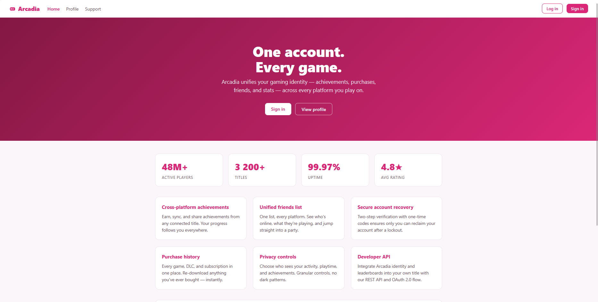
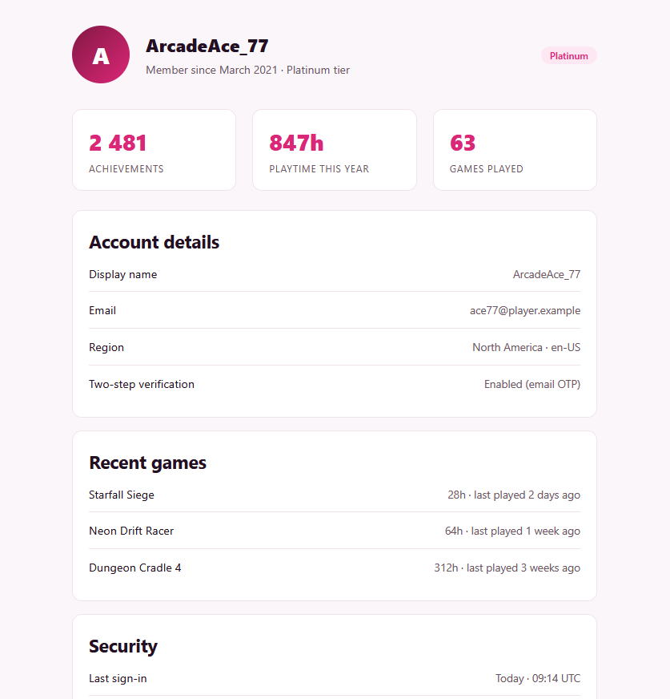
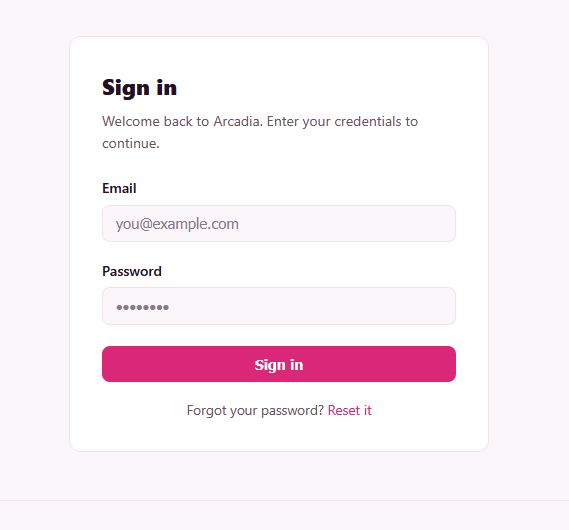
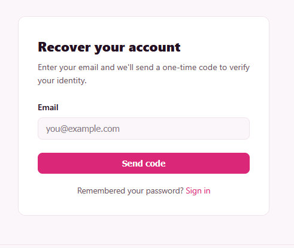
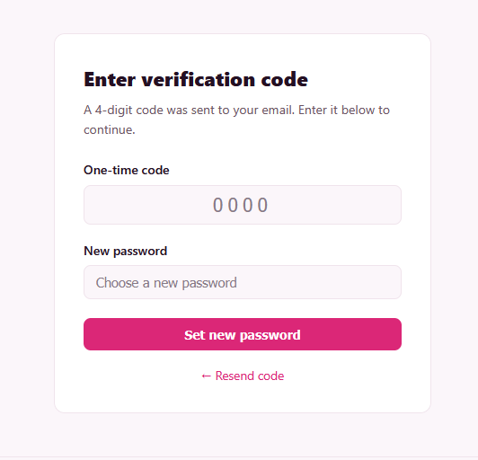
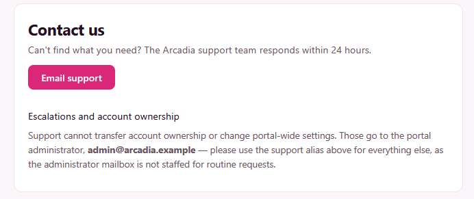
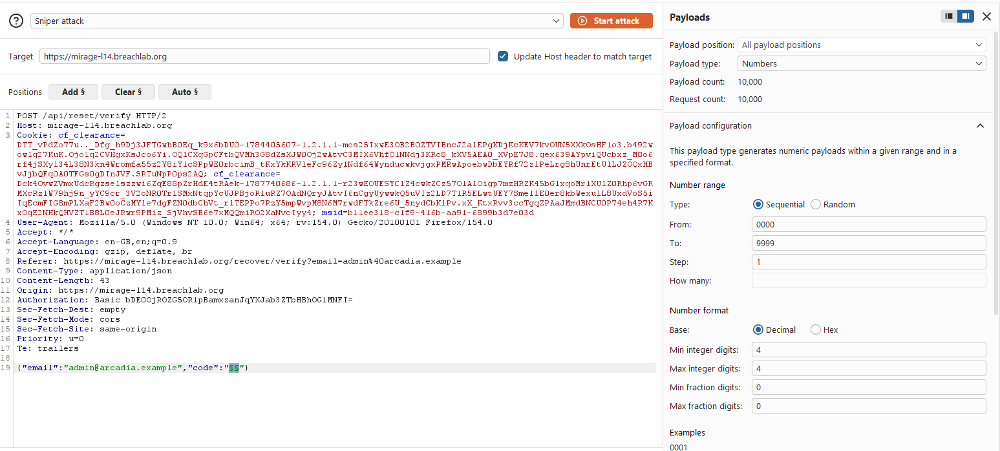
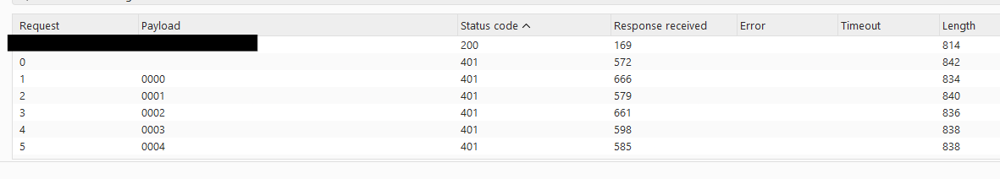
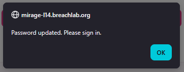
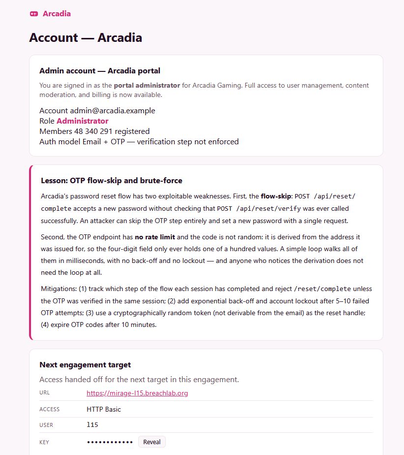

# Level 14: Reset Without Proof

Link: [Level 14](https://breachlab.org/tracks/mirage/14)

---

## Objective

Arcadia. A password reset that never checks the code was verified — and a one-time code you can guess anyway.

---

## Reconnaissance

Looks like an online arcade game platform. Let's see what we get here.

Got a Profile, Login, Password Reset and OTP page page:

I also got the `admin` email in the applicaion, which I guess will give us the foothold.

I inspected the source code but didn't find any thing useful.

From the objective, I have two hypothesis:
    - The password reset function is not set properly like no rate-limit mechanism, timeouts, account lockdown etc.
    - We can brute-force the OTP for the password change without any restrictions.

Let's test these out.

---

## Exploitation

Let's test the OTP password change mechanism.

Using **Burpsuite**, I captured a request, forwareded it to **Burp Intruder**.

I am using `sniper attack` mode for this attacks, configured the payload from `0000` to `9999` as the OTP should be of 4-digits.

We got the correct OTP for password change.

Using the OTP, I change the `admin` account's password:

Then, using the email and changed password, I got access to the admin console and retrieved the challenge flag.

---

## Root Cause

The application contained multiple security weaknesses within the password reset implementation.

### 1. Weak OTP Verification

The password reset mechanism relied on a **4-digit numeric OTP** without implementing sufficient protections against online guessing.

Missing controls included:

* Rate limiting
* Account lockout
* Request throttling
* Progressive authentication delays

As a result, the entire OTP space could be exhaustively enumerated in a practical amount of time.

### 2. Broken Password Reset Workflow

The password reset flow failed to enforce the intended verification sequence on the server side.

The endpoint responsible for changing the password didn't properly verified the OTP validation before accepting a new password.

This represented a **Flow-Skip vulnerability**, where a critical authentication step was not enforced by the backend.

---

## Security Impact

Weak password reset implementations can allow attackers to:

* Take over user accounts.
* Reset administrator passwords.
* Bypass intended authentication workflows.
* Compromise privileged accounts without knowing existing credentials.
* Gain unauthorized administrative access.

Because password reset functionality effectively acts as an alternative authentication mechanism, weaknesses in its implementation can completely undermine account security.

---

## Mitigation

Developers should:

* Increase OTP entropy by using longer, randomly generated verification codes.
* Implement strict rate limiting and account lockout for failed login attempts.
* Enforce progressive delays after repeated failures.
* Invalidate OTPs immediately after successful verification or keep a OTP expiration time (like valid for 5-10 minutes).
* Require successful OTP validation before allowing access to password reset endpoints.
* Maintain server-side state to ensure each step of the reset workflow is completed in the intended order.

---

## Key Takeaways

* Password reset functionality should always be treated as an authentication endpoint.
* Small OTP spaces become vulnerable when brute-force protections are absent.
* Always evaluate whether multi-step workflows can be bypassed by directly invoking backend endpoints.
* Critical authentication steps must be enforced on the server rather than relying on client-side workflow sequencing.
* Burp Suite Intruder is highly effective for evaluating OTP implementations and password reset mechanisms.

---

## Vulnerability Classification

| Category       | Value                                                     |
| -------------- | ----------------------------------------------------------|
| Type           | Weak OTP Verification & Password Reset Flow Bypass        |
| OWASP Top 10   | A07:2021 – Identification and Authentication Failures     |
| CWE-307        | Improper Restriction of Excessive Authentication Attempts |
| CWE-640        | Weak Password Recovery Mechanism for Forgotten Password   |