# Level 15: Unverified Identity

---

## Objective

Workgrid. OIDC that trusts a client-supplied id_token without verifying it. Claim to be admin.

---

## Reconnaissance

A project management application, let's see what we have here.

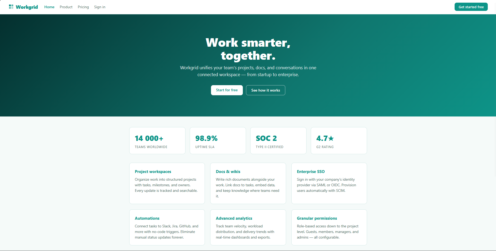

It seems the application have a role-based authorization and `Admin` might be the highest privilege role.

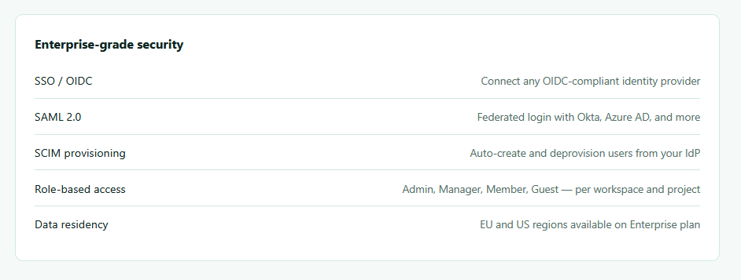

We have a login page here. We can either sign using the `Single Sign-On (SSO)` or the classic email/password authentication.

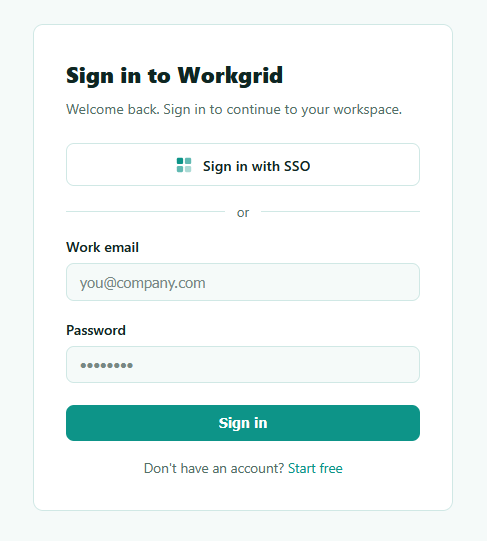

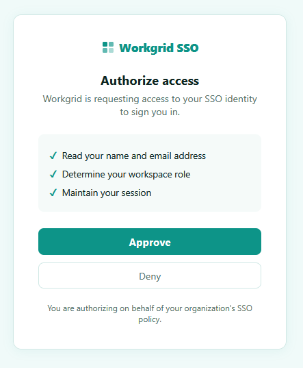

SSO is an authentication process that lets a user log in once with a single set of credentials to access multiple independent applications. 

It is using OpenID Connect (OIDC) which is a simple identity verification layer built on top of the OAuth 2.0 protocol that lets applications confirm who a user is.

While inspecting the source code, I got the SSO authentication flow which redirect the browser to a authorization endpoint:

```html
/authorize?redirect_uri=/callback&amp;state=login
```

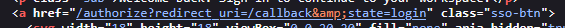

Let's test this endpoint in **Burpsuite**.

---

## Exploitation

I captured a request, forwarded it to **Burp Repeater**, modified the header and sent the request.

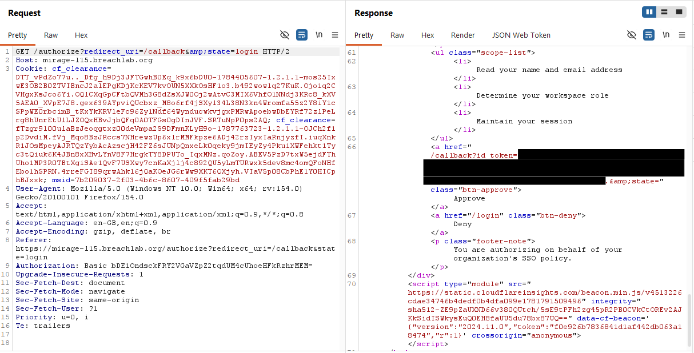

We got a JWT token which seem to be member's account login token. Because I got the same token while I captured the SSO authorize access.

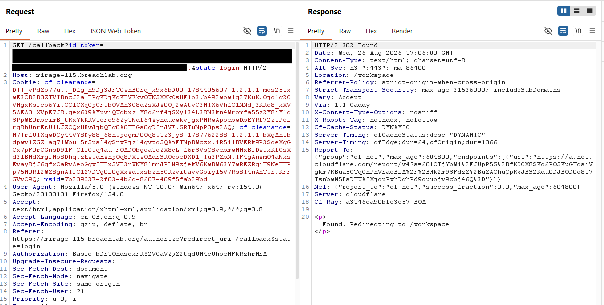

Took the JWT and decoded it using `JWT Web Token` extension in the **Burpsuite**, you can use [jwt.io](https://www.jwt.io/) also. It looks like there is no proper algorithm used in the JWT token, without it anyone can modify the token and can escalate privileges in the application.

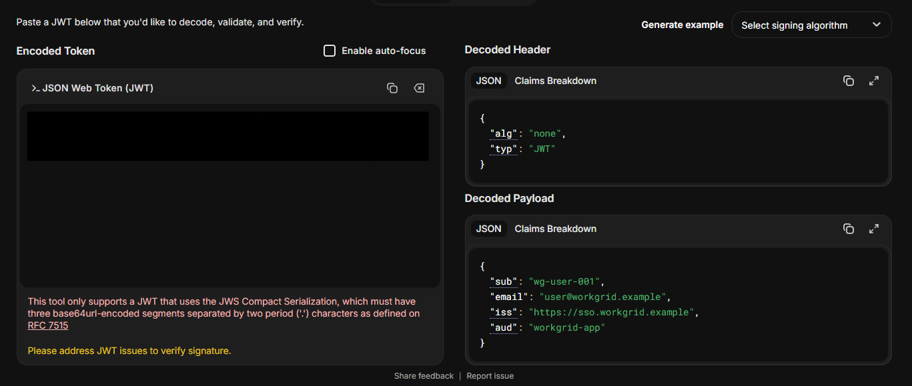

I simply change the id and email values:

From:

```json
{
  "sub": "wg-user-001",
  "email": "user@workgrid.example"
}
```

To:

```json
{
  "sub": "wg-admin-001",
  "email": "admin@workgrid.example"
}
```

and encoded the JWT token with these values.

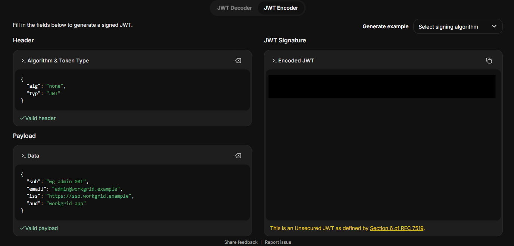

Because there is `none` algorithm already in the token, the authentication function will simply allow the JWT token without any verifications. Also from the roles messaga, I simply guessed the `admin` role and email (also challenge objective mentioned it too).

Take the modified JWT token, replace with the earlier token and sent the request.

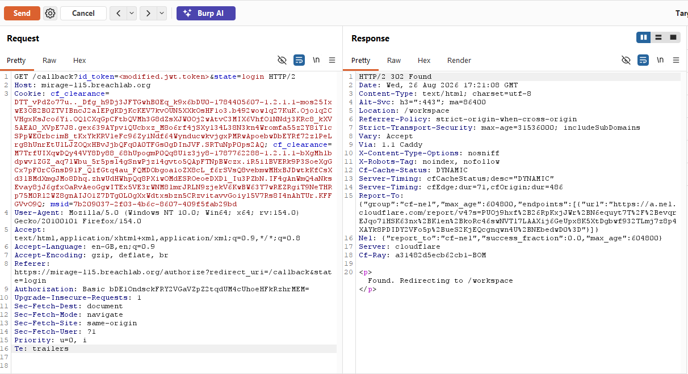

After getting 302 status code, forward again which will get to access to the admin console and the challenge flag.

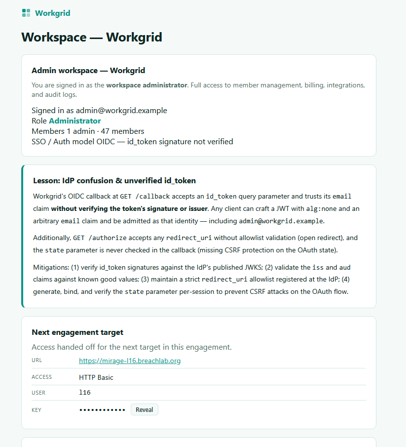

---

## Root Cause

The callback endpoint trusted the contents of the supplied **OIDC `id_token`** without verifying its authenticity.

Specifically, the application failed to:

* Verify the JWT signature.
* Validate the token issuer (`iss`).
* Validate the intended audience (`aud`).

Instead, it accepted attacker-controlled identity claims such as:

* `sub`
* `email`

Because these claims directly determined the authenticated user, modifying them resulted in complete account impersonation.

During testing, two additional weaknesses were also identified:

### Open Redirect

The authorization endpoint accepted arbitrary `redirect_uri` values without enforcing an allowlist.

```html
GET /authorize?redirect_uri=<attacker-controlled-jwt>
```

This could allow malicious redirection during the authentication flow.

### Missing OAuth State Validation

Although the authorization flow included a `state` parameter, the callback endpoint did not verify its value before processing the authentication response.

This removed an important CSRF protection mechanism from the OAuth/OIDC flow.

---

## Security Impact

Improper validation of OIDC identity tokens can allow attackers to:

* Impersonate arbitrary users.
* Authenticate as administrators.
* Bypass the identity provider entirely.
* Compromise role-based access control.
* Gain unauthorized access to protected resources.

Combined with an open redirect and missing state validation, the authentication flow becomes vulnerable to multiple attack vectors.

---

## Mitigation

Developers should:

* Verify `id_token` signatures using the Identity Provider's published JWKS.
* Validate the `iss` (issuer) and `aud` (audience) claims before trusting any token.
* Reject unsigned or improperly signed JWTs.
* Enforce a strict allowlist of approved `redirect_uri` values.
* Generate, bind, and verify the OAuth/OIDC `state` parameter for every authentication request to prevent CSRF attacks.
* Never rely solely on client-supplied identity claims without cryptographic verification.

---

## Key Takeaways

* Always inspect OAuth and OIDC authentication flows during web application assessments.
* Never trust JWT claims until the token's signature has been successfully verified.
* Identity claims such as `sub` and `email` should never be treated as trustworthy without validation.
* Misconfigured authentication flows often expose multiple related vulnerabilities rather than a single issue.
* Burp Suite and jwt.io provide an effective combination for analysing JWT-based authentication.

---

## Vulnerability Classification

| Category       | Value                                                                                                                     |
| -------------- | ------------------------------------------------------------------------------------------------------------------------- |
| Type           | OIDC `id_token` Forgery / Unverified JWT Validation                                                                       |
| OWASP Top 10   | A07:2021 – Identification and Authentication Failures                                                                     |
| Related Issues | CWE-347 (Improper Verification of Cryptographic Signature), CWE-601 (Open Redirect), CWE-352 (Cross-Site Request Forgery) |
