# Level 16: WALK THE PATH

Link: [Level 16](https://breachlab.org/tracks/mirage/16)

---

## Objective

Slate. Path traversal behind a decoder that decodes twice — %252e your way out of the document root.

---

## Reconnaissance

It looks like a documentation platform application where teams store their documentations. Let's look around!


The website is built as backend service using `Node.js` and utilizes a `Flat-file content store` to store the documentation in `Markdown (.md)` format.

This system stores the files on a local disk rather than rational database like `MySQL` or `PostgreSQL`.

The files are stored inside a directory `content/`.

The application is packaged and shipped as a standard `Docker image` built from the root directory and everything is managed by the `environment variables (.env)`.

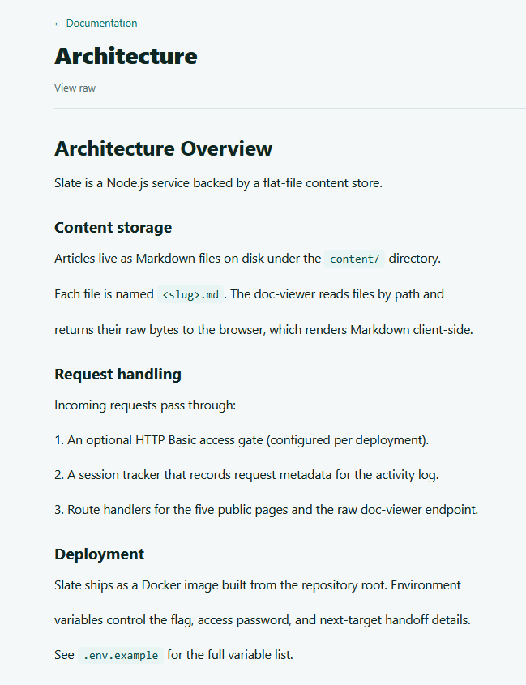

The `doc-viewer` component locates files from their path and sends the raw bytes directly to the browser.

Then user's web browser parses and render the Markdown text into HTML page.

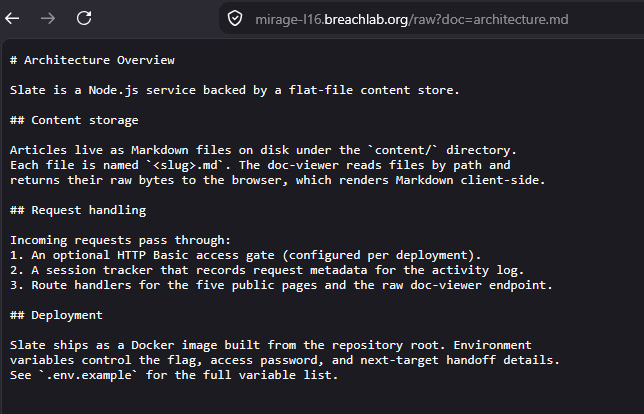

The interesting part here was that the server maps the query parameter to the internal file system and streams the raw bytes directly to the browser for client-side Markdown parsing and rendering.


By looking at the parameter, I guessed it would be vulnerable to **Path Traversal** (also the objective mention it too).

---

## Exploitation

It test the vulnerability, I captured a request, forwarded it to **Burp Repeater**.

Modified the header to a classic Path Traversal payload: `../../../etc/passwd`

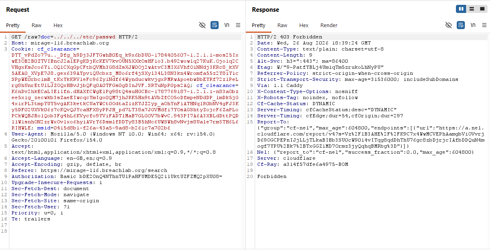

It seems the Web Application Firewall (WAF) is blocking the Path Traversal payloads.

Don't worry, as we can encode the payload using `URL encode` and check again.

```
%2e%2e%2f%2e%2e%2f%2e%2e%2fetc%2fpasswd
```

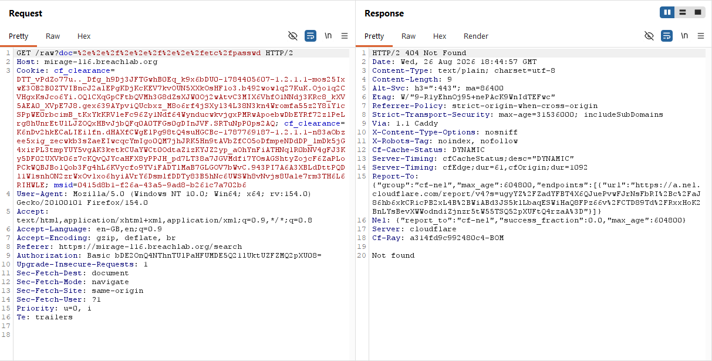

As you can see, now 403 Forbidden is not coming which means it bypassed the WAF. But we still can't access the file, which means we might be much deeper inside the root folder.

The classic `../../../etc/passwd` is used when we are three folder inside like `/var/www/html`.

We have to increase the traversal payload to get to the location.

```
%2e%2e%2f%2e%2e%2f%2e%2e%2f%2e%2e%2f%2e%2e%2fetc%2fpasswd
```

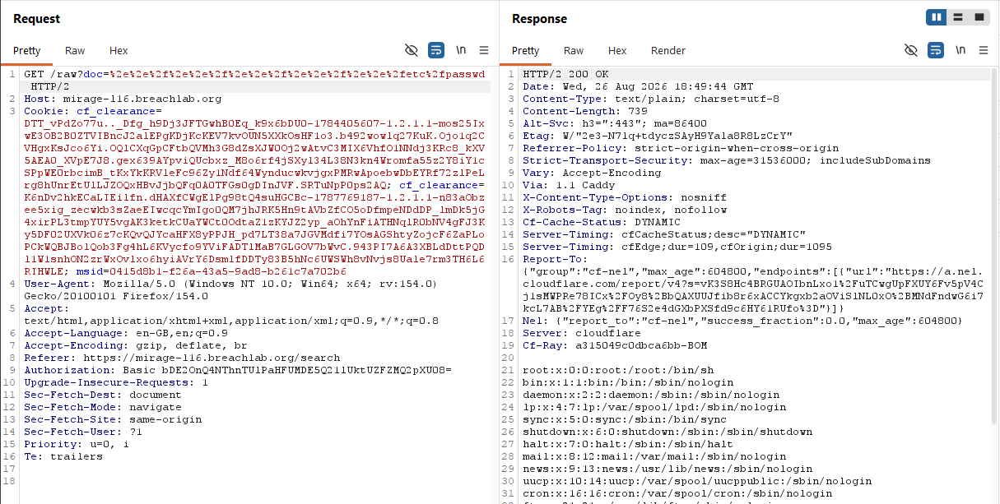

This confirmed two things:
    - The application is vulnerable to Path Traversal
    - We must be five directory inside from the root directory, theoretically something like this `/../../../../content`

As our goal now is to find the files which might help us complete the challege.

Eariler, the architecture page mentioned that the `env.example` contains the variable.

This might contain some clue, so let's check it out!

I added a file name from the application before a path traversal payload to satisfy backend concatenation logic that expects a valid filename.

Without it we won't be able to do Path Traversal inside application directory.

So, our payload would look something like this:

```
getting-started.md%2e%2e%2f%2e%2e%2f%2e%2e%2f%2e%2e%2fenv.example
```

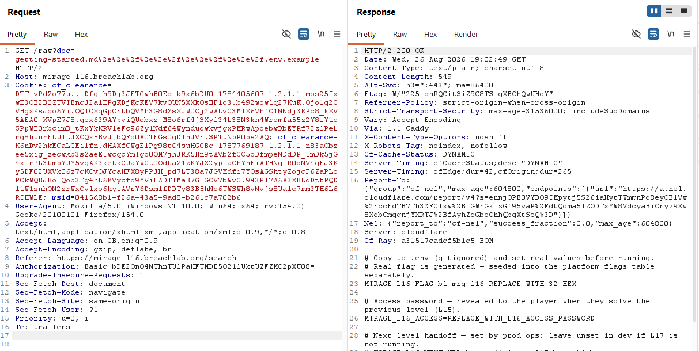

Seem like we got another file `.gitignore` which is a plain text file that tells Git which files or folders to skip and not add during production.

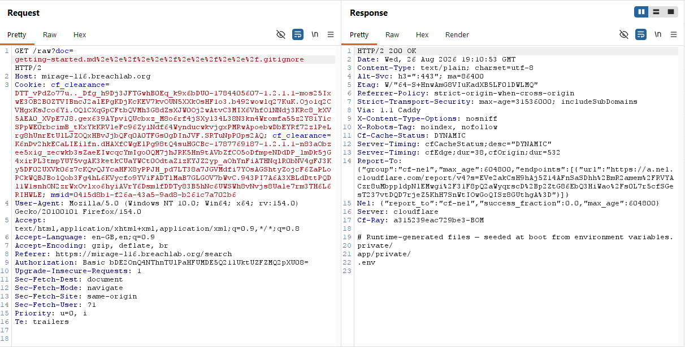

We got more files which seems interesting, `.env`, `private/` and `app/private/`.

I wasn't able to find the `.env`
`private/` and `app/private` looks like a directory, not a file.

I did a research on Node.js file structure and got to know that all files are stored under `app/` directory by default and all source code are stored inside `src/`.

These are some common file name for Node.js project:
- `index.js`
- `app.js`
- `server.js`
- `main.js`

So I started looking for these file for any clue.

```
getting-started.md%2e%2e%2f%2e%2e%2f%2e%2e%2fsrc/app.js
```

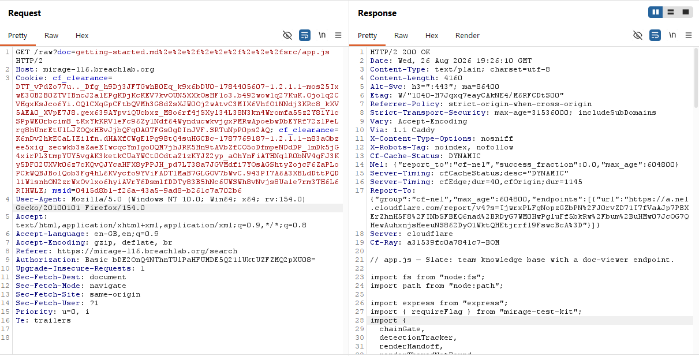

And I got the backend source code for the application, which contains two files `render.js` and `files.js`.

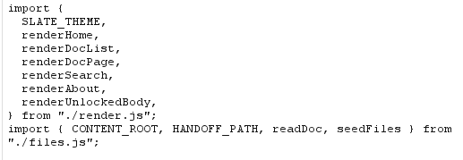

The `render.js` was the frontend code which wasn't useful but the `files.js` was very useful.

```
getting-started.md%2e%2e%2f%2e%2e%2f%2e%2e%2fsrc/files.js
```

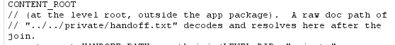

It revealed a very interesting file `handoff.txt` inside the `private/` directory.

```
getting-started.md%2e%2e%2f%2e%2e%2f%2e%2e%2f%2e%2e%2fprivate/handoff.txt
```

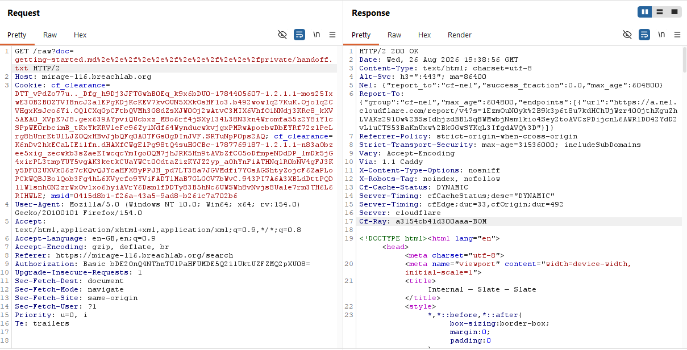

This gave us access to the admin console which was outside the application service directory. We got the challenge flag from the admin console.

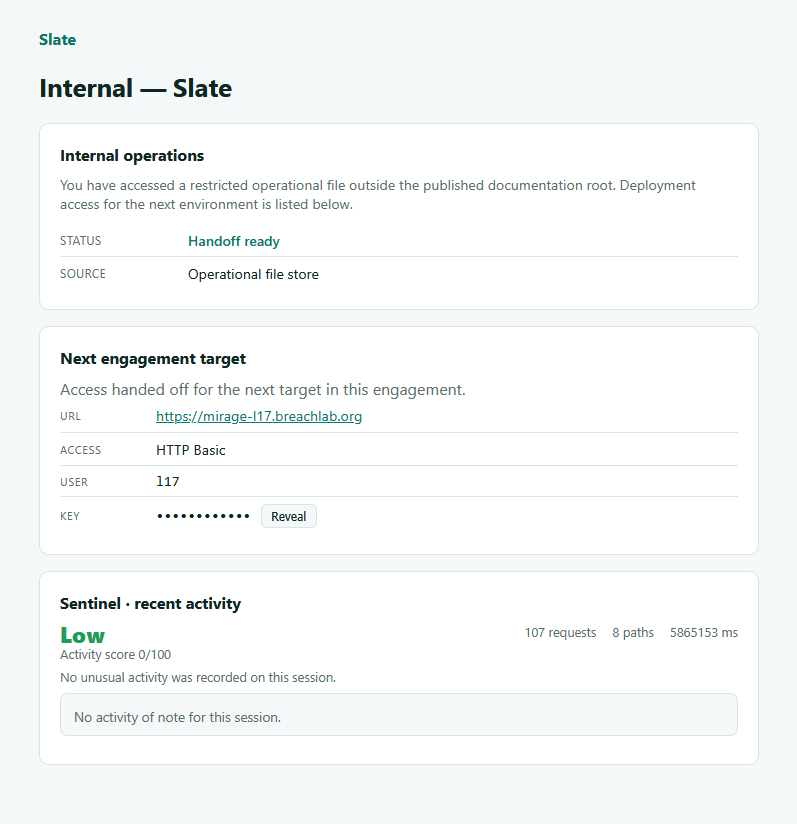

---

## Root Cause

The root cause was an unsafe file-reading mechanism combined with insufficient canonicalization and traversal validation.

The `/raw` endpoint accepted an attacker-controlled path `doc` and passed it to the application's file-reading logic.

The security check block the plain path traversal payload but failed to block the URL-encoded traversal payload characters.

The application then resolved the resulting path against the filesystem without reliably ensuring that the final canonical path remained inside the intended `content/` directory.

---

## Security Impact

An attacker able to access the `/raw` endpoint could potentially:

* Read arbitrary files from the server filesystem.
* Access application source code.
* Read configuration files.
* Discover internal filesystem structure.
* Access sensitive operational files.
* Potentially retrieve secrets, credentials, or other sensitive data.

In this challenge, arbitrary file read ultimately provided access to the protected operational handoff file containing the flag.

---

## Mitigation

The application should never rely on string-based filtering of traversal sequences.

Instead:

* Decode and normalize the input **before validation**.
* Resolve the requested path to its canonical filesystem path.
* Verify that the final path remains inside the intended document directory.
* Reject absolute paths.
* Reject paths that escape the allowed directory after normalization.
* Prefer mapping document slugs to known files rather than accepting arbitrary filesystem paths.
* Avoid exposing raw filesystem reads through user-controlled parameters.

---

## Key Takeaways

* Test how the application handles **individually encoded characters**.
* `%2e` represents `.`, while `%2f` represents `/`.
* `%2e%2e%2f` can therefore become `../` after decoding.
* A difference between `403` for plaintext traversal and `200` for encoded traversal is a strong indicator of a parsing/validation mismatch.
* Once arbitrary file read is confirmed, **always go for the application's source code**.
* Source code often reveals the exact location of sensitive files.
* `.gitignore` can provide useful hints about application directories and runtime-generated files.
* Don't blindly brute-force filenames when the application's own source can reveal the intended target.

---

## Vulnerability Classification

| Category | Value |
|---|---|
| Type | Path Traversal / Arbitrary File Read |
| OWASP Top 10 | A01:2021 – Broken Access Control |
| CWE | CWE-22 – Improper Limitation of a Pathname to a Restricted Directory |
| Related Issue | URL-Encoding / Canonicalization Bypass |
