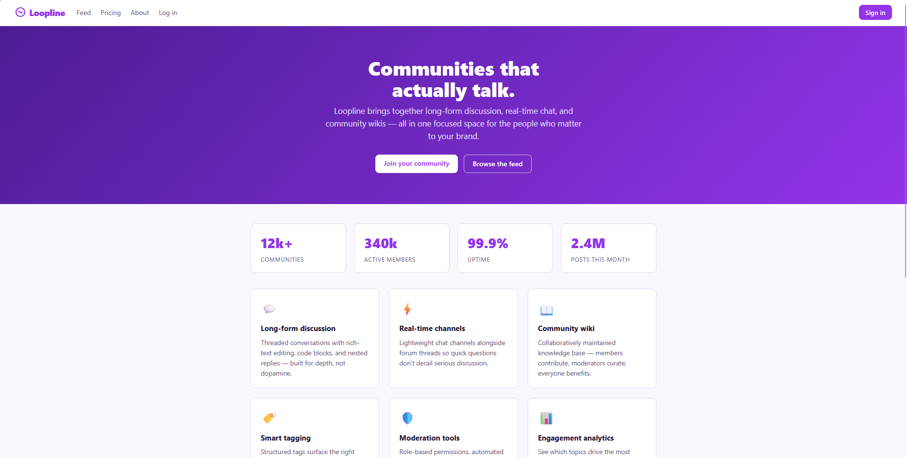
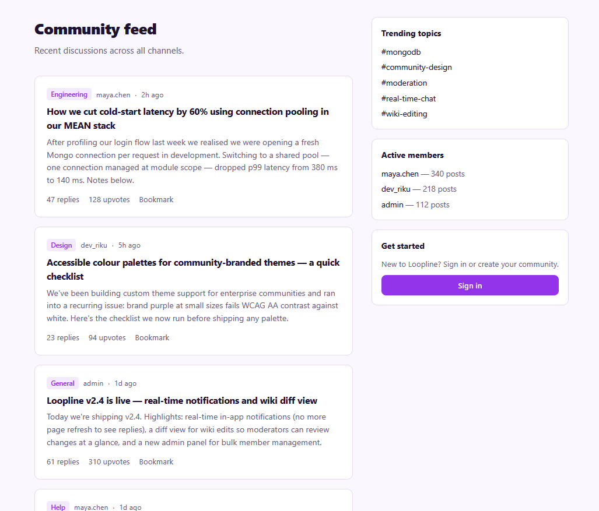
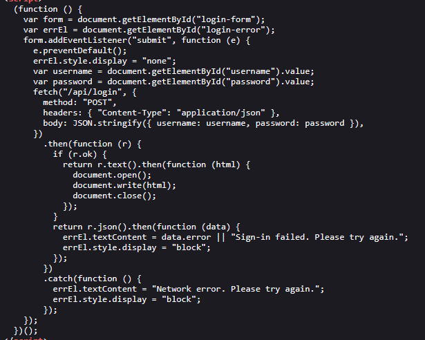
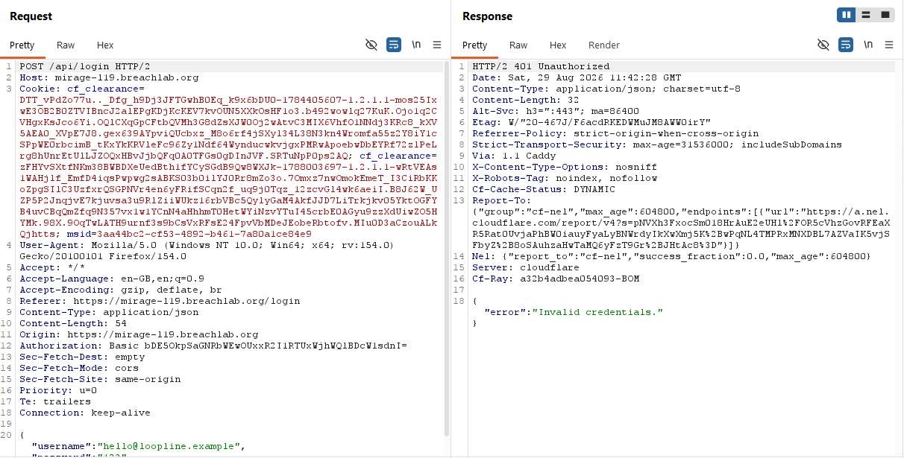
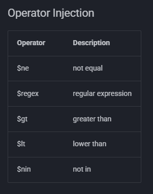
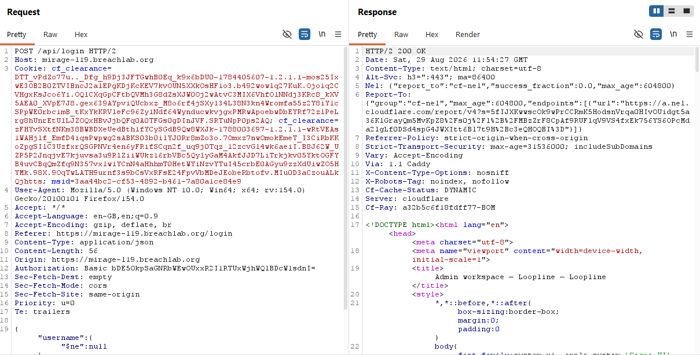
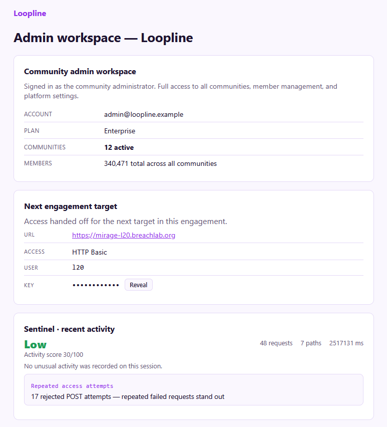

# Level 19 - Operators Welcome

Link: [Level 19](https://breachlab.org/tracks/mirage/19)

---

## Objective

Loopline. A Mongo query that takes your JSON at face value — inject the operators it never expected.

---

## Reconnaissance

Seems to a online chatting and social media web application just like `discord`. Let's see what we have here!

The application has a login page which seems to be the target surface for the challenge.

While inspecting the application source, I got the login function code which tells us something interesting:

The `document.write()` method is a legacy JavaScript function used to write text or HTML markup directly into an open document stream.

This method is heavily outdated and unpredictable as it forces the browser to pause parsing the page, delaying the download of other scripts and images which might break the code logic.

The main issue is that it parses inputs directly as HTML which makes it an injection sink vulnerable to Cross-Site Scripting (XSS) attacks.

Let's test out this login form and see what we can do in it!

---

## Exploitation

As the objective, as we know that `Mango query` is a MongoDB-inspired declarative JSON querying language used to interact with NoSQL databases like Apache CouchDB and PouchDB.

As we also that the login form is outdated and might be vulnerable to injection attacks, let's test `NoSQL Injection` attack on the login page.

First, I captured a sample request using **Burpsuite**, forwarded it to the **Burp Repeater**, added the email and a sample password to test out the response.

Let's now test the login form by adding `NoSQL injection` JSON operator payload in the body field.

Find all the payloads here: [PayloadsAllTheThings](https://swisskyrepo.github.io/PayloadsAllTheThings/NoSQL%20Injection/)

As you see, wwe got access to the admin console which also contains the challenge flag.

---

## Root Cause

* Improper Input Validation: The backend /api/login endpoint accepts JSON payloads but fails to enforce strict data type checking on the username and password fields.

* Unsanitized Query Construction: The application passes the raw JSON input directly into the NoSQL database query (e.g., MongoDB). This allows an attacker to inject NoSQL operators like `{"$ne": ""}` (not equal) or `{"$gt":""}` (greater than) instead of standard strings.

* Secondary Vulnerability (Frontend): While not the vector for the login bypass, the frontend uses `document.write()` to render the successful login response. If the backend reflects user input in that HTML without sanitization, it opens the door for DOM-based Cross-Site Scripting (XSS).

---

## Security Impact

* Authentication Bypass: By manipulating the query logic using the `$ne` operator, an attacker can force the database to return a truthy result, granting unauthorized access to accounts (often the first user in the database, usually an admin) without knowing the credentials.

* Data Exposure: Successful bypass grants access to authenticated sessions, exposing sensitive data, internal dashboards, and CTF flags.

* Confidentiality Breach: In a real-world scenario, attackers could expand this to extract additional database records or perform broader enumeration using different NoSQL operators (like `$regex` or `$gt`).

---

## Mitigation

* Strict Type Validation: Explicitly cast all user inputs to strings before passing them to the database query (e.g., `String(req.body.username)` in Node.js).

* Sanitize Inputs: Utilize sanitization libraries designed for NoSQL databases (such as mongo-sanitize) to automatically strip out any keys beginning with `$` or `.` from user input.

* Use Strict ODM Schemas: Implement an Object Data Modeling (ODM) library like Mongoose with strict schemas to ensure the database strictly expects and validates specific primitive data types.

* Modernize Frontend Rendering: Replace the outdated and risky `document.write()` method with safer DOM manipulation techniques (like setting `textContent` or using modern framework binding) to prevent potential DOM XSS.

---

## Key Takeaways

* NoSQL != No Injection: Relying on NoSQL databases does not eliminate injection vulnerabilities; it merely changes the syntax from SQL strings to JSON objects.

* Never Trust JSON Structures: APIs accepting `application/json` are highly susceptible to object injection if the backend blindly trusts the structure and types provided by the client.

* Defense-in-Depth: Secure applications require both frontend hardening (avoiding `document.write`) and strict backend validation to prevent chained exploits.

---

## Vulnerability Classification

| Category | Value |
| -------- | ----- |
| Type | NoSQL Injection |
| OWASP Top 10 | A03:2021 – Injection |
| CWE | CWE-943: Improper Neutralization of Special Elements in Data Query Logic |
