# Level 20 - Shell on Demand

Link: [Level 20](https://breachlab.org/tracks/mirage/20)

---

## Objective

Pingdeck. A diagnostics tool that shells out with your input in the command line. RCE — ephemeral box.

---

## Reconnaissance

It looks a network proble console which is used to track the network traffic, analyze packets and gather information on performance of the networks.

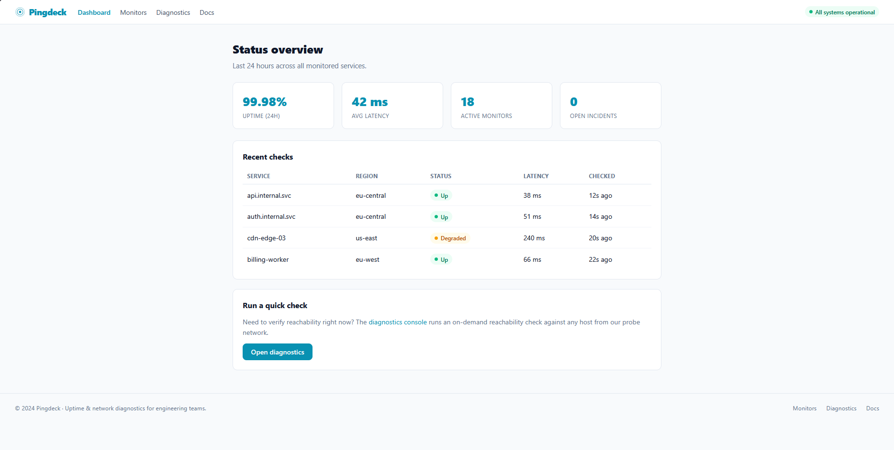

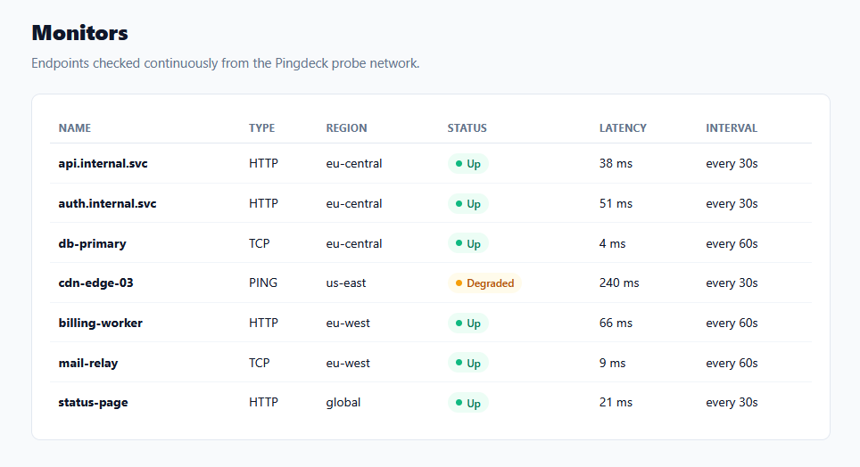

The `/docs` page gives us a brief on two endpoints used in a `Diagnostic Tool` used in the application, let's check that out!

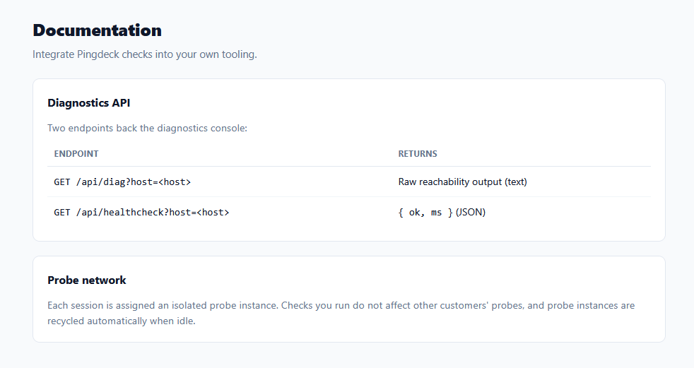

It seems the `Diagnostic Tool` is a input console which test host reachability, diagnose network issues, and measure data round-trip latency just like the `ping` command.

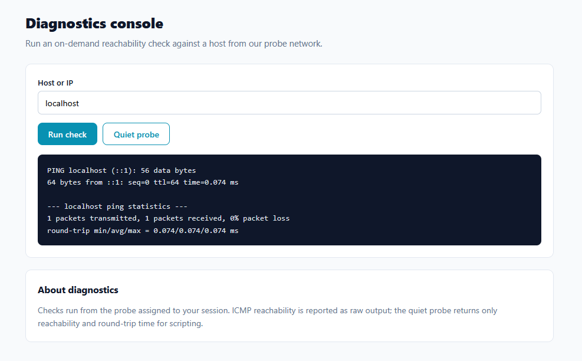

Here is the function for the console written in the frontend source code.

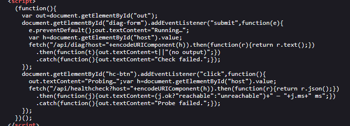

This code seems to be very interesting!

Look closely at how the backend server processes the `host` parameter.

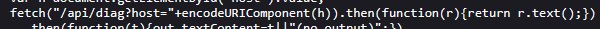

Web interfaces that wrap tools like `ping` are notorious targets for `Command Injection` attacks.

When the user enters a domain or IP address in the console, that text is sent to the backend server.

If the backend server directly passes the host string to a system shell execution function without strict validation, an attacker can append malicious commands.

Let's test this out!

---

## Exploitation

System shells (like Bash in Linux) use special characters to chain multiple commands together on a single line:

- `;` (Semicolon): Runs the second command after the first one finishes.
- `&` or `&&` (And): Runs commands concurrently or sequentially.
- `|` (Pipe): Passes the output of one command as input to another.

We can use these characters to craft a malicious code. Instead of typing `localhost` into the input, I typed type:

```bash
localhost; ls
```

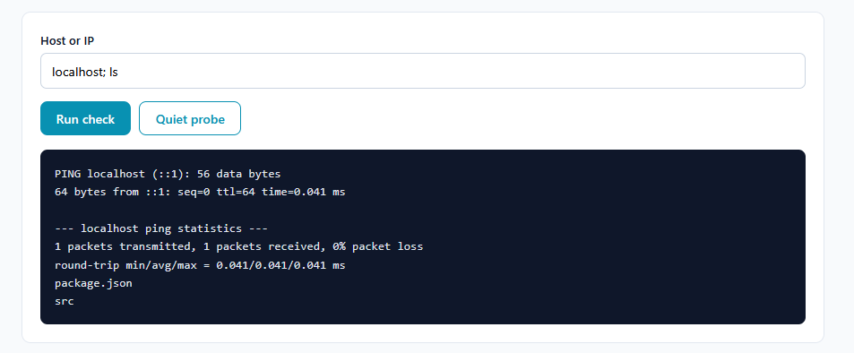

```bash
localhost; ls -al
```

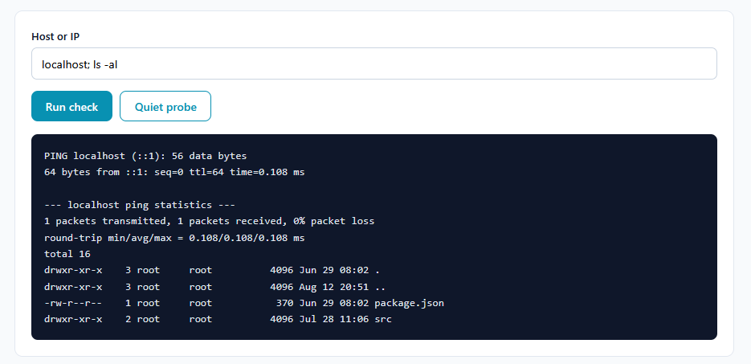

This confirmed that the input field is vulnerable to `OS command injection` vulnerability, as it not only gave us the network information but also gave output of the command we appended after the `ping` input.

I started looking around for anything useful. While looking I got the source code and in it I found something very interesting.

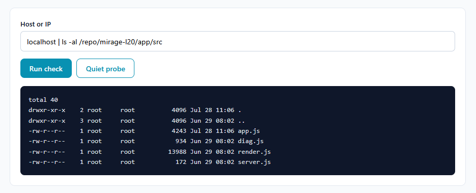

I found the internal endpoint inside the backend source code.

To get access, it uses a authentication token in the request header. And below in the code, I found the location for the token that we can use to access the internal page.

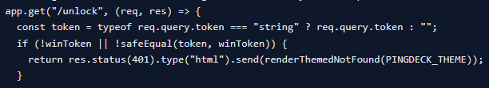

I won't show the location, Try finding yourself!

Happy finding 😁!

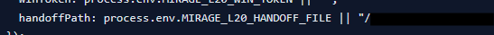

Got the token, now let's send the request to access the internal location.

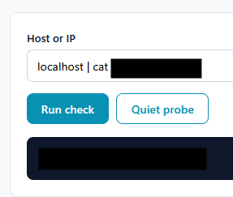

I capture a sample request in **Burpsuite**, forwarded it to the **Burp Repeater**, changed the request header to `GET /unlock?token=<TOKEN> HTTP/2` and sent the request.

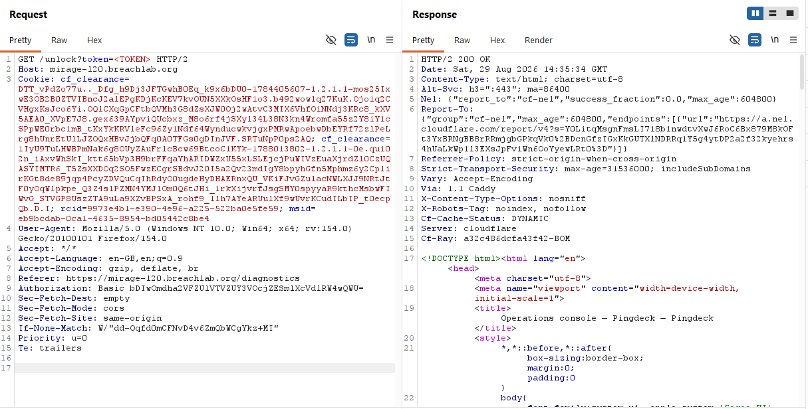

We got access to the internal admin console which had the challenge flag.

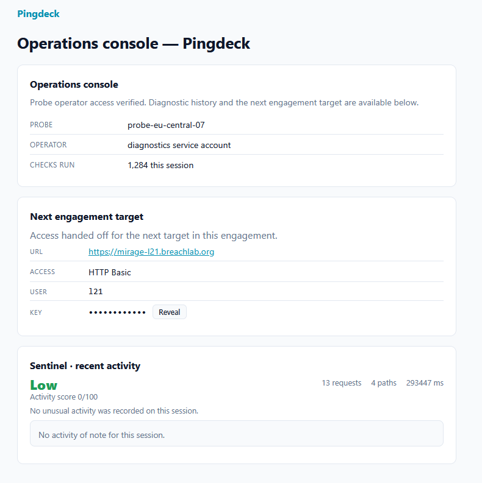

---

## Root Cause

* The application takes user-supplied input from the host parameter and directly passes it to an underlying operating system shell (e.g., via functions like `exec()`, `os.system()`, or `child_process.exec`) without sufficient sanitization or escaping.

By using shell metacharacters like the semicolon (;) or pipe (|), an attacker can terminate the intended ping command early and append entirely new arbitrary commands to be executed sequentially by the shell.

---

## Security Impact

* Remote Code Execution (RCE): The vulnerability allows an attacker to execute arbitrary system commands with the privileges of the user running the web server process.

* Information Disclosure: The attacker can read arbitrary files on the system, leading to the exposure of sensitive backend source code, configuration files, and authentication tokens (e.g., the plaintext `.txt` token file).

* Lateral Movement / Privilege Escalation: Using the extracted source code and tokens, the attacker can pivot to hidden internal services (the admin portal) and completely compromise the application's administrative backend.

---

## Mitigation

* Use Native APIs: Replace OS-level shell calls with native programming language libraries (e.g., using a native networking library to resolve DNS or measure latency instead of invoking the `ping` binary).

* Parameterization: If invoking OS commands is unavoidable, use execution functions that do not spawn a system shell (such as `child_process.execFile` or `spawn` in Node.js). Pass arguments as an array rather than concatenating strings, preventing metacharacters from being interpreted by the shell.

* Strict Input Validation: Implement a strict allowlist for the host parameter, permitting only valid IP address formats or alphanumeric characters and dots for hostnames. Reject any input containing spaces or shell metacharacters (`;`, `&`, `|`, `$`, ` ).

* Defense in Depth: Store sensitive tokens securely (e.g., as environment variables or in a secrets manager, not in plaintext text files) and run the web application process with the least privilege necessary.

---

## Key Takeaways

* Never trust user input: Any data passed from the client-side must be strictly validated before interacting with backend infrastructure, especially the operating system.

* Chaining vulnerabilities amplifies impact: A single RCE became a full application compromise because the environment stored hardcoded tokens in plaintext and lacked internal network segmentation to protect the admin portal.

* Source code exposure is a roadmap: Reading backend source code provides a blueprint for further attacks, revealing hidden endpoints, internal architecture, and hardcoded authentication mechanisms.

---

## Vulnerability Classification

| Category | Value |
| -------- | ----- |
| Type | OS Command Injection / Remote Code Execution (RCE) |
| OWASP Top 10 | A03:2021 – Injection |
| CWE | CWE-78: Improper Neutralization of Special Elements used in an OS Command ('OS Command Injection') |
